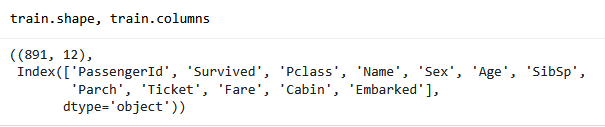
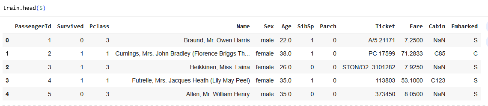
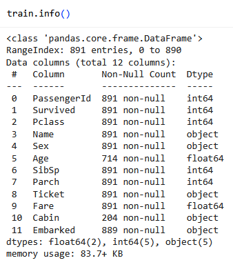
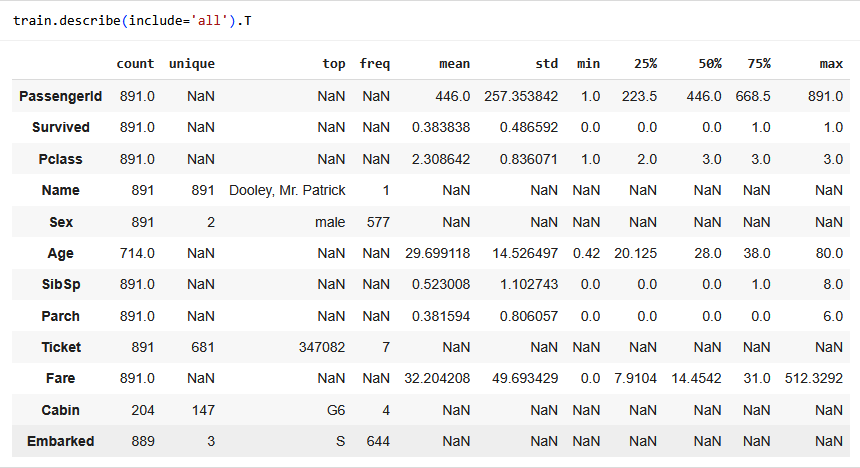
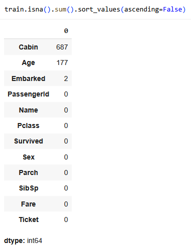
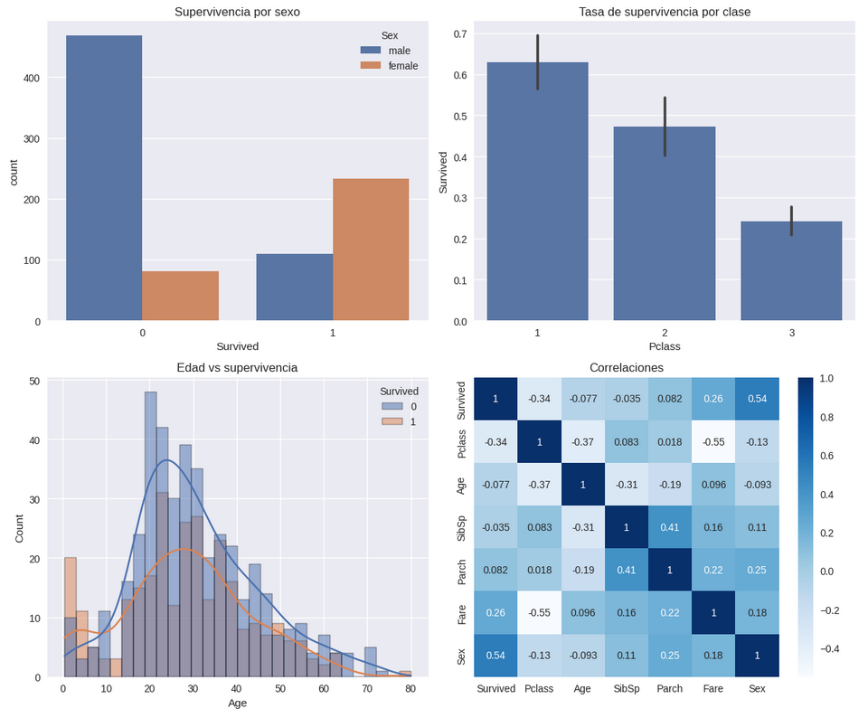

# Entrada 01 — EDA Titanic

## Contexto
En esta actividad incial nos familiarizaremos con Kaggle para acceder al
dataset del Titanic y a través de diversas herramientas (pandasm, numpy, 
seaborn, matplotlib) realizaremos un análisis de los datos buscando hallar
una relación entre estos y la supervivencia de la persona.

## Objetivos
- Entender el dataset del Titanic y la competencia de Kaggle.
- Familiarizarme con herramientas para el EDA de datasets.
- Encontrar los factores que tuvieron más relevancia en la supervivencia
de los pasajeros del Titanic.

## Actividades (con tiempos estimados)
- Investigación del Dataset del Titanic — 10 min
- Setup en Colab — 5 min
- Cargar el dataset de Kaggle — 5 min
- Conocer el dataset — 10 min
- EDA visual con seaborn/matplotlib — 15 min

## Desarrollo
### 1. Investigación del Dataset del Titanic
El dataset consiste en datos acerca del incidente del Titanic, teniendo
datos sobre las personas (nombre, edad, sexo), datos relacionados a
su pasaje (clase, ticket, tarifa) y si en definitiva sobrevivieron o no
la catástrofe.

Este dataset se encuentra divido en dos sets: un training set, para el
entrenamiento de los modelos; y un test set, para la validación del mismo.
En este caso analizaremos el training set, se diferencian únicamente en
las personas que contienen y que el test set no tiene la columna que 
indica la supervivencia del pasajero.

#### Columnas:
- PassengerId: Id numérico del pasajero
- Survived: Booleano que dicta si sobrevivió, siendo 1 = sobrevivió
- Pclass: Indica la clase del pasajero en el viaje, pudiendo ser
primera, segunda o tercera clase (1, 2, 3)
- Name: Nombre del pasajero
- Sex: Sexo del pasajero
- Age: Edad del pasajero en años
- SibSp: Cantidad de hermanos más cantidad de cónyuges a bordo
- Parch: Cantidad de padres más cantidad de hijos a bordo
- Ticket: Número de ticket
- Fare: Tarifa del pasajero
- Cabin: Número de cabina
- Embarked: Puerto de embarcación, siendo C = Cherbourg, Q = Queenstown
y S = Southampton

!!! note "Nota"
    - Pclass sirve como alternativa al estado socioeconómico:
    1 = clase alta, 2 = clase media, 3 = clase baja.
    - Edad si es menor a 1, es fraccional. Si es estimada, se
    añade .5 al final.
    - SibSp suma la cantidad de hermanos (hermano, hermana,
    hermanastro, hermanastra) y cónyuges (esposo, esposa).
    - Parch suma la cantidad de padres (padre, madre) e hijos
    (hijo, hija, hijastro, hijastra).

#### Factores más influyentes
En primera instancia, factores como el sexo y edad seguro
incrementarían las probabilidades de supervivencia, siendo que
existe el dicho "mujeres y niños primero" con mayor relevancia
en esa época.

Segundo, factores como la clase socioeconómica del pasajero
también habría tenido un impacto, aumentando las probabilidades de
sobrevivir cuanto mejor posiciando haya estado uno.

Adicionalmente, factores como el nombre, número de ticket no parecen 
tener un impacto directo en la supervivencia de un pasajero.

#### Desafíos de calidad de datos
Datos faltantes debido al desconocimiento o estimaciones erróneas
de datos que perjudiquen el análisis.

Campos de datos no estandarizados, teniendo que analizar caso a
caso o probar diferentes patrones para comprenderlos.

#### Variables correlacionadas
SibSp y Parch está directamente relacionadas, siendo que uno al tener
hermanos directamente impacta en la cantidad de hijos del padre.

SibSp y Parch pueden llegar a tener relación con Age, dado que tener
cónyuge o tener hijos limita la edad mínima que podría tener el
pasajero.

Fare y Pclass pueden estar relacionadas en cuanto mayor es la tarifa,
mayor suele ser la clase del pasajero. 

### 2. Setup en Cloab
A continuación, configuramos el ambiente de trabajo en Google Colab
instalando las librerías a utilizar (pandas, numpy, matplotlib,
seaborn) y montando en drive los directorios data y results.

```python linenums="1"
import pandas as pd
import numpy as np
import matplotlib.pyplot as plt
import seaborn as sns
import warnings
warnings.filterwarnings('ignore')

plt.style.use('seaborn-v0_8')
sns.set_palette('deep')
```

```python linenums="1"
from pathlib import Path
try:
    from google.colab import drive
    drive.mount('/content/drive')
    ROOT = Path('/content/drive/MyDrive/IA-UT1')
except Exception:
    ROOT = Path.cwd() / 'IA-UT1'

DATA_DIR = ROOT / 'data'
RESULTS_DIR = ROOT / 'results'
for d in (DATA_DIR, RESULTS_DIR):
    d.mkdir(parents=True, exist_ok=True)
print('Outputs →', ROOT)
```

### 3. Cargar el dataset de Kaggle
Luego de obtener la API key de Kaggle, la subimos al Colab y
descargamos tanto el training set como el test set del Titanic.

```python linenums="1"
!pip -q install kaggle
from google.colab import files
files.upload()  # Subí tu archivo kaggle.json descargado
!mkdir -p ~/.kaggle && cp kaggle.json ~/.kaggle/ && chmod 600 ~/.kaggle/kaggle.json
!kaggle competitions download -c titanic -p data
!unzip -o data/titanic.zip -d data

train = pd.read_csv('data/train.csv')
test = pd.read_csv('data/test.csv')
```

### 4. Conocer el dataset





Ya inicialmente podemos observar valores faltantes en la columna Cabin
y la aparente falta de estructura de la columna Ticket.







En la última imágen podemos claramente ver que hay bastantes valores
faltantes de la columna Cabin, Age y sólo 2 de embarked.

La alta cantidad de valores faltantes en Cabin me lleva a pensar que
puede que no todos los pasajeros tuvieran asignados una cabina, que
puede estar relacionado con alguna otra columna.

Los valores faltantes de Age me llevan a pensar que se desconocía la
edad de muchos de los pasajeros.


Como podemos observar, parece que la probabilidad de supervivencia de
los pasajeros del training set se encuentra entre 1/3 y 2/5.

### 5. EDA visual con seaborn/matplotlib

```python linenums="1"
fig, axes = plt.subplots(2, 2, figsize=(12, 10))

# Supervivencia global por sexo
sns.countplot(data=train, x='Survived', hue='Sex', ax=axes[0,0])
axes[0,0].set_title('Supervivencia por sexo')

# Tasa de supervivencia por clase
sns.barplot(data=train, x='Pclass', y='Survived', estimator=np.mean, ax=axes[0,1])
axes[0,1].set_title('Tasa de supervivencia por clase')

# Distribución de edad por supervivencia
sns.histplot(data=train, x='Age', hue='Survived', kde=True, bins=30, ax=axes[1,0])
axes[1,0].set_title('Edad vs supervivencia')

# Creando copia del dataset mapeando sexo a valores numéricos para graficar correlación
train_copy = train.copy()
train_copy['Sex'] = train_copy['Sex'].map({'male': 0, 'female': 1})

# Correlaciones numéricas
numeric_cols = ['Survived', 'Pclass', 'Age', 'SibSp', 'Parch', 'Fare', 'Sex']
sns.heatmap(train_copy[numeric_cols].corr(), annot=True, cmap='Blues', ax=axes[1,1])
axes[1,1].set_title('Correlaciones')

plt.tight_layout()
plt.show()
```



Analizando las gráficas podemos visualizar lo siguiente del training set:

- Sobrevivieron más del doble de mujeres que de hombres.
- Alrededor del 75% de mujeres sobrevivieron.
- Alrededor del 80% de hombres no sobrevivieron.
- En comparación con la tercera clase, sobrevivieron casi el doble de
pasajeros de segunda y más del doble de pasajeros de primera.
- Prácticamente el único rango etario donde la probabilidad de
supervivencia es positiva es en edades menores a 10, especialmente
menores a 6 años.
- La clase de los pasajeros tiene fuerte correlación con la tarifa y
moderada con la supervivencia.
- Cantidad de hermanos y cónyuge tiene moderada correlación con la
cantidad de padres e hijos.
- Edad no parece tener correlación con supervivencia a pesar de lo
graficado.
- Sexo tiene una fuerte correlación con supervivencia.

### Preguntas posteriores
- ¿Qué variables parecen más relacionadas con Survived?

Tanto sexo como clase del pasajero tuvieron el mayor impacto en la
supervivencia de la persona, cabe mencionar que edad también tuvo un
gran impacto en edades muy tempranas.

- ¿Dónde hay más valores faltantes? ¿Cómo los imputarías?

Para el caso de embarked, dado que son sólo 2 valores podrían ser
eliminados del análisis.

Viendo que la edad no tiene mucha relevancia en la chance de
supervivencia excepto en valores atípicos se podría imputar con
la mediana del sexo correspondiente.

Dado que las filas con la columna cabin nula constituyen alrededor
del 75% del dataset, se podría investigar más en profundidad el
porqué de los valores nulos, hasta entonces, optaría por evitar
la columna cabin para el propósito del análisis.

- ¿Qué hipótesis probarías a continuación?

El hecho de ser hombre en el Titanic impactaba drasticamente de
manera negativa en tu probabilidad de sobrevivir, mientras que
tanto ser mujer como pertenecer a la clase alta, la aumentaban
en gran medida.

## Evidencias
- [Link al Colab](https://colab.research.google.com/drive/1Z9lnzZWP9iS_rHIycbxb_0MPbEJP9whg?usp=sharing)

## Reflexión

Considero que el dataset del Titanic sirve como una buena
introducción al análisis de datos, ya que no es un dataset
muy extenso que sea difícil de comprender, contiene columnas
que están relacionadas entre ellas, tiene valores faltantes
en diferentes escalas que inducen a pensar como manejarlos
y provee la capacidad de contrastar lo que un modelo
entrenado podría predecir con los valores reales de
supervivencia.