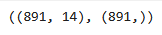

# Entrada 02 — Feature Engineering simple + Modelo base

## Contexto
En esta actividad realizaremos feature engineering con el dataset
del Titanic para mejorar la evaluación de un modelo de regresión
logística que luego compararemos con un modelo base para validar su
efectividad.

## Objetivos
- Comprender la utilidad del feature engineering y aplicarlo en un
ejemplo visto anteriormente.
- Entender la función de la regresión logística y aplicarlo para
predecir la supervivencia de los pasajeros del Titanic.
- Utilizar un modelo arbitrario dummy como baseline para validar
el funcionamiento del modelo entrenado.
- Utilizar el reporte de clasificación y matriz de confusión para
tener un mejor análisis de lo resultados y efectividad del modelo.

## Actividades (con tiempos estimados)
- Investigación de Scikit-learn — 10 min
- Preprocesamiento y features — 15 min
- Modelo base y baseline — 20 min

## Desarrollo
### 1. Investigación de Scikit-learn

#### LogisticRegression:

- La regresión logística predice valores discretos, sirve para resolver
problemas de clasificación binaria, como decidir si un mail es spam o no.
- Parametros importantes:
    - penalty: define el tipo de norma usada para regularización,
    se utiliza para evitar el overfitting.
    - C: inversa de la fuerza de regularización.
    - solver: algoritmo usado para optimización.
    - max_iter: máximo número de iteraciones para converger.
    - fit_intercept: determina si el modelo calcula el bias.
- Se utiliza liblinear solver uando se quiere resolver problemas de 
clasificación en datasets pequeños.

#### DummyClassifier:

- DummyClassifier realiza preiddciones ignorando las features de input,
sirve para verificar que un modelo que debería funcionar realmente
prediga mejor que una predicción aleatorio o sin fundamentos.
- Estratégias:
    - most_frequent: predice la clase más frecuente del conjunto y.
    - stratified: predice aleatoriamente con pesos basados en el
    conjunto y.
    - prior: idem a most_frequent con ligeras diferencias.
    - uniform: predice clases uniformemente aleatorias.
    - constant: siempre predice la clase provista por el usuario.
- Es importante tener un baseline para validar que el modelo que
estemos entrenando prediga de manera efectiva y no sea peor a una
predicción arbitraria o aleatoria.

#### train_test_split:

- Stratify permite que la proporción de clases pasada al parametro
se mantenga en los conjuntos de train y test.
- Para asegurar que los conjuntos de train y test sean los mismos
cada ejecución permitiendo obtener resultados fiables.
- De manera predeterminada este valor es 0.25 si tampoco se setea
el tamaño del train set, por tanto tomo ese valor como recomendable.

#### Métricas de evaluación:

- Métricas:
    - Precision: TP / (TP + FP).
    - Recall: TP / (TP + FN).
    - F1-score: media harmónico de precision y recall.
    - Support: cantidad de caso de cada clase.
- En la posición C<sub>i,j</sub> de la matriz representa los casos
donde la clase era i y el modelo predijo j.
- Está bien usar accuracy en vez de otras métricas cuando el dataset
está balanceado en sus clases.


### 2. Preprocesamiento y features

Con el mismo dataset de la entrada anterior, utilizaremos Feature Engineering
para crear features nuevas (con base en las existentes) al dataset que 
consideremos puedan ser de utilidad para un posterior análisis.

```python linenums="1"
df = train.copy()

# 🚫 PASO 1: Manejar valores faltantes (imputación)
df['Embarked'] = df['Embarked'].fillna(df['Embarked'].mode()[0])  # Valor más común
df['Fare'] = df['Fare'].fillna(df['Fare'].median())              # Mediana
df['Age'] = df['Age'].fillna(df.groupby(['Sex','Pclass'])['Age'].transform('median'))
```

En este paso, se imputan las columnas pertinentes que contienen valores 
faltantes con diferentes métodos.

Mediana para tanto la tarifa como la edad, ya que no genera valores inexistentes
y no se ve tan alterada por casos atípicos. Como embarked no tiene valores
númericos, utiliza el valor más frecuente.

```python linenums="1"
# 🆕 PASO 2: Crear nuevas features útiles
df['FamilySize'] = df['SibSp'] + df['Parch'] + 1
df['IsAlone'] = (df['FamilySize'] == 1).astype(int)

df['Title'] = df['Name'].str.extract(',\s*([^\.]+)\.')
rare_titles = df['Title'].value_counts()[df['Title'].value_counts() < 10].index
df['Title'] = df['Title'].replace(rare_titles, 'Rare')
```

A continuación, genera features que podrian ser de utilidad para el análisis,
como el tamaño de familia a bordo (basándose en la cantidad de hermanos, cónyuges,
padres e hijos), opuesto a lo anterior si viaja sólo (familia = 1) y dividiendo 
el nombre junto con el título en nombre y título.

```python linenums="1"
# 🔄 PASO 3: Preparar datos para el modelo
features = ['Pclass','Sex','Age','Fare','Embarked','FamilySize','IsAlone','Title','SibSp','Parch']
X = pd.get_dummies(df[features], drop_first=True)
y = df['Survived']

X.shape, y.shape
```



Por último, separa el dataset en las features de input y el resultado esperado
(X e y), además de aplicar una modificación a X transformando las columnas
categóricas (por ejemplo, sexo siendo male o female) en sexo_male teniendo
valores true o false.

### 3. Modelo base y baseline

```python linenums="1"
from sklearn.model_selection import train_test_split
from sklearn.metrics import accuracy_score, classification_report, confusion_matrix
from sklearn.linear_model import LogisticRegression
from sklearn.dummy import DummyClassifier

X_train, X_test, y_train, y_test = train_test_split(
    X, y, test_size=0.2, random_state=42, stratify=y
)

dummy = DummyClassifier(strategy='most_frequent', random_state=42)
dummy.fit(X_train, y_train)
baseline_pred = dummy.predict(X_test)

lr = LogisticRegression(max_iter=1000, solver='liblinear', random_state=42)
lr.fit(X_train, y_train)
pred = lr.predict(X_test)

print('Baseline acc:', accuracy_score(y_test, baseline_pred))
print('LogReg acc  :', accuracy_score(y_test, pred))

print('\nClassification report (LogReg):')
print(classification_report(y_test, pred))

print('\nConfusion matrix (LogReg):')
print(confusion_matrix(y_test, pred))
```


### Preguntas posteriores
- Matriz de confusión: ¿En qué casos se equivoca más el modelo: cuando
predice que una persona sobrevivió y no lo hizo, o al revés?

Se equivoca más cuando predice que murió y está vivo (FN).

- Clases atendidas: ¿El modelo acierta más con los que sobrevivieron
o con los que no sobrevivieron?

Acierta más con los que no sobrevivieron, teniendo 98 de 110 predicciones
correctas frente a 48 de 69.

- Comparación con baseline: ¿La Regresión Logística obtiene más aciertos
que el modelo que siempre predice la clase más común?

La Regresión Logística acierta más que el DummyClassifier dado que consiguió
81% de aciertos frente a los 61% del dummy.

- Errores más importantes: ¿Cuál de los dos tipos de error creés que es
más grave para este problema?

Considero que es peor predecir que alguien sobrevivió
cuando no lo hizo en vez de predecir que murió estando vivo, pensando
en las personas cercanas al afectado y temas de propiedad legal.

- Observaciones generales: Mirando las gráficas y números, ¿qué patrones
encontraste sobre la supervivencia?

No aplica a esta entrada, refiérase a [Titanic: Exploración de datos y descubrimiento de patrones de supervivencia](01.md).

- Mejoras simples: ¿Qué nueva columna (feature) se te ocurre que podría
ayudar a que el modelo acierte más?

Una columna que basándose en el título, sexo y SibSp determine si una persona
estaba casada con otra en el barco u otra columna que divida las edades en
diferentes rangos etarios de importancia (bebé, niño, adulto, anciano, etc.).


## Evidencias
- [Link al colab](https://colab.research.google.com/drive/18zOq-MXkOFXdz7T_GNKs0AvHLyjihmyX?usp=sharing)

## Reflexión
Considero que el feature engineering puede ser muy útil cuando se puede inferir
features que podrían ayudar a las predicciones de los modelos o incluso
simplemente para facilitar la comprensión del dataset. Además la comparación con
varios baselines parece ser algo bastante importante para implementar en futuras
iteraciones.

Finalmente, considero que fue una buena progresión pasar del análisis del dataset
del Titanic a un modelo simple prediciendo la supervivencia de los pasajeros.

## Referencias

- [Mastering Logistic Regression with Scikit-Learn: A Complete Guide](https://www.digitalocean.com/community/tutorials/logistic-regression-with-scikit-learn)