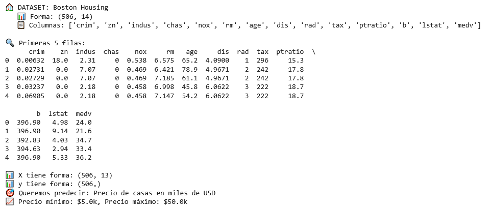
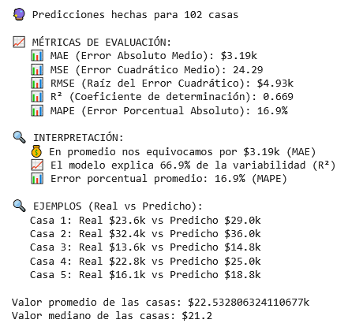
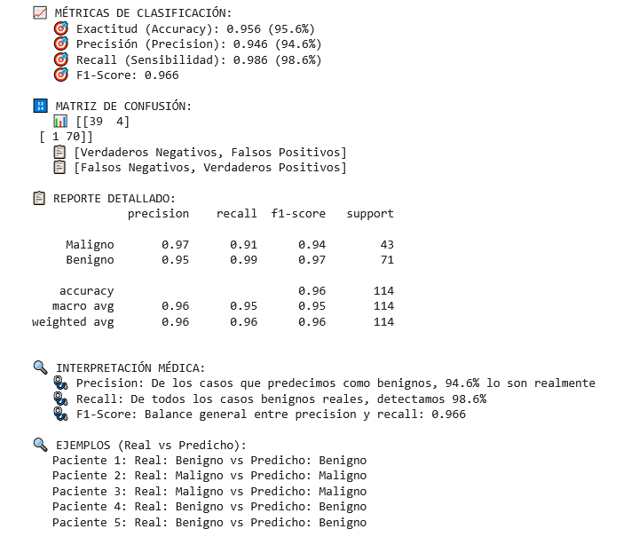

# Entrada 03 — Regresión Logística y Lineal

## Contexto
En este artículo utilizaremos técnicas de regresión lineal y logística
sobre 2 diferentes dataset y finalmente realizaremos una comparación
de las cualidades de ambas técnicas y sus casos de uso.

Para la regresión lineal utilizaremos el dataset de Boston Housing, buscando
determinar el valor mediano de las propiedades, y para la regresión logística
utilizaremos el dataset de Breast Cancer Wisconsin, buscando determinar si
un tumor es benigno o maligno.

## Objetivos
- Crear una implementación básica de regresión lineal
- Crear una implementación básica de regresión logística
- Entender las diferencias de ambas técnicas y casos de uso

## Actividades (con tiempos estimados)
- Investigación de LinearRegression y LogisticRegression de Scikit-learn — 5 min
- Investigación de métricas a utilizar — 5 min
- Investigación del Dataset de Boston Housing — 10 min
- Desarrollo del modelo de regresión lineal — 15 min
- Investigación del Dataset de Breast Cancer Wisconsin — 10 min
- Desarrollo del model de regresión logística — 15 min
- Comparación de los modelos — 8 min

## Desarrollo
### 1. Investigación de LinerRegression y LogisticRegression

#### LinearRegression:

- La regresión linear predice valores continuos, sirve para resolver
problemas de predicción numérica o estimación, como estimar el precio
de una casa en base a sus características.
- Parámetros importantes:
    - fit_intercept: determina si el modelo calcula el bias. 
    - positive: determina si los coeficientes debe ser exclusivamente positivos.

#### LogisticRegression:

Por la investigación de LogisticRegression (y train_test_split), refiérase a [UT1 - Práctica 2: Feature Engineering simple + Modelo base](02-Feature-Engineering-simple.md).

### 2. Investigación de métricas a utilizar

Métricas para regresión lineal:

- MAE (Mean Absolute Error): Promedio de los errores absolutos sin importar si son positivos o negativos.
- MSE (Mean Squared Error):	Promedio de los errores cuadráticos (elevados al cuadrado), penaliza más los errores grandes.
- RMSE: Raíz cuadrada del MSE, vuelve a las unidades originales del problema.
- R<sup>2</sup>: Indica qué porcentaje de la variabilidad es explicada por el modelo (0-1, donde 1 es perfecto).
- MAPE: Error porcentual promedio, útil para comparar modelos con diferentes escalas o unidades.

Métricas para regresión logística:

- Accuracy: Porcentaje de predicciones correctas sobre el total.
- Precision: De todas las predicciones positivas (de la clase de interés), ¿cuántas fueron realmente correctas?
- Recall (Sensibilidad): De todos los casos positivos reales, ¿cuántos detectamos?
- F1-Score: Promedio armónico entre precision y recall.
- Matriz de Confusión: Tabla que muestra predicciones vs valores reales.

### 3. Investigación del Dataset de Boston Housing
El dataset consiste en datos acerca de alojamientos en el área de Boston, Massachusetts;
teniendo datos referentes a la población, referentes a la superficie en base a qué la ocupa 
y referentes a los alojamientos mismos, estando dentro de estos datos los valores medianos
de los hogares ocupados.

Cada fila del dataset consiste en un vecindario dentro del área de Boston y, en este caso,
la variable objetivo a predecir será MEDV o el valor mediano de hogares ocupados.

#### Columnas:

- CRIM: Crimen  per cápita por pueblo
- ZN: Proporción de terreno residencial zonificado para lotes por encima de 25000 pies cuadrados
- INDUS: Proporción de acres de negocios no minoristas por pueblo
- CHAS: Booleano que determina si el vecindario limita con el río Charles (1 sí, 0 no)
- NOX: Concentración de óxido nítrico (partes por 10 millones)
- RM: Número promedio de habitaciones por vivienda
- AGE: Proporción de unidades ocupadas construidas previo al 1940
- DIS: Distancias ponderadas a 5 centros de empleo en Boston
- RAD: Índice de accesibilidad a autopistas radiales
- TAX: Tasa de impuesto a valor total de la propiedad por cada 10000 dolares
- PTRATIO - Relación estudiante-profesor por pueblo.
- B: 1000(Bk - 0.63)^2 donde Bk es la proporción de personas negras por pueblo
- LSTAT: Porcentaje de población de bajo estado económico
- MEDV: Valor mediano de hogares ocupados expresados en 1000 de dolares

### 4. Desarrollo del modelo de regresión lineal

Primeramente, cargaremos el dataset y analizaremos brevemente su contenido y forma,
y luego prepararemos la variable con las features (X) y la variable objetivo (y).

```python linenums="1"
# === CARGAR DATOS DE CASAS EN BOSTON ===

# 1. Cargar el dataset desde una URL
url = "https://raw.githubusercontent.com/selva86/datasets/master/BostonHousing.csv"
boston_data = pd.read_csv(url)

print("🏠 DATASET: Boston Housing")
print(f"   📊 Forma: {boston_data.shape}")
print(f"   📋 Columnas: {list(boston_data.columns)}")

# 2. Explorar los datos básicamente
print("\n🔍 Primeras 5 filas:")
print(boston_data.head())

# 3. Preparar X (variables independientes) e y (variable dependiente)
# La columna 'medv' es el precio de la casa que queremos predecir
X = boston_data.drop('medv', axis=1)  # Todas las columnas EXCEPTO la que queremos predecir
y = boston_data['medv']                # Solo la columna que queremos predecir

print(f"\n📊 X tiene forma: {X.shape}")
print(f"📊 y tiene forma: {y.shape}")
print(f"🎯 Queremos predecir: Precio de casas en miles de USD")
print(f"📈 Precio mínimo: ${y.min():.1f}k, Precio máximo: ${y.max():.1f}k")
```




Luego, utilizando train_test_split dividimos el set en 80% para entrenamiento y el 20% restante
para validación.

```python linenums="1"
# 1. Dividir datos en entrenamiento y prueba
X_train, X_test, y_train, y_test = train_test_split(X, y, test_size=0.2, random_state=42)

print(f"📊 Datos de entrenamiento: {X_train.shape[0]} casas")
print(f"📊 Datos de prueba: {X_test.shape[0]} casas")
```


Creamos y entrenamos el modelo.

```python linenums="1"
# 2. Crear y entrenar el modelo
modelo_regresion = LinearRegression()
modelo_regresion.fit(X_train, y_train)

print("✅ Modelo entrenado!")
```

Predecimos en base al set de entrenamiento, evaluamos en base a distintas métricas
y comparamos los resultados reales con las predicciones del modelo.

```python linenums="1"
# 3. Hacer predicciones
predicciones = modelo_regresion.predict(X_test)

print(f"\n🔮 Predicciones hechas para {len(predicciones)} casas")

# 4. Evaluar qué tan bueno es el modelo con MÚLTIPLES MÉTRICAS
mae = mean_absolute_error(y_test, predicciones)
mse = mean_squared_error(y_test, predicciones)
rmse = np.sqrt(mse)
r2 = r2_score(y_test, predicciones)

# Calcular MAPE manualmente
mape = np.mean(np.abs((y_test - predicciones) / y_test)) * 100

print(f"\n📈 MÉTRICAS DE EVALUACIÓN:")
print(f"   📊 MAE (Error Absoluto Medio): ${mae:.2f}k")
print(f"   📊 MSE (Error Cuadrático Medio): {mse:.2f}")
print(f"   📊 RMSE (Raíz del Error Cuadrático): ${rmse:.2f}k")
print(f"   📊 R² (Coeficiente de determinación): {r2:.3f}")
print(f"   📊 MAPE (Error Porcentual Absoluto): {mape:.1f}%")

print(f"\n🔍 INTERPRETACIÓN:")
print(f"   💰 En promedio nos equivocamos por ${mae:.2f}k (MAE)")
print(f"   📈 El modelo explica {r2*100:.1f}% de la variabilidad (R²)")
print(f"   📊 Error porcentual promedio: {mape:.1f}% (MAPE)")

# 5. Comparar algunas predicciones reales vs predichas
print(f"\n🔍 EJEMPLOS (Real vs Predicho):")
for i in range(5):
    real = y_test.iloc[i]
    predicho = predicciones[i]
    print(f"   Casa {i+1}: Real ${real:.1f}k vs Predicho ${predicho:.1f}k")

print(f"\nValor promedio de las casas: ${y.mean()}k")
print(f"Valor mediano de las casas: ${y.median()}")
```



Viendo estos resultados, con un error absoluto medio (MAE) de $3.19k pero siendo el valor
promedio de las casas $22.53k, esto constituye un error porcentual absoluto (MAPE) del 16.9%;
por lo tanto, si bien este modelo de regresión lineal resultó fácil y simple de implementar,
si se está buscando una estimación con un márgen de error más estricto se deberá optar por
otro tipo de modelo, realizar feature engineering en las features o aumentar el conjuntos de datos.
Por otro lado, el modelo consigue un coeficiente de determinación de 0.669, lo que podría llegar
a ser aceptable considerando que predice casi un 67% de la variación de los precios de las
propiedades a través de los datos de entrada.

### 5. Investigación del Dataset de Breast Cancer Wisconsin
El dataset consiste en datos de pacientes que fueron estudiados y determinados (o no) tener
cáncer de mama, teniendo un resumen de las características de los núcleos celulares en la
imágen digitalizada de la masa de los senos de cada paciente.

Cada fila del dataset contiene distintas métricas de las distintas características de los
núcleos celulares observados en las imagenes tomadas de cada paciente, además de 2 valores
adicionales como el id y la variable objetivo que determina si el tumor es maligno o no.

#### Columnas:

- ID number: número identificador
- Diagnosis: M = maligno, B = benigno
- radio: promedio de distancia del centro al perimetro
- textura: desviación estándar de valores de escala de grises (determina la
uniformidad y rugosidad de la superficie del núcleo)
- perimetro: valor del perimetro
- área: valor del área
- suavidad: variación local de los radios
- compactibilidad: perimetro^2 / area - 1.0
- concavidad: severidad de las porciones cóncavas del contorno
- puntos cóncavos: número de porciones cóncavas del contorno
- simetría: medida de simetría del núcleo
- dimension fractal: aproximación de la línea costal - 1

!!! note "Nota"
    Si bien menciono estas características como columnas, a partir del radio hasta la dimensión fractal,
    se toma el promedio, error estándar y el peor (promedio de los tres valores más grandes); y estas 3 medidas forman
    cada columna a partir de la 3 hasta la 32. Por ejemplo, la columna 3 es el promedio del radio, la columna
    13 es el error estándar del radio y la columna 23 es el peor de los radios; de manera similar ocurre con las
    otras características.


### 6. Desarrollo del model de regresión logística

Primeramente, cargaremos el dataset y analizaremos brevemente su contenido y forma,
y luego prepararemos la variable con las features (X) y la variable objetivo (y).

```python linenums="1"
# === CARGAR DATOS DE DIAGNÓSTICO DE CÁNCER ===

# 1. Cargar el dataset de cáncer de mama (que viene con sklearn)
cancer_data = load_breast_cancer()

# 2. Convertir a DataFrame para verlo mejor
X_cancer = pd.DataFrame(cancer_data.data, columns=cancer_data.feature_names)
y_cancer = cancer_data.target  # 0 = maligno, 1 = benigno

print("🏥 DATASET: Breast Cancer (Diagnóstico)")
print(f"   📊 Pacientes: {X_cancer.shape[0]}")
print(f"   📊 Características: {X_cancer.shape[1]}")
print(f"   🎯 Objetivo: Predecir si tumor es benigno (1) o maligno (0)")

# 3. Ver balance de clases
casos_malignos = (y_cancer == 0).sum()
casos_benignos = (y_cancer == 1).sum()

print(f"\n📊 DISTRIBUCIÓN:")
print(f"   ❌ Casos malignos: {casos_malignos}")
print(f"   ✅ Casos benignos: {casos_benignos}")
```


Luego, utilizando train_test_split dividimos el set en 80% para entrenamiento y el 20% restante
para validación.

```python linenums="1"
# 1. Dividir datos en entrenamiento y prueba
X_train_cancer, X_test_cancer, y_train_cancer, y_test_cancer = train_test_split(
    X_cancer, y_cancer, test_size=0.2, random_state=42
)

print(f"📊 Datos de entrenamiento: {X_train_cancer.shape[0]} pacientes")
print(f"📊 Datos de prueba: {X_test_cancer.shape[0]} pacientes")
```


Creamos y entrenamos el modelo.

```python linenums="1"
# 2. Crear y entrenar modelo de regresión logística
modelo_clasificacion = LogisticRegression(max_iter=5000, random_state=42)
modelo_clasificacion.fit(X_train_cancer, y_train_cancer)

print("✅ Modelo de clasificación entrenado!")
```

Predecimos en base al set de entrenamiento, evaluamos en base a distintas métricas
y comparamos los resultados reales con las predicciones del modelo.

```python linenums="1"
# 3. Hacer predicciones
predicciones_cancer = modelo_clasificacion.predict(X_test_cancer)

# 4. Evaluar con MÚLTIPLES MÉTRICAS de clasificación
exactitud = accuracy_score(y_test_cancer, predicciones_cancer)
precision = precision_score(y_test_cancer, predicciones_cancer)
recall = recall_score(y_test_cancer, predicciones_cancer)
f1 = f1_score(y_test_cancer, predicciones_cancer)

print(f"\n📈 MÉTRICAS DE CLASIFICACIÓN:")
print(f"   🎯 Exactitud (Accuracy): {exactitud:.3f} ({exactitud*100:.1f}%)")
print(f"   🎯 Precisión (Precision): {precision:.3f} ({precision*100:.1f}%)")
print(f"   🎯 Recall (Sensibilidad): {recall:.3f} ({recall*100:.1f}%)")
print(f"   🎯 F1-Score: {f1:.3f}")

# Mostrar matriz de confusión de forma simple
matriz_confusion = confusion_matrix(y_test_cancer, predicciones_cancer)
print(f"\n🔢 MATRIZ DE CONFUSIÓN:")
print(f"   📊 {matriz_confusion}")
print(f"   📋 [Verdaderos Negativos, Falsos Positivos]")
print(f"   📋 [Falsos Negativos, Verdaderos Positivos]")

# Reporte detallado
print(f"\n📋 REPORTE DETALLADO:")
print(classification_report(y_test_cancer, predicciones_cancer, target_names=['Maligno', 'Benigno']))

print(f"\n🔍 INTERPRETACIÓN MÉDICA:")
print(f"   🩺 Precision: De los casos que predecimos como benignos, {precision*100:.1f}% lo son realmente")
print(f"   🩺 Recall: De todos los casos benignos reales, detectamos {recall*100:.1f}%")
print(f"   🩺 F1-Score: Balance general entre precision y recall: {f1:.3f}")

# 5. Ver ejemplos específicos
print(f"\n🔍 EJEMPLOS (Real vs Predicho):")
for i in range(5):
    real = "Benigno" if y_test_cancer[i] == 1 else "Maligno"
    predicho = "Benigno" if predicciones_cancer[i] == 1 else "Maligno"
    print(f"   Paciente {i+1}: Real: {real} vs Predicho: {predicho}")
```



En este caso, los resultados obtenidos son bastante decentes, siendo el más bajo de estos (precisión) tan sólo
ligeramente inferior al 95% y teniendo un F1-Score del 96.6%. 

Si bien no me es posible determinar la causa de su mejor resultado en comparación al obtenido por la regresión
lineal, puede que la mayor cantidad de features, un mayor relacionamiento entre estas y la variable objetivo, o
simplemente sea más sencillo para un modelo predecir o 0 o 1 que en un rango entre dos números sean las causantes
de este resultado superior.


### 7. Comparación de los modelos

| Aspecto           | Regresión Lineal | Regresión Logística               |
|---------------------|:------:|----------------------------------|
| Qué predice |  Valores continuos  |   Pertenencia a una clase   |
| Ejemplo de uso      |  Estimación numérica, cálculos de precios o cantidades   | Clasificación binaria, detección de spam, determinar supervivencia de pasajeros    |
| Rango de salida     | Todos los números reales   | 0 o 1   |
| Métrica principal   | MAE o RMSE | F1-Score

!!! note "Nota"
    La métrica principal de la regresión lineal podría ser MAE o RMSE dependiendo de la
    importancia de errores grandes al contexto. Adicionalmente, podría también tomarse
    R<sup>2<sup> si interesa qué tan bien el modelo captura la variabilidad de los datos.

### Preguntas Posteriores

- ¿Cuál es la diferencia principal entre regresión lineal y logística?

Una regresión lineal predice ultimamente valores continuos y se utiliza para estimaciones
de precios, cálculos de ventas, análisis del clima o cantidades, etc.; mientras que la
regresión logística predice la pertenencia de ciertos datos a una clase y se utiliza para
predecir si un paciente tiene cierta enfermedad, determinar si una imagen es de un gato o
no, analizar si un cliente es leal o no, etc.

- ¿Por qué dividimos los datos en entrenamiento y prueba?

Para verificar el correcto funcionamiento de un modelo, necesitamos, por lo menos, un conjunto de
datos de enternamiento y otro de validación; como ocasionalmente se suele poseer un conjunto único
de datos, este se divide en parte para el entrenamiento y otra parte para la validación.

- ¿Qué significa una exactitud del 95%?

Una exactitud del 95% indica que el modelo asigna correctamente las clases a un 95% de
las predicciones, es decir: (TN + TP)/(TN + TP + FN + FP) = 0.95.

- ¿Cuál es más peligroso: predecir "benigno" cuando es "maligno", o al revés?

Considero que es más peligroso predecir "benigno" cuando es "maligno", ya que, en caso contrario,
muy probablemente se realizacen estudios adicionales que finalmente determinen que el paciente
estaba sano y concluiría con una mera pérdida monetaria. Sin embargo, en el primer caso, al
determinar que el paciente estaba "sano", puede que no se realicen análisis posteriores y que
sólo se enteren de la verdad cuando sea demasiado tarde, concluyendo en un desastre tanto para
el paciente, su personas cercanas y, ultimamente, la entidad que dio el veredicto del paciente
que podría ser involucrada en problemas legales.

- ¿Cuál modelo usarías para predecir el salario de un empleado?

Utilizaría una regresión lineal con variable objetivo el salario del empleado.

- ¿Cuál modelo usarías para predecir si un email es spam?

Utilizaría una regresión logística con clases spam (1) y no spam (0).

- ¿Por qué es importante separar datos de entrenamiento y prueba?

Es importante separar datos de entrenamiento y prueba ya que, en el entrenamiento,
el modelo puede llegar a "memorizar" completamente el conjuntos de datos y no aprender 
los patrones generales que explican la realidad con otros datos.


## Evidencias
- [Link al colab](https://colab.research.google.com/drive/1dQVgfHaU2pkt2yJlHMqDmNGCkin0YCTB?usp=sharing)

## Reflexión
Considero que la regresión lineal puede ser una herramienta muy útil a futuro y me parece 
interesante para indagar en maneras de mejorar sus resultados.

La regresión logística parece funcionar bastante bien con el conjunto de datos utilizado,
se podría experimentar con otros datasets para corroborar el correcto funcionamiento de
este modelo.

Finalmente, puedo ver la necesidad de tantos tipos diferentes de métricas, desde algunas más generales
hasta otras más especíicas, teniendo cada una su uso que hace que no sea completamente reemplazable por 
otra y que en conjunto le dan mayor profundidad al análisis; familiarizarme con estas métricas será
muy importante para las siguientes prácticas.

## Referencias

- [Mastering Logistic Regression with Scikit-Learn: A Complete Guide](https://www.digitalocean.com/community/tutorials/logistic-regression-with-scikit-learn)