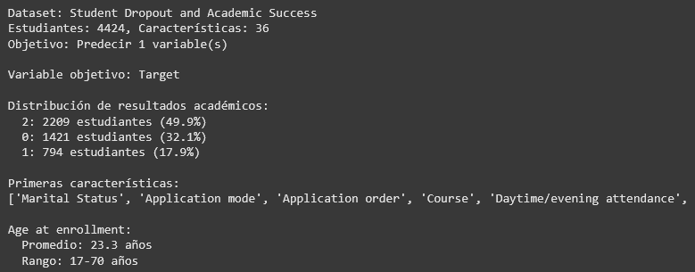
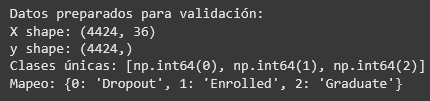
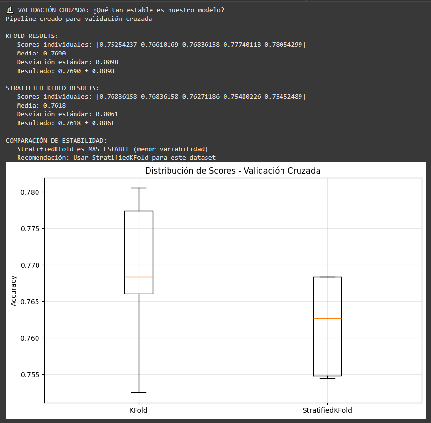
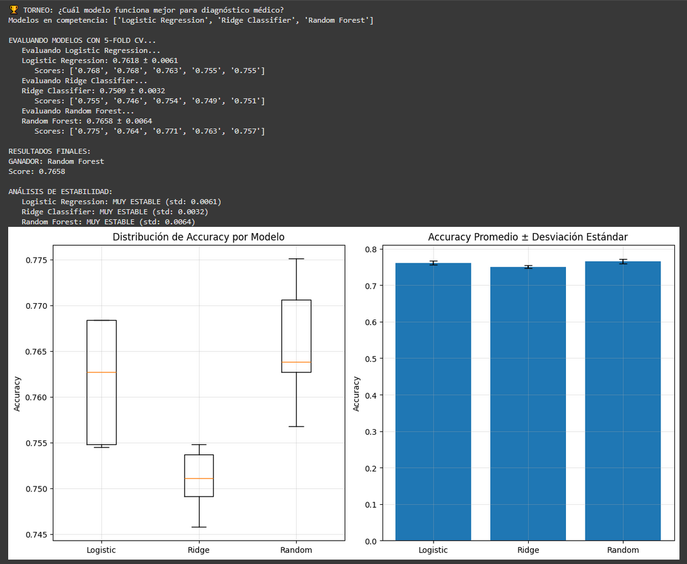
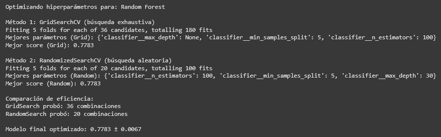
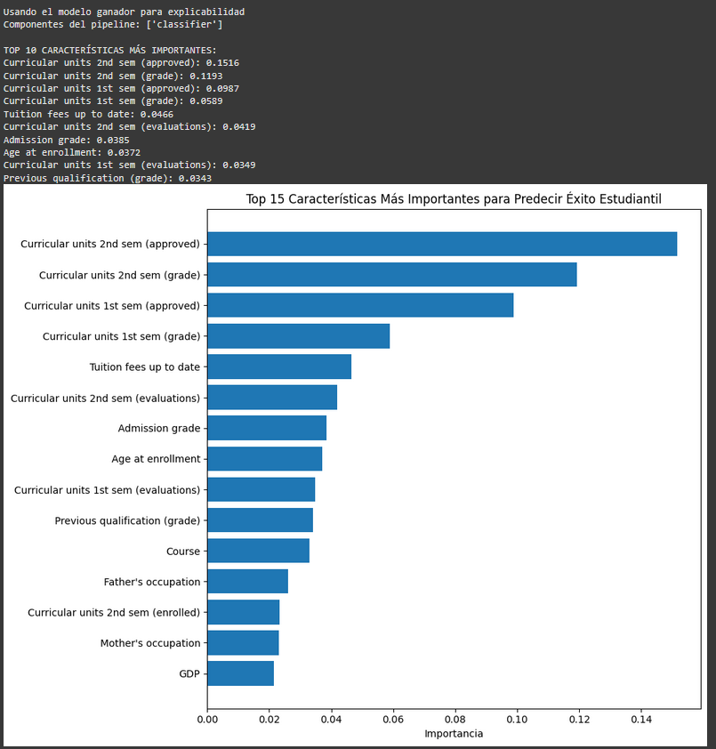
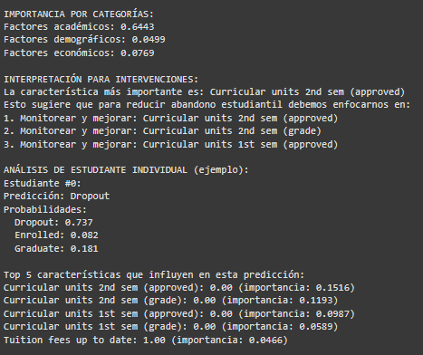
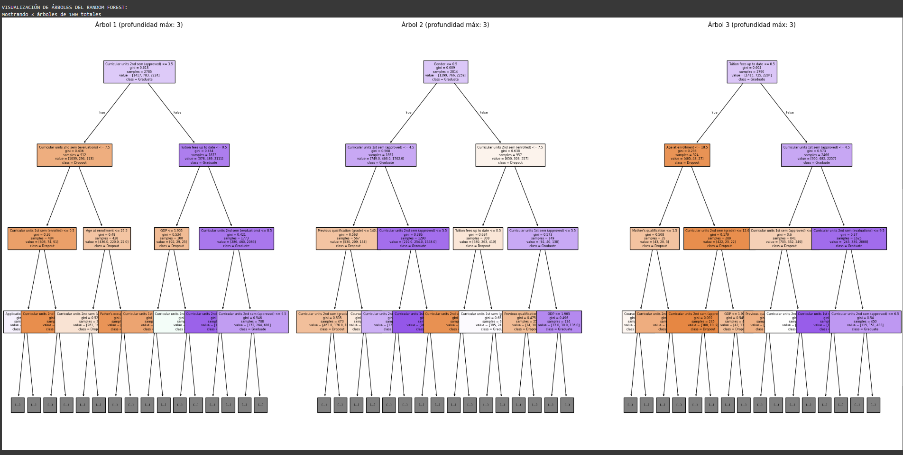
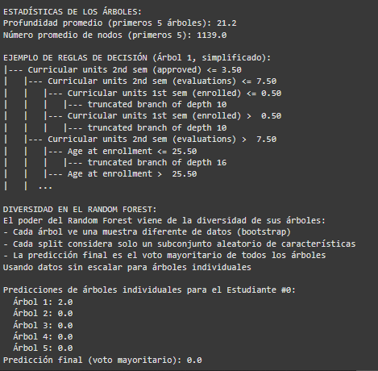

# Entrada 04 — Validación y Selección de Modelos

## Contexto

En este artículo trabajaremos con un dataset de abandono estudiantil y éxito
académico en educación superior (Predict Students' Dropout and Academic Success),
buscando predecir el éxito o abandono de los estudiantes en base características
acádemicas, familiares, étnicas y financieras.

Para esta práctica utilizaremos modelos de regresión logística, regresión Ridge y
bosque aleatorio para la predicción y posteriormente realizaremos validación
cruzada con técnicas de KFold y StratifiedKFold para evaluar el funcionamiento de
los modelos.

## Objetivos
- Aprender a prevenir data leakage usando pipelines
- Implementar validación cruzada (cross-validation) robusta
- Comparar múltiples modelos de forma sistemática
- Interpretar métricas de estabilidad y selección de modelos

## Actividades (con tiempos estimados)
- Setup de herramientas, carga y exploración del dataset — 10 min
- Preparación de datos — 3 min
- Implementación de validación cruzada — 10 min
- Comparación con diferentes modelos - 15 min
- Optimización de hiperparámetros — 15 min
- Explicabilidad del modelo — 20 min


## Desarrollo

### 1. Setup de herramientas, carga y exploración del dataset 

Primeramente instalaremos ucimlrepo, que es donde encontraremos el dataset, e importaremos las
herramientas a utilizar en esta práctica.

```python linenums="1"
!pip install ucimlrepo

# Importar librerías que vamos a usar
import pandas as pd
import numpy as np
import matplotlib.pyplot as plt

# Para validación y selección de modelos
from sklearn.linear_model import LogisticRegression, RidgeClassifier
from sklearn.ensemble import RandomForestClassifier
from sklearn.model_selection import train_test_split, cross_val_score, KFold, StratifiedKFold
from sklearn.preprocessing import StandardScaler
from sklearn.pipeline import Pipeline
# Para cargar datos desde UCI ML Repository
from ucimlrepo import fetch_ucirepo
from sklearn.metrics import accuracy_score, classification_report

print("Setup completo!")
```

A continuación, cargaremos el dataset, guardaremos las features y las variables objetivo,
y revisaremos ligeramente el dataset y sus características.

```python linenums="1"
# Cargar dataset de estudiantes desde UCI
student_data = fetch_ucirepo(id=697)

# Preparar datos
X = student_data.data.features
y = student_data.data.targets

print("Dataset: Student Dropout and Academic Success")
print(f"Estudiantes: {X.shape[0]}, Características: {X.shape[1]}")
print(f"Objetivo: Predecir {len(y.columns)} variable(s)")

# Explorar variable objetivo
target_col = y.columns[0]  # Primera columna objetivo
y_series = y[target_col]
print(f"\nVariable objetivo: {target_col}")

# Mapear valores para mejor interpretación
target_mapping = {'Dropout': 0, 'Enrolled': 1, 'Graduate': 2}
y_mapped = y_series.map(target_mapping)

# Distribución de clases
print("\nDistribución de resultados académicos:")
value_counts = y_mapped.value_counts()
for outcome, count in value_counts.items():
    percentage = (count / len(y_mapped)) * 100
    print(f"  {outcome}: {count} estudiantes ({percentage:.1f}%)")

# Ver algunas características
print(f"\nPrimeras características:")
print(X.columns.tolist()[:10], "...")

# Estadísticas básicas
print(f"\nAge at enrollment:")
if 'Age at enrollment' in X.columns:
    age_col = X['Age at enrollment']
    print(f"  Promedio: {age_col.mean():.1f} años")
    print(f"  Rango: {age_col.min():.0f}-{age_col.max():.0f} años")
```



Como podemos ver, este dataset cuenta con 4424 muestras con 36 características cada una,
también se observa que las clases están muy desbalanceadas, con una clase conteniendo 1/6 de
los datos, otra conteniendo 2/6 de los datos y la última con los 3/6 restantes.

### 2. Preparación de datos

En caso de que las clases finales estén guardadas como strings, pasan a valores numéricos.

```python linenums="1"
# Preparar variable objetivo como serie simple
# Convertir strings a números para sklearn
target_mapping = {0: 'Dropout', 1: 'Enrolled', 2: 'Graduate'}
reverse_mapping = {'Dropout': 0, 'Enrolled': 1, 'Graduate': 2}

# Si y_series contiene strings, convertir a números
if y_series.dtype == 'object':
    y_target = y_series.map(reverse_mapping)
else:
    y_target = y_series

X_features = X       # Features del dataset

print("Datos preparados para validación:")
print(f"X shape: {X_features.shape}")
print(f"y shape: {y_target.shape}")
print(f"Clases únicas: {sorted(y_target.unique())}")
print(f"Mapeo: {target_mapping}")
```



### 3. Implementación de validación cruzada

Creamos un pipeline que contenga tanto la técnica de estandarización como el modelo seleccionado,
de este modo, se aplicará la estandarización unicamente al conjunto de datos de cada pliegue 
(ya sea los de KFold o StratifiedKFold) sin tener en cuenta el conjunto de datos entero previniendo
la fuga de datos.

```python linenums="1"
# === VALIDACIÓN CRUZADA PARA ESTABILIDAD ===

print("🔬 VALIDACIÓN CRUZADA: ¿Qué tan estable es nuestro modelo?")

# 1. Crear pipeline robusto para usar en CV
pipeline_robust = Pipeline([
    ('scaler', StandardScaler()),
    ('classifier', LogisticRegression(max_iter=1000, random_state=42))
])

print("Pipeline creado para validación cruzada")
```

Luego realizamos la validación cruzada con ambos KFold y visualizamos los resultados.

```python linenums="1"
# 2. Crear KFold básico
kfold = KFold(n_splits=5, shuffle=True, random_state=42)

# 3. Evaluar con KFold usando cross_val_score
scores_kfold = cross_val_score(
    pipeline_robust, X_features, y_target, cv=kfold, scoring='accuracy'
)

print(f"\nKFOLD RESULTS:")
print(f"   Scores individuales: {scores_kfold}")
print(f"   Media: {scores_kfold.mean():.4f}")
print(f"   Desviación estándar: {scores_kfold.std():.4f}")
print(f"   Resultado: {scores_kfold.mean():.4f} ± {scores_kfold.std():.4f}")

# 4. Crear StratifiedKFold (mantiene proporción de clases)
stratified_kfold = StratifiedKFold(n_splits=5, shuffle=True, random_state=42)

# 5. Evaluar con StratifiedKFold
scores_stratified = cross_val_score(
    pipeline_robust, X_features, y_target, cv=stratified_kfold, scoring='accuracy'
)

print(f"\nSTRATIFIED KFOLD RESULTS:")
print(f"   Scores individuales: {scores_stratified}")
print(f"   Media: {scores_stratified.mean():.4f}")
print(f"   Desviación estándar: {scores_stratified.std():.4f}")
print(f"   Resultado: {scores_stratified.mean():.4f} ± {scores_stratified.std():.4f}")

# 6. Comparar estabilidad (menor desviación = más estable)
print(f"\nCOMPARACIÓN DE ESTABILIDAD:")
if scores_stratified.std() < scores_kfold.std():
    print("   StratifiedKFold es MÁS ESTABLE (menor variabilidad)")
    mejor_cv = "StratifiedKFold"
else:
    print("   KFold es MÁS ESTABLE (menor variabilidad)")
    mejor_cv = "KFold"

print(f"   Recomendación: Usar {mejor_cv} para este dataset")

# 7. Visualizar la distribución de scores
import matplotlib.pyplot as plt
plt.figure(figsize=(10, 6))
plt.boxplot([scores_kfold, scores_stratified], labels=['KFold', 'StratifiedKFold'])
plt.title('Distribución de Scores - Validación Cruzada')
plt.ylabel('Accuracy')
plt.grid(True, alpha=0.3)
plt.show()
```



Si bien ambos KFold dieron buenos resultados, nos quedaremos con el StratifiedKFold
dado a su menor desviación estándar, que se traduce en mayor estabilidad, y por el
hecho de que las clases se encuentran bastante desbalanceadas y el Stratified mantiene
la proporción de las clases en cada pliegue.

### 4. Comparación con diferentes modelos

En este paso creamos diferentes pipelines para los diferentes modelos de manera similar
al utilizado anteriormente.

```python linenums="1"
# === COMPETENCIA DE MODELOS ===

print("🏆 TORNEO: ¿Cuál modelo funciona mejor para diagnóstico médico?")

# 1. Definir candidatos (diferentes algoritmos)
models = {
    'Logistic Regression': Pipeline([
        ('scaler', StandardScaler()),
        ('classifier', LogisticRegression(max_iter=1000, random_state=42))
    ]),

    # 2. Ridge Classifier (regresión logística con regularización L2)
    'Ridge Classifier': Pipeline([
        ('scaler', StandardScaler()),
        ('classifier', RidgeClassifier(alpha=1.0, random_state=42))
    ]),

    # 3. Random Forest (ensemble, no necesita escalado)
    'Random Forest': Pipeline([
        ('classifier', RandomForestClassifier(n_estimators=100, random_state=42))
    ])
}

print(f"Modelos en competencia: {list(models.keys())}")
```

!!! note "Nota"
    Nótese que, para el modelo del Random Forest, no es necesario aplicar estandarización
    debido a la manera en que este funciona; ya que, por ejemplo, sería lo mismo la decisión de 
    'calificación > 150' que 'calificación > 0.75' una vez estandarizado, por esto se omite.

Evaluamos cada modelo con la validación cruzada, conseguimos el mejor y visualizamos los
resultados.


```python linenums="1"
# 4. Evaluar cada modelo con validación cruzada
print(f"\nEVALUANDO MODELOS CON 5-FOLD CV...")

results = {}
for name, model in models.items():
    print(f"   Evaluando {name}...")

    # Usar StratifiedKFold para mantener balance de clases
    scores = cross_val_score(
        model, X_features, y_target, 
        cv=StratifiedKFold(n_splits=5, shuffle=True, random_state=42),
        scoring='accuracy'
    )

    results[name] = scores

    print(f"   {name}: {scores.mean():.4f} ± {scores.std():.4f}")
    print(f"      Scores: {[f'{s:.3f}' for s in scores]}")

# 5. Encontrar el mejor modelo
print(f"\nRESULTADOS FINALES:")

# Encontrar modelo con mayor accuracy promedio
best_mean_score = 0
best_model_name = ""

for name, scores in results.items():
    if scores.mean() > best_mean_score:
        best_mean_score = scores.mean()
        best_model_name = name

print(f"GANADOR: {best_model_name}")
print(f"Score: {best_mean_score:.4f}")

# 6. Análisis detallado de estabilidad
print(f"\nANÁLISIS DE ESTABILIDAD:")
for name, scores in results.items():
    stability = scores.std()

    if stability < 0.02:
        status = "MUY ESTABLE"
    elif stability < 0.05:
        status = "ESTABLE"
    else:
        status = "INESTABLE"

    print(f"   {name}: {status} (std: {stability:.4f})")

# 7. Visualización comparativa
plt.figure(figsize=(12, 6))

# Boxplot de distribución de scores
plt.subplot(1, 2, 1)
plt.boxplot([results[name] for name in models.keys()], 
           labels=[name.split()[0] for name in models.keys()])
plt.title('Distribución de Accuracy por Modelo')
plt.ylabel('Accuracy')
plt.grid(True, alpha=0.3)

# Barplot de medias con error bars
plt.subplot(1, 2, 2)
names = list(models.keys())
means = [results[name].mean() for name in names]
stds = [results[name].std() for name in names]

plt.bar(range(len(names)), means, yerr=stds, capsize=5)
plt.xticks(range(len(names)), [name.split()[0] for name in names])
plt.title('Accuracy Promedio ± Desviación Estándar')
plt.ylabel('Accuracy')
plt.grid(True, alpha=0.3)

plt.tight_layout()
plt.show()
```



### 5. Optimización de hiperparámetros

```python linenums="1"
from sklearn.model_selection import GridSearchCV, RandomizedSearchCV

# Seleccionar el mejor modelo de la competencia anterior
best_model_base = models[best_model_name]

print(f"Optimizando hiperparámetros para: {best_model_name}")

# Definir espacio de búsqueda de hiperparámetros
if 'Random Forest' in best_model_name:
    param_grid = {
        'classifier__n_estimators': [50, 100, 200],
        'classifier__max_depth': [None, 10, 20, 30],
        'classifier__min_samples_split': [2, 5, 10]
    }
elif 'Logistic' in best_model_name:
    param_grid = {
        'classifier__C': [0.1, 1, 10, 100],
        'classifier__max_iter': [1000, 2000]
    }
else:  # Ridge
    param_grid = {
        'classifier__alpha': [0.1, 1, 10, 100]
    }

# MÉTODO 1: GridSearchCV (búsqueda exhaustiva)
print("\nMétodo 1: GridSearchCV (búsqueda exhaustiva)")
grid_search = GridSearchCV(
    best_model_base,
    param_grid,
    cv=5,
    scoring='accuracy',
    n_jobs=-1,
    verbose=1
)

grid_search.fit(X_features, y_target)

print(f"Mejores parámetros (Grid): {grid_search.best_params_}")
print(f"Mejor score (Grid): {grid_search.best_score_:.4f}")

# MÉTODO 2: RandomizedSearchCV (búsqueda aleatoria, más eficiente)
print("\nMétodo 2: RandomizedSearchCV (búsqueda aleatoria)")
random_search = RandomizedSearchCV(
    best_model_base,
    param_grid,
    n_iter=20,  # Solo 20 combinaciones aleatorias
    cv=5,
    scoring='accuracy',
    n_jobs=-1,
    random_state=42,
    verbose=1
)

random_search.fit(X_features, y_target)

print(f"Mejores parámetros (Random): {random_search.best_params_}")
print(f"Mejor score (Random): {random_search.best_score_:.4f}")

# Comparar eficiencia
print(f"\nComparación de eficiencia:")
print(f"GridSearch probó: {len(grid_search.cv_results_['params'])} combinaciones")
print(f"RandomSearch probó: {len(random_search.cv_results_['params'])} combinaciones")

# Evaluar modelo final optimizado
final_model = grid_search.best_estimator_
final_scores = cross_val_score(final_model, X_features, y_target, cv=5)
print(f"\nModelo final optimizado: {final_scores.mean():.4f} ± {final_scores.std():.4f}")
```



### 6. Explicabilidad del modelo

```python linenums="1"
# Usar Random Forest para explicabilidad (si no ganó, crearlo)
if 'Random Forest' not in best_model_name:
    # Crear Random Forest específico para explicabilidad
    # Random Forest no necesita escalado, así que lo omitimos para simplicidad
    rf_model = Pipeline([
        ('classifier', RandomForestClassifier(n_estimators=100, random_state=42))
    ])
    rf_model.fit(X_features, y_target)
    print("Creado Random Forest específico para análisis de explicabilidad")
else:
    rf_model = final_model
    print("Usando el modelo ganador para explicabilidad")

# Verificar estructura del pipeline
print(f"Componentes del pipeline: {list(rf_model.named_steps.keys())}")

# 1. FEATURE IMPORTANCE - ¿Qué características son más importantes?
feature_names = X_features.columns
importances = rf_model.named_steps['classifier'].feature_importances_

# Crear DataFrame para mejor visualización
feature_importance_df = pd.DataFrame({
    'feature': feature_names,
    'importance': importances
}).sort_values('importance', ascending=False)

print("\nTOP 10 CARACTERÍSTICAS MÁS IMPORTANTES:")
for i, row in feature_importance_df.head(10).iterrows():
    print(f"{row['feature']}: {row['importance']:.4f}")

# Visualizar importancia de características
plt.figure(figsize=(10, 8))
top_features = feature_importance_df.head(15)
plt.barh(range(len(top_features)), top_features['importance'])
plt.yticks(range(len(top_features)), top_features['feature'])
plt.xlabel('Importancia')
plt.title('Top 15 Características Más Importantes para Predecir Éxito Estudiantil')
plt.gca().invert_yaxis()
plt.tight_layout()
plt.show()

# 2. ANÁLISIS POR CATEGORÍAS - Agrupar características relacionadas
academic_features = [col for col in feature_names if any(word in col.lower() 
                    for word in ['grade', 'units', 'curricular', 'semester'])]
demographic_features = [col for col in feature_names if any(word in col.lower() 
                       for word in ['age', 'gender', 'nationality', 'marital'])]
economic_features = [col for col in feature_names if any(word in col.lower() 
                    for word in ['scholarship', 'debt', 'fee', 'tuition'])]

def calculate_category_importance(features, importance_df):
    if not features:
        return 0
    category_importance = importance_df[importance_df['feature'].isin(features)]['importance'].sum()
    return category_importance

academic_importance = calculate_category_importance(academic_features, feature_importance_df)
demographic_importance = calculate_category_importance(demographic_features, feature_importance_df)
economic_importance = calculate_category_importance(economic_features, feature_importance_df)

print(f"\nIMPORTANCIA POR CATEGORÍAS:")
print(f"Factores académicos: {academic_importance:.4f}")
print(f"Factores demográficos: {demographic_importance:.4f}")
print(f"Factores económicos: {economic_importance:.4f}")

# 3. INTERPRETACIÓN PRÁCTICA - ¿Qué significa esto?
print(f"\nINTERPRETACIÓN PARA INTERVENCIONES:")
print(f"La característica más importante es: {feature_importance_df.iloc[0]['feature']}")
print(f"Esto sugiere que para reducir abandono estudiantil debemos enfocarnos en:")

# Generar recomendaciones basadas en las top features
top_3_features = feature_importance_df.head(3)['feature'].tolist()
for i, feature in enumerate(top_3_features, 1):
    print(f"{i}. Monitorear y mejorar: {feature}")

# 4. PREDICCIÓN INDIVIDUAL - ¿Por qué un estudiante específico está en riesgo?
print(f"\nANÁLISIS DE ESTUDIANTE INDIVIDUAL (ejemplo):")
student_idx = 0
student_data = X_features.iloc[student_idx:student_idx+1]
prediction = rf_model.predict(student_data)[0]
prediction_proba = rf_model.predict_proba(student_data)[0]

# Definir mapeo localmente para esta sección
outcome_mapping = {0: 'Dropout', 1: 'Enrolled', 2: 'Graduate'}

# Manejar si prediction es string o número
if isinstance(prediction, str):
    predicted_outcome = prediction
else:
    predicted_outcome = outcome_mapping[prediction]

print(f"Estudiante #{student_idx}:")
print(f"Predicción: {predicted_outcome}")
print(f"Probabilidades:")
for i, prob in enumerate(prediction_proba):
    outcome_name = outcome_mapping[i]
    print(f"  {outcome_name}: {prob:.3f}")

# Mostrar las características más importantes de este estudiante
student_features = pd.DataFrame({
    'feature': feature_names,
    'value': student_data.iloc[0].values,
    'importance': importances
}).sort_values('importance', ascending=False)

print(f"\nTop 5 características que influyen en esta predicción:")
for i, row in student_features.head(5).iterrows():
    print(f"{row['feature']}: {row['value']:.2f} (importancia: {row['importance']:.4f})")

# 5. VISUALIZACIÓN DE ÁRBOLES INDIVIDUALES
print(f"\nVISUALIZACIÓN DE ÁRBOLES DEL RANDOM FOREST:")

# Instalar graphviz si no está disponible
try:
    from sklearn.tree import export_graphviz, plot_tree, export_text
    import matplotlib.pyplot as plt

    # Obtener algunos árboles del bosque
    forest = rf_model.named_steps['classifier']
    n_trees_to_show = min(3, len(forest.estimators_))

    print(f"Mostrando {n_trees_to_show} árboles de {len(forest.estimators_)} totales")

    # Visualizar árboles con plot_tree (más simple)
    fig, axes = plt.subplots(1, n_trees_to_show, figsize=(25, 12))
    if n_trees_to_show == 1:
        axes = [axes]

    for i in range(n_trees_to_show):
        tree = forest.estimators_[i]

        # Limitar profundidad para que sea legible
        plot_tree(tree, 
                 ax=axes[i],
                 feature_names=list(feature_names),  # Usar todos los nombres de características
                 class_names=list(outcome_mapping.values()),
                 filled=True,
                 max_depth=3,  # Limitar profundidad
                 fontsize=6)  # Fuente más pequeña para que quepa

        axes[i].set_title(f'Árbol {i+1} (profundidad máx: 3)', fontsize=12)

    plt.tight_layout()
    plt.show()

    # Información sobre la estructura de los árboles
    print(f"\nESTADÍSTICAS DE LOS ÁRBOLES:")
    depths = [tree.get_depth() for tree in forest.estimators_[:5]]
    n_nodes = [tree.tree_.node_count for tree in forest.estimators_[:5]]

    print(f"Profundidad promedio (primeros 5 árboles): {sum(depths)/len(depths):.1f}")
    print(f"Número promedio de nodos (primeros 5): {sum(n_nodes)/len(n_nodes):.1f}")

    # Mostrar un árbol muy simple por texto
    print(f"\nEJEMPLO DE REGLAS DE DECISIÓN (Árbol 1, simplificado):")
    tree_rules = export_text(forest.estimators_[0], 
                           feature_names=list(feature_names),
                           max_depth=2)
    print(tree_rules[:500] + "..." if len(tree_rules) > 500 else tree_rules)

except ImportError:
    print("Para visualizar árboles, instala: pip install graphviz")
    print("Alternativamente, mostramos la estructura del bosque:")

    forest = rf_model.named_steps['classifier']
    print(f"Random Forest contiene {len(forest.estimators_)} árboles")
    print(f"Cada árbol fue entrenado con {forest.max_features_} características aleatorias")

    # Estadísticas básicas sin visualización
    if len(forest.estimators_) > 0:
        depths = [tree.get_depth() for tree in forest.estimators_[:5]]
        print(f"Profundidad promedio: {sum(depths)/len(depths):.1f}")

# 6. DIVERSIDAD DEL BOSQUE
print(f"\nDIVERSIDAD EN EL RANDOM FOREST:")
print("El poder del Random Forest viene de la diversidad de sus árboles:")
print("- Cada árbol ve una muestra diferente de datos (bootstrap)")
print("- Cada split considera solo un subconjunto aleatorio de características")
print("- La predicción final es el voto mayoritario de todos los árboles")

# Mostrar diferencias en predicciones individuales
student_sample = X_features.iloc[0:1]
individual_predictions = []

# Preparar datos dependiendo de si el modelo tiene scaler o no
if 'scaler' in rf_model.named_steps:
    # Modelo con scaler
    scaled_sample = rf_model.named_steps['scaler'].transform(student_sample)
    print("Usando datos escalados para árboles individuales")
else:
    # Modelo sin scaler (ej: Random Forest sin preprocesamiento)
    scaled_sample = student_sample.values
    print("Usando datos sin escalar para árboles individuales")

for i, tree in enumerate(forest.estimators_[:5]):
    tree_pred = tree.predict(scaled_sample)[0]
    individual_predictions.append(tree_pred)

print(f"\nPredicciones de árboles individuales para el Estudiante #0:")
for i, pred in enumerate(individual_predictions):
    pred_name = outcome_mapping[pred] if isinstance(pred, int) else pred
    print(f"  Árbol {i+1}: {pred_name}")

final_pred = max(set(individual_predictions), key=individual_predictions.count)
final_pred_name = outcome_mapping[final_pred] if isinstance(final_pred, int) else final_pred
print(f"Predicción final (voto mayoritario): {final_pred_name}")
```










### Preguntas posteriores

- ¿Qué es data leakage y por qué es peligroso?

Data leakage se produce cuando el modelo accede a información de la variable objetivo o a información del
set de validación en el entrenamiento, esto resulta en el modelo mostrando un rendimiento muy alto
en el entrenamiento y validación, pero uno muy pobre cuando se lleva a un ambiente real.

- ¿Cuándo usar KFold vs StratifiedKFold?

Se utiliza KFold cuando las clases en la variable objetivo están balanceadas, mientras que es preferible usar StratifiedKFold cuando las clases no están balanceadas, ya que intentará
mantener la proporción del dataset original.

- ¿Cómo interpretar "95.2% ± 2.1%" en cross-validation?

95.2% en la validación cruzada significa que, el modelo a través de todos los pliegues, logró un rendimiento
promedio de 95.2% en la métrica utilizada; mientras que el 2.1% indica la desviación estándar, que determina
la estabilidad e indica qué tanto variaron los resultados del promedio a través de todos los pliegues.

- ¿Por qué Random Forest no necesita StandardScaler?

Random Forest no necesita StandardScaler ya que este se basa en comparaciones y no toma en cuenta la magnitud
de los valores, para el Random Forest es igual la comparación 'edad > 18' que 'edad > 0.22' (suponiendo que 18 se
vuelve 0.18 luego de la estandarización), y es por eso que no requiere StandardScaler.

- En diagnóstico médico, ¿prefieres un modelo con 98% accuracy pero inestable, o 95% accuracy pero muy estable?

Teniendo en cuenta un contexto médico, donde errores grandes pueden costar la vida de un paciente, es prefereible
un modelo con ligeramente menor accuracy pero, a su vez, mucha menor varianza. En este sentido, es mejor unos
cuantos diagnosticos ligeramente inexactos que unos pares de diagnosticos completamente erróneos.

#### ¿Qué significan las métricas de validación?
- Cross-Validation: Técnica que divide los datos en K partes para entrenar y evaluar múltiples veces.
- Accuracy promedio: La estimación de rendimiento esperado en datos nuevos.
- Desviación estándar: Indica qué tan estable es el modelo entre diferentes divisiones de datos.
- StratifiedKFold: Mantiene la proporción de clases en cada fold, especialmente importante en datasets desbalanceados.

#### ¿Cuándo usar cada método?
- GridSearchCV cuando tienes pocos hiperparámetros y suficiente tiempo de cómputo.
- RandomizedSearchCV cuando tienes muchos hiperparámetros o un tiempo limitado.
- Pipeline + SearchCV siempre previene data leakage automáticamente.
- cross_val_score en el resultado final valida que la optimización no causó overfitting.

#### ¿Por qué es importante la explicabilidad?
- Confianza: Los educadores necesitan entender por qué el modelo predice abandono.
- Intervenciones: Conociendo las características importantes permite crear estrategias específicas.
- Bias detection: La explicabilidad ayuda a detectar bias en el modelo.
- Regulaciones: Muchos contextos requieren modelos interpretables por ley.
- Mejora continua: Entender el modelo ayuda a iterar futuras versiones.

## Evidencias
- [Link al Colab](https://colab.research.google.com/drive/1CUSprz-0sMtYtH-Rjuq2ve7nYMmepkRc?usp=sharing)

## Reflexión
Conidero que la validación cruzada pasará a ser bastante importante cuando no solo precisemos
modelos con buen rendimiento sino que también sean estables y consistentes en sus resultados.
Un próximo paso previsible sería utilizar validación cruzada junto con train_test_split,
utilizando los datos de entrenamiento para la validación cruzada y teniendo los últimos
datos de test para una prueba final.

Algo importante a tener en cuenta es la existencia del data leakage y tenerlo en cuenta a la
hora de entrenar modelos para que estos puedan funcionar correctamente. Otro punto de interés
sería maneras de eivtarlo además del uso de pipelines.