# Entrada 05 — Clustering y PCA

## Contexto
Breve descripción del tema/actividad.

## Objetivos
- Identificar de 3 a 5 segmentos de clientes distintos usando K-Means
- Aplicar diferentes técnicas de normalización
- Usar PCA para reducción de dimensionalidad y visualización 
- Comparar PCA con métodos de selección de features 
- Interpretar resultados desde perspectiva de negocio

## Actividades (con tiempos estimados)
- Entendimiento del negocio — 5 min
- Entendimiento de los datos — 25 min
- Preparación de los datos — 45 min
- Modelado y clustering — 30 min
- Evaluación y resumen — 25 min

## Desarrollo

### 1. Entendimiento del negocio

Los centros comerciales buscan mejores maneras de llegar a sus clientes, ya sea a través de
marketing personalizado, ofertas especíicas o mayor accesibilidad a productos relevantes
para los clientes.

Para lograr esto, el negocio debe conocer bien a sus cliente y, sobre todo, ser capaz de
agruparlos de manera que maximize la cantidad de clientes afectados cuando intervenga con
un segmento de los clientes con los objetivos dichos en el párrafo anterior.

### 2. Entendimiento de los datos

El dataset de Mall Customer Segmentation de Kaggle incluye información de 200 clientes
en centro comerciales con pocos pero relevantes datos para le negocio.

#### Columnas:

- CustomerID: número identificador del cliente
- Gender: género del cliente, 'male' o 'female'
- Age: edad del cliente, número entero mayor a 18
- Annual Income (k$): ingreso anual representado en 1000 de dolares
- Spending Score: puntuación asignada por el centro comercial basada
en comportamiento y naturaleza de compra, número del 1 al 100

```python linenums="1"
print("INFORMACIÓN DEL DATASET:")
print(f"Shape: {df_customers.shape[0]} filas, {df_customers.shape[1]} columnas")
print(f"Columnas: {list(df_customers.columns)}")
print(f"Memoria: {df_customers.memory_usage(deep=True).sum() / 1024:.1f} KB")

print(f"\nPRIMERAS 5 FILAS:")
df_customers.head()
```

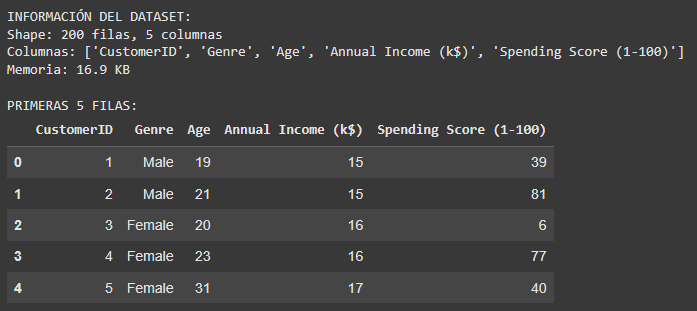


```python linenums="1"
# === ANÁLISIS DE GÉNERO ===
print("DISTRIBUCIÓN POR GÉNERO:")
gender_counts = df_customers['Genre'].value_counts()
print(gender_counts)
print(f"\nPorcentajes:")
for gender, count in gender_counts.items():
    pct = (count / len(df_customers) * 100)
    print(f"   {gender}: {pct:.1f}%")
```


```python linenums="1"
# === ESTADÍSTICAS DE VARIABLES DE SEGMENTACIÓN ===
numeric_vars = ['Age', 'Annual Income (k$)', 'Spending Score (1-100)']

print("ESTADÍSTICAS CLAVE:")
print(df_customers[numeric_vars].describe().round(2))

print(f"\nRANGOS OBSERVADOS:")
for var in numeric_vars:
    min_val, max_val = df_customers[var].min(), df_customers[var].max()
    mean_val = df_customers[var].mean()
    print(f"   {var}: {min_val:.0f} - {max_val:.0f} (promedio: {mean_val:.1f})")
```

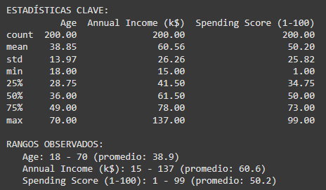

```python linenums="1"
# === DETECCIÓN DE OUTLIERS USANDO IQR ===
print("DETECCIÓN DE OUTLIERS:")

outlier_cols = ['Age', 'Annual Income (k$)', 'Spending Score (1-100)']

for col in outlier_cols:
    Q1 = df_customers[col].quantile(0.25)
    Q3 = df_customers[col].quantile(0.75)
    IQR = Q3 - Q1

    # Calcular límites
    lower_bound = Q1 - 1.5 * IQR
    upper_bound = Q3 + 1.5 * IQR

    # Encontrar outliers
    outliers = df_customers[(df_customers[col] < lower_bound) |
                           (df_customers[col] > upper_bound)]

    print(f"   {col}: {len(outliers)} outliers ({len(outliers)/len(df_customers)*100:.1f}%)")
    print(f"      Límites normales: {lower_bound:.1f} - {upper_bound:.1f}")
```

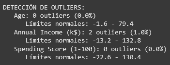

```python linenums="1"
# === IMPORTS PARA VISUALIZACIÓN ===
import matplotlib.pyplot as plt
import seaborn as sns

# Configurar estilo
plt.style.use('default')
sns.set_palette("husl")

# === HISTOGRAMAS DE VARIABLES PRINCIPALES ===
fig, axes = plt.subplots(1, 3, figsize=(15, 5))
fig.suptitle('Distribuciones de Variables Clave', fontsize=14, fontweight='bold')

vars_to_plot = ['Age', 'Annual Income (k$)', 'Spending Score (1-100)']
colors = ['#FF6B6B', '#4ECDC4', '#45B7D1']

for i, (var, color) in enumerate(zip(vars_to_plot, colors)):
    axes[i].hist(df_customers[var], bins=20, alpha=0.7, color=color, edgecolor='black')
    axes[i].set_title(f'{var}')
    axes[i].set_xlabel(var)
    axes[i].set_ylabel('Frecuencia')
    axes[i].grid(True, alpha=0.3)

plt.tight_layout()
plt.show()
```


```python linenums="1"
# === SCATTER PLOTS PARA RELACIONES CLAVE ===
fig, axes = plt.subplots(1, 3, figsize=(18, 5))
fig.suptitle('Relaciones Entre Variables', fontsize=14, fontweight='bold')

# Age vs Income
axes[0].scatter(df_customers['Age'], df_customers['Annual Income (k$)'],
                alpha=0.6, color='#96CEB4', s=50)
axes[0].set_xlabel('Age (años)')
axes[0].set_ylabel('Annual Income (k$)')
axes[0].set_title('Age vs Income')
axes[0].grid(True, alpha=0.3)

# Income vs Spending Score ⭐ CLAVE PARA SEGMENTACIÓN
axes[1].scatter(df_customers['Annual Income (k$)'], df_customers['Spending Score (1-100)'],
                alpha=0.6, color='#FFEAA7', s=50)
axes[1].set_xlabel('Annual Income (k$)')
axes[1].set_ylabel('Spending Score (1-100)')
axes[1].set_title('Income vs Spending Score (CLAVE)')
axes[1].grid(True, alpha=0.3)

# Age vs Spending Score
axes[2].scatter(df_customers['Age'], df_customers['Spending Score (1-100)'],
                alpha=0.6, color='#DDA0DD', s=50)
axes[2].set_xlabel('Age (años)')
axes[2].set_ylabel('Spending Score (1-100)')
axes[2].set_title('Age vs Spending Score')
axes[2].grid(True, alpha=0.3)

plt.tight_layout()
plt.show()
```

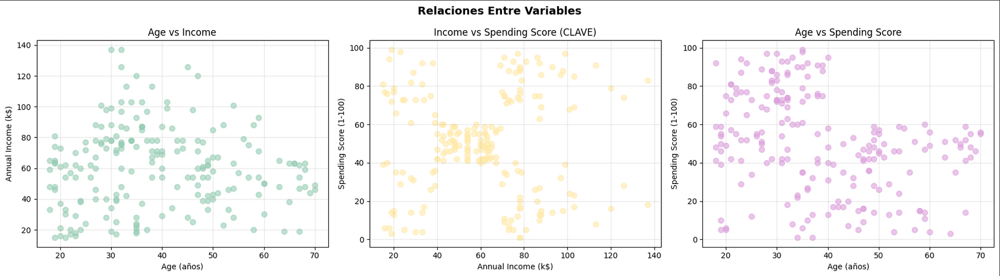

```python linenums="1"
# === MATRIZ DE CORRELACIÓN ===
correlation_vars = ['Age', 'Annual Income (k$)', 'Spending Score (1-100)']
corr_matrix = df_customers[correlation_vars].corr()

print("MATRIZ DE CORRELACIÓN:")
print(corr_matrix.round(3))

# Visualizar matriz de correlación
plt.figure(figsize=(8, 6))
sns.heatmap(corr_matrix, annot=True, cmap='RdYlBu_r', center=0,
            fmt='.3f', linewidths=0.5, square=True)
plt.title('Matriz de Correlación - Mall Customers')
plt.tight_layout()
plt.show()

print(f"\nCORRELACIÓN MÁS FUERTE:")
# Encontrar la correlación más alta (excluyendo diagonal)
corr_flat = corr_matrix.where(np.triu(np.ones(corr_matrix.shape), k=1).astype(bool))
max_corr = corr_flat.stack().idxmax()
max_val = corr_flat.stack().max()
print(f"   {max_corr[0]} ↔ {max_corr[1]}: {max_val:.3f}")
```

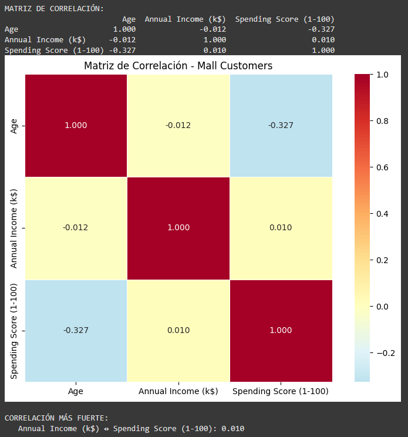

```python linenums="1"
# === COMPARACIÓN ESTADÍSTICAS POR GÉNERO ===
print("ANÁLISIS COMPARATIVO POR GÉNERO:")

gender_stats = df_customers.groupby('Genre')[numeric_vars].agg(['mean', 'std']).round(2)
print(gender_stats)

print(f"\nINSIGHTS POR GÉNERO:")
for var in numeric_vars:
    male_avg = df_customers[df_customers['Genre'] == 'Male'][var].mean()
    female_avg = df_customers[df_customers['Genre'] == 'Female'][var].mean()
    if male_avg > female_avg:
        higher = "Hombres"
        diff = male_avg - female_avg
    else:
        higher = "Mujeres"
        diff = female_avg - male_avg
    print(f"   {var}: {higher} tienen promedio más alto (diferencia: {diff:.1f})")
```

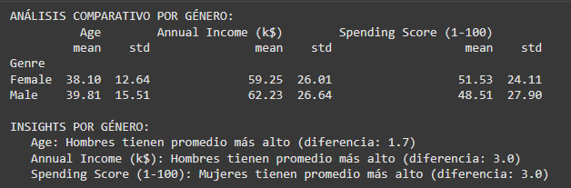

En base a lo observado:
- Variable con mayor variabilidad: Annual Income
- ¿Existe correlación fuerte entre alguna variable? Entre Annual Income y Spending Score
- ¿Qué variable tiene más outliers? Annual Income
- ¿Los hombres y mujeres tienen patrones diferentes? Las mujeres suelen tener mayor Spending Score y menor Annual Income que los hombres
- ¿Qué insight es más relevante para el análisis? Matriz de correlación
- ¿Qué 2 variables serán más importantes para clustering? Annual Income y Spending Score

Preparación para clustering:
- ¿Qué relación entre Income y Spending Score observas? Practicamente exclusivamente los individuos cercanos al promedio de Annual Income (entre 40 y 70) tiene un Spending Score cercano al promedio (entre 40 y 60). También existen 'grupos' de individuos en las 4 combinaciones de Annual Income (Bajo/Alto) y Spending Score (Bajo/Alto).
- ¿Puedes imaginar grupos naturales de clientes? Cliente que ganan poco y compran pocos; ganan poco y compran mucho; ganan mucho y compran poco; ganan mucho y compran mucho; y ganan el promedio y compran lo promedio.

```python linenums="1"
# === ANÁLISIS DE COLUMNAS DISPONIBLES ===
print("ANÁLISIS DE COLUMNAS PARA CLUSTERING:")
print(f"   Todas las columnas: {list(df_customers.columns)}")
print(f"   Numéricas: {df_customers.select_dtypes(include=[np.number]).columns.tolist()}")
print(f"   Categóricas: {df_customers.select_dtypes(include=[object]).columns.tolist()}")

# Identificar qué excluir y qué incluir
exclude_columns = ['CustomerID']  # ID no aporta información
numeric_columns = ['Age', 'Annual Income (k$)', 'Spending Score (1-100)']
categorical_columns = ['Genre']

print(f"\nSELECCIÓN DE FEATURES:")
print(f"   Excluidas: {exclude_columns} (no informativas)")
print(f"   Numéricas: {numeric_columns}")
print(f"   Categóricas: {categorical_columns} (codificaremos)")
```


```python linenums="1"
# === IMPORT ONEHOTENCODER ===
from sklearn.preprocessing import OneHotEncoder

print("CODIFICACIÓN DE VARIABLES CATEGÓRICAS CON SKLEARN:")
print("Usaremos OneHotEncoder en lugar de pd.get_dummies() por varias razones:")
print("   Integración perfecta con pipelines de sklearn")
print("   Manejo automático de categorías no vistas en nuevos datos")
print("   Control sobre nombres de columnas y comportamiento")
print("   Consistencia con el ecosistema de machine learning")

# Crear y configurar OneHotEncoder
encoder = OneHotEncoder(sparse_output=False)

# Ajustar y transformar Genre
genre_data = df_customers[['Genre']]  # Debe ser 2D para sklearn
genre_encoded_array = encoder.fit_transform(genre_data)  # Método para ajustar y transformar

# Obtener nombres de las nuevas columnas
feature_names = encoder.get_feature_names_out(['Genre'])  # Método para obtener nombres de las features
genre_encoded = pd.DataFrame(genre_encoded_array, columns=feature_names)

print(f"\nRESULTADO DE CODIFICACIÓN:")
print(f"   Categorías originales: {df_customers['Genre'].unique()}")
print(f"   Columnas generadas: {list(genre_encoded.columns)}")
print(f"   Shape: {genre_data.shape} → {genre_encoded.shape}")

# Mostrar ejemplo de codificación
print(f"\nEJEMPLO DE TRANSFORMACIÓN:")
comparison = pd.concat([
    df_customers['Genre'].head().reset_index(drop=True),
    genre_encoded.head()
], axis=1)
print(comparison)
```


```python linenums="1"
# === CREACIÓN DEL DATASET FINAL ===
# Combinar variables numéricas + categóricas codificadas
X_raw = pd.concat([
    df_customers[numeric_columns],
    genre_encoded
], axis=1)

print("DATASET FINAL PARA CLUSTERING:")
print(f"   Shape: {X_raw.shape}")
print(f"   Columnas: {list(X_raw.columns)}")
print(f"   Variables numéricas: {numeric_columns}")
print(f"   Variables categóricas codificadas: {list(genre_encoded.columns)}")
print(f"   Total features: {X_raw.shape[1]} (3 numéricas + 2 categóricas binarias)")
print(f"   Memoria: {X_raw.memory_usage(deep=True).sum() / 1024:.1f} KB")
```


```python linenums="1"
# === VERIFICACIONES ANTES DE CONTINUAR ===
print("VERIFICACIÓN DE CALIDAD:")

# 1. Datos faltantes
missing_data = X_raw.isnull().sum()
print(f"\nDATOS FALTANTES:")
if missing_data.sum() == 0:
    print("   PERFECTO! No hay datos faltantes")
else:
    for col, missing in missing_data.items():
        if missing > 0:
            pct = (missing / len(X_raw)) * 100
            print(f"   WARNING {col}: {missing} faltantes ({pct:.1f}%)")

# 2. Vista previa
print(f"\nVISTA PREVIA DEL DATASET:")
print(X_raw.head())

# 3. Tipos de datos
print(f"\nTIPOS DE DATOS:")
print(X_raw.dtypes)
```

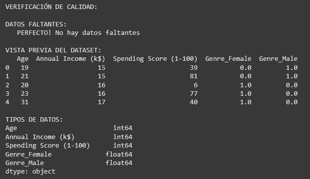

```python linenums="1"
# === ANÁLISIS DE ESCALAS ===
print("ANÁLISIS DE ESCALAS - ¿Por qué necesitamos normalización?")

print(f"\nESTADÍSTICAS POR VARIABLE:")
for col in X_raw.columns:
    if X_raw[col].dtype in ['int64', 'float64']:  # Solo numéricas
        min_val = X_raw[col].min()
        max_val = X_raw[col].max()
        mean_val = X_raw[col].mean()
        std_val = X_raw[col].std()

        print(f"\n   {col}:")
        print(f"      Rango: {min_val:.1f} - {max_val:.1f}")
        print(f"      Media: {mean_val:.1f}")
        print(f"      Desviación: {std_val:.1f}")

# Guardar para próximas fases
feature_columns = list(X_raw.columns)
print(f"\nLISTO PARA DATA PREPARATION con {len(feature_columns)} features")
```


ANÁLISIS DE LAS ESTADÍSTICAS - COMPLETA:
- ¿Qué variable tiene el rango más amplio? Annual Income
- ¿Cuál es la distribución de género en el dataset? Uniforme
- ¿Qué variable muestra mayor variabilidad (std)? Annual Income
- ¿Los clientes son jóvenes o mayores en promedio? Mayores, alrededor de 40 años
- ¿El income promedio sugiere qué clase social? Clase media o media baja
- ¿Por qué la normalización será crítica aca? Será crítica ya que hay variables con valores 
de hasta 100 (Spending Score y Annual Income) y otras que su máximo es sólo 1 (Género) pero 
estas últimas pueden tener un aporte similar o mayor a las primeras en el resultado

### 3. Preparación de los datos

Habiendo preparado la información para normalizar, utilizaremos 3 diferentes técnicas:
MinMaxScaler, StandardScaler y RobustScaler

```python linenums="1"
# === CREAR Y APLICAR LOS 3 SCALERS ===
scalers = {
    'MinMax': MinMaxScaler(),        # Escala a rango [0,1]
    'Standard': StandardScaler(),      # Media=0, std=1
    'Robust': RobustScaler()         # Usa mediana y IQR, robusto a outliers
}

# Aplicar cada scaler
X_scaled = {}
for name, scaler in scalers.items():
    X_scaled[name] = scaler.fit_transform(X_raw)  # Método para entrenar y transformar
    print(f"{name}Scaler aplicado: {X_scaled[name].shape}")

print(f"\nTenemos 3 versiones escaladas de los datos para comparar")
```

```python linenums="1"
# === COMPARACIÓN VISUAL CON BOXPLOTS ===
fig, axes = plt.subplots(1, 4, figsize=(16, 4))
fig.suptitle('Comparación de Scalers - Boxplots', fontsize=14, fontweight='bold')

# Datos originales
axes[0].boxplot([X_raw[col] for col in X_raw.columns], tick_labels=X_raw.columns)
axes[0].set_title('Original')
axes[0].tick_params(axis='x', rotation=45)

# Datos escalados
for i, (name, X_scaled_data) in enumerate(X_scaled.items(), 1):
    axes[i].boxplot([X_scaled_data[:, j] for j in range(X_scaled_data.shape[1])],
                    tick_labels=X_raw.columns)
    axes[i].set_title(f'{name}')
    axes[i].tick_params(axis='x', rotation=45)

plt.tight_layout()
plt.show()

print("Observa cómo cada scaler ajusta las escalas de forma diferente")
```

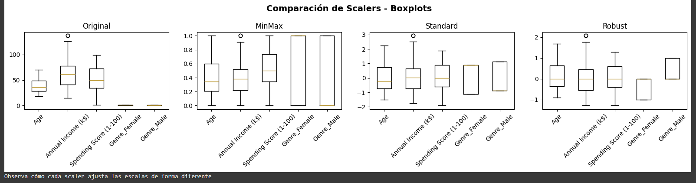

```python linenums="1"
# === COMPARAR DISTRIBUCIONES DE UNA VARIABLE ===
# Vamos a analizar 'Annual Income (k$)' en detalle
income_col_idx = 1  # Posición de Annual Income

fig, axes = plt.subplots(1, 4, figsize=(16, 4))
fig.suptitle('Annual Income: Original vs Scalers', fontsize=14, fontweight='bold')

# Original
axes[0].hist(X_raw.iloc[:, income_col_idx], bins=20, alpha=0.7, color='gray', edgecolor='black')
axes[0].set_title('Original')
axes[0].set_xlabel('Annual Income (k$)')

# Escalados
colors = ['#FF6B6B', '#4ECDC4', '#45B7D1']
for i, ((name, X_scaled_data), color) in enumerate(zip(X_scaled.items(), colors), 1):
    axes[i].hist(X_scaled_data[:, income_col_idx], bins=20, alpha=0.7, color=color, edgecolor='black')
    axes[i].set_title(f'{name}')
    axes[i].set_xlabel('Annual Income (escalado)')

plt.tight_layout()
plt.show()

print("¿Notas cómo cambia la forma de la distribución?")
```


```python linenums="1"
# === ESTADÍSTICAS DESPUÉS DEL SCALING ===
print("ESTADÍSTICAS POST-SCALING (Annual Income):")

# Original
income_original = X_raw['Annual Income (k$)']
print(f"\n   Original:")
print(f"      Media: {income_original.mean():.1f}")
print(f"      Std:   {income_original.std():.1f}")
print(f"      Min:   {income_original.min():.1f}")
print(f"      Max:   {income_original.max():.1f}")

# Escalados
for name, X_scaled_data in X_scaled.items():
    income_scaled = X_scaled_data[:, income_col_idx]
    print(f"\n   {name}:")
    print(f"      Media: {income_scaled.mean():.3f}")
    print(f"      Std:   {income_scaled.std():.3f}")
    print(f"      Min:   {income_scaled.min():.3f}")
    print(f"      Max:   {income_scaled.max():.3f}")

print(f"\nOBSERVACIONES:")
print(f"   MinMaxScaler → Rango [0,1]")
print(f"   StandardScaler → Media=0, Std=1")
print(f"   RobustScaler → Menos afectado por outliers")
```

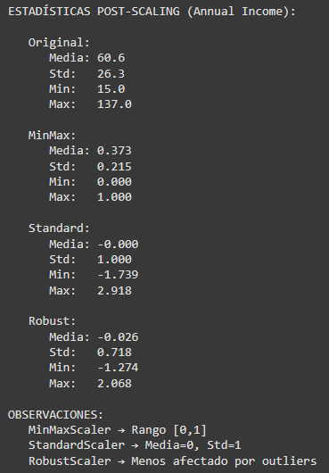

```python linenums="1"
# === IMPORT PARA CLUSTERING TEST ===
from sklearn.cluster import KMeans
from sklearn.metrics import silhouette_score

# === QUICK TEST: ¿Qué scaler funciona mejor para clustering? ===
print("QUICK TEST: Impacto en Clustering (K=4)")

clustering_results = {}
for name, X_scaled_data in X_scaled.items():
    # Aplicar K-Means con K=4
    kmeans = KMeans(n_clusters=4, random_state=42, n_init=10)  # Completar
    labels = kmeans.fit_predict(X_scaled_data)  # Método para obtener clusters

    # Calcular silhouette score
    silhouette = silhouette_score(X_scaled_data, labels)  # Métrica de calidad
    clustering_results[name] = silhouette

    print(f"   {name:>10}: Silhouette Score = {silhouette:.3f}")

# Encontrar el mejor
best_scaler = max(clustering_results, key=clustering_results.get)
best_score = clustering_results[best_scaler]

print(f"\nGANADOR: {best_scaler} (Score: {best_score:.3f})")
```

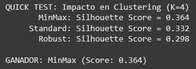

```python linenums="1"
# === TOMAR DECISIÓN BASADA EN RESULTADOS ===
print("DECISIÓN FINAL DEL SCALER:")

# Implementar decisión
selected_scaler_name = best_scaler  # O elige manualmente: 'MinMax', 'Standard', 'Robust'
selected_scaler = scalers[selected_scaler_name]

# Aplicar scaler elegido
X_preprocessed = X_scaled[selected_scaler_name]
feature_names_scaled = [f"{col}_scaled" for col in X_raw.columns]

print(f"\nSCALER SELECCIONADO: {selected_scaler_name}")
print(f"Datos preparados: {X_preprocessed.shape}")
print(f"Listo para PCA y Feature Selection")
```

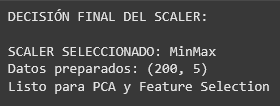

Breve análisis:
- Mejor scaler según silhouette: MinMax
- ¿Por qué crees que funcionó mejor? Debido a la poca cantidad de outliers presentes, y la manera en que manejo las variables de género puede haber sido superior a la de los otros scalers
- ¿Algún scaler tuvo problemas obvios? RobustScaler a pesar de resultar de manera similar a StandardScaler, tuvo altas distinciones en el manejo de las variables de género (y relacionado o no a esto), y resulto con el menor Silhouette score

```python linenums="1"

```


```python linenums="1"

```


### 4. Modelado y clustering


### 5. Evaluación y resumen

## Evidencias
- [Link al Colab](https://colab.research.google.com/drive/1CF5oHvPmK4o1lfW5oue_HXQhEuPSry79?usp=sharing)

## Reflexión
- Qué aprendiste, qué mejorarías, próximos pasos

## Referencias
- Fuentes consultadas con enlaces relativos cuando corresponda

```python linenums="1"

```