# Entrada 05 — Clustering y PCA

## Contexto
Breve descripción del tema/actividad.

## Objetivos
- Identificar de 3 a 5 segmentos de clientes distintos usando K-Means
- Aplicar diferentes técnicas de normalización
- Usar PCA para reducción de dimensionalidad y visualización 
- Comparar PCA con métodos de selección de features 
- Interpretar resultados desde perspectiva de negocio

## Actividades (con tiempos estimados)
- Entendimiento del negocio — 5 min
- Entendimiento de los datos — 25 min
- Preparación de los datos — 45 min
- Modelado y clustering — 30 min
- Evaluación y resumen — 25 min

## Desarrollo

### 1. Entendimiento del negocio

Los centros comerciales buscan mejores maneras de llegar a sus clientes, ya sea a través de
marketing personalizado, ofertas especíicas o mayor accesibilidad a productos relevantes
para los clientes.

Para lograr esto, el negocio debe conocer bien a sus cliente y, sobre todo, ser capaz de
agruparlos de manera que maximize la cantidad de clientes afectados cuando intervenga con
un segmento de los clientes con los objetivos dichos en el párrafo anterior.

### 2. Entendimiento de los datos

El dataset de Mall Customer Segmentation de Kaggle incluye información de 200 clientes
en centro comerciales con pocos pero relevantes datos para le negocio.

#### Columnas:

- CustomerID: número identificador del cliente
- Gender: género del cliente, 'male' o 'female'
- Age: edad del cliente, número entero mayor a 18
- Annual Income (k$): ingreso anual representado en 1000 de dolares
- Spending Score: puntuación asignada por el centro comercial basada
en comportamiento y naturaleza de compra, número del 1 al 100

```python linenums="1"
print("INFORMACIÓN DEL DATASET:")
print(f"Shape: {df_customers.shape[0]} filas, {df_customers.shape[1]} columnas")
print(f"Columnas: {list(df_customers.columns)}")
print(f"Memoria: {df_customers.memory_usage(deep=True).sum() / 1024:.1f} KB")

print(f"\nPRIMERAS 5 FILAS:")
df_customers.head()
```

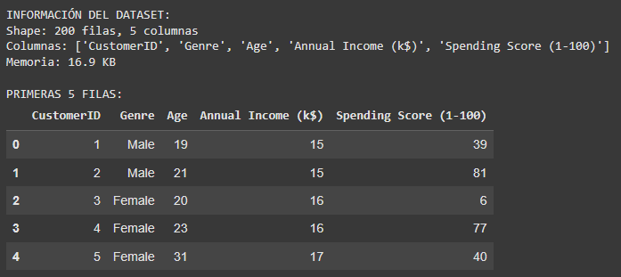


```python linenums="1"
# === ANÁLISIS DE GÉNERO ===
print("DISTRIBUCIÓN POR GÉNERO:")
gender_counts = df_customers['Genre'].value_counts()
print(gender_counts)
print(f"\nPorcentajes:")
for gender, count in gender_counts.items():
    pct = (count / len(df_customers) * 100)
    print(f"   {gender}: {pct:.1f}%")
```

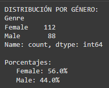

```python linenums="1"
# === ESTADÍSTICAS DE VARIABLES DE SEGMENTACIÓN ===
numeric_vars = ['Age', 'Annual Income (k$)', 'Spending Score (1-100)']

print("ESTADÍSTICAS CLAVE:")
print(df_customers[numeric_vars].describe().round(2))

print(f"\nRANGOS OBSERVADOS:")
for var in numeric_vars:
    min_val, max_val = df_customers[var].min(), df_customers[var].max()
    mean_val = df_customers[var].mean()
    print(f"   {var}: {min_val:.0f} - {max_val:.0f} (promedio: {mean_val:.1f})")
```

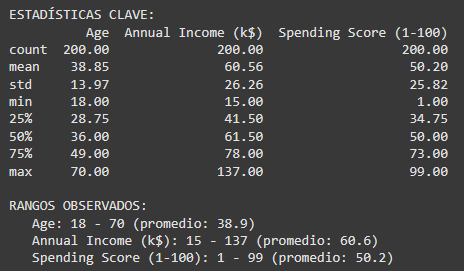

```python linenums="1"
# === DETECCIÓN DE OUTLIERS USANDO IQR ===
print("DETECCIÓN DE OUTLIERS:")

outlier_cols = ['Age', 'Annual Income (k$)', 'Spending Score (1-100)']

for col in outlier_cols:
    Q1 = df_customers[col].quantile(0.25)
    Q3 = df_customers[col].quantile(0.75)
    IQR = Q3 - Q1

    # Calcular límites
    lower_bound = Q1 - 1.5 * IQR
    upper_bound = Q3 + 1.5 * IQR

    # Encontrar outliers
    outliers = df_customers[(df_customers[col] < lower_bound) |
                           (df_customers[col] > upper_bound)]

    print(f"   {col}: {len(outliers)} outliers ({len(outliers)/len(df_customers)*100:.1f}%)")
    print(f"      Límites normales: {lower_bound:.1f} - {upper_bound:.1f}")
```

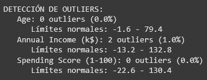

```python linenums="1"
# === IMPORTS PARA VISUALIZACIÓN ===
import matplotlib.pyplot as plt
import seaborn as sns

# Configurar estilo
plt.style.use('default')
sns.set_palette("husl")

# === HISTOGRAMAS DE VARIABLES PRINCIPALES ===
fig, axes = plt.subplots(1, 3, figsize=(15, 5))
fig.suptitle('Distribuciones de Variables Clave', fontsize=14, fontweight='bold')

vars_to_plot = ['Age', 'Annual Income (k$)', 'Spending Score (1-100)']
colors = ['#FF6B6B', '#4ECDC4', '#45B7D1']

for i, (var, color) in enumerate(zip(vars_to_plot, colors)):
    axes[i].hist(df_customers[var], bins=20, alpha=0.7, color=color, edgecolor='black')
    axes[i].set_title(f'{var}')
    axes[i].set_xlabel(var)
    axes[i].set_ylabel('Frecuencia')
    axes[i].grid(True, alpha=0.3)

plt.tight_layout()
plt.show()
```

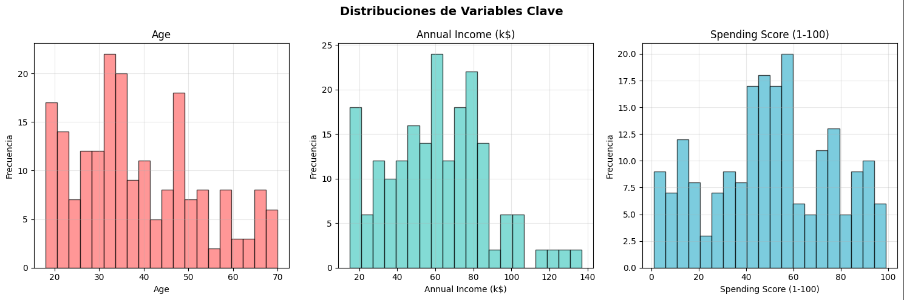

```python linenums="1"
# === SCATTER PLOTS PARA RELACIONES CLAVE ===
fig, axes = plt.subplots(1, 3, figsize=(18, 5))
fig.suptitle('Relaciones Entre Variables', fontsize=14, fontweight='bold')

# Age vs Income
axes[0].scatter(df_customers['Age'], df_customers['Annual Income (k$)'],
                alpha=0.6, color='#96CEB4', s=50)
axes[0].set_xlabel('Age (años)')
axes[0].set_ylabel('Annual Income (k$)')
axes[0].set_title('Age vs Income')
axes[0].grid(True, alpha=0.3)

# Income vs Spending Score ⭐ CLAVE PARA SEGMENTACIÓN
axes[1].scatter(df_customers['Annual Income (k$)'], df_customers['Spending Score (1-100)'],
                alpha=0.6, color='#FFEAA7', s=50)
axes[1].set_xlabel('Annual Income (k$)')
axes[1].set_ylabel('Spending Score (1-100)')
axes[1].set_title('Income vs Spending Score (CLAVE)')
axes[1].grid(True, alpha=0.3)

# Age vs Spending Score
axes[2].scatter(df_customers['Age'], df_customers['Spending Score (1-100)'],
                alpha=0.6, color='#DDA0DD', s=50)
axes[2].set_xlabel('Age (años)')
axes[2].set_ylabel('Spending Score (1-100)')
axes[2].set_title('Age vs Spending Score')
axes[2].grid(True, alpha=0.3)

plt.tight_layout()
plt.show()
```

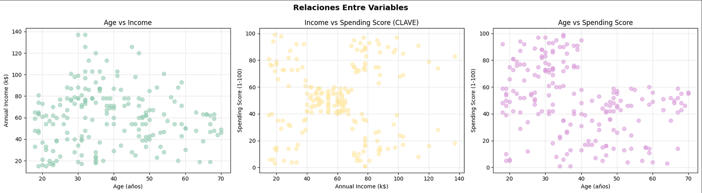

```python linenums="1"
# === MATRIZ DE CORRELACIÓN ===
correlation_vars = ['Age', 'Annual Income (k$)', 'Spending Score (1-100)']
corr_matrix = df_customers[correlation_vars].corr()

print("MATRIZ DE CORRELACIÓN:")
print(corr_matrix.round(3))

# Visualizar matriz de correlación
plt.figure(figsize=(8, 6))
sns.heatmap(corr_matrix, annot=True, cmap='RdYlBu_r', center=0,
            fmt='.3f', linewidths=0.5, square=True)
plt.title('Matriz de Correlación - Mall Customers')
plt.tight_layout()
plt.show()

print(f"\nCORRELACIÓN MÁS FUERTE:")
# Encontrar la correlación más alta (excluyendo diagonal)
corr_flat = corr_matrix.where(np.triu(np.ones(corr_matrix.shape), k=1).astype(bool))
max_corr = corr_flat.stack().idxmax()
max_val = corr_flat.stack().max()
print(f"   {max_corr[0]} ↔ {max_corr[1]}: {max_val:.3f}")
```

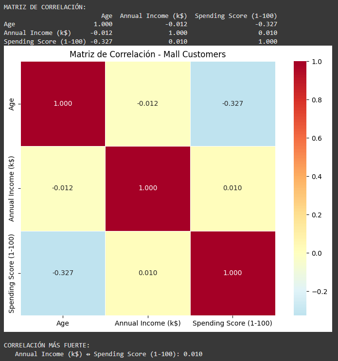

```python linenums="1"
# === COMPARACIÓN ESTADÍSTICAS POR GÉNERO ===
print("ANÁLISIS COMPARATIVO POR GÉNERO:")

gender_stats = df_customers.groupby('Genre')[numeric_vars].agg(['mean', 'std']).round(2)
print(gender_stats)

print(f"\nINSIGHTS POR GÉNERO:")
for var in numeric_vars:
    male_avg = df_customers[df_customers['Genre'] == 'Male'][var].mean()
    female_avg = df_customers[df_customers['Genre'] == 'Female'][var].mean()
    if male_avg > female_avg:
        higher = "Hombres"
        diff = male_avg - female_avg
    else:
        higher = "Mujeres"
        diff = female_avg - male_avg
    print(f"   {var}: {higher} tienen promedio más alto (diferencia: {diff:.1f})")
```


En base a lo observado:
- Variable con mayor variabilidad: Annual Income
- ¿Existe correlación fuerte entre alguna variable? Entre Annual Income y Spending Score
- ¿Qué variable tiene más outliers? Annual Income
- ¿Los hombres y mujeres tienen patrones diferentes? Las mujeres suelen tener mayor Spending Score y menor Annual Income que los hombres
- ¿Qué insight es más relevante para el análisis? Matriz de correlación
- ¿Qué 2 variables serán más importantes para clustering? Annual Income y Spending Score

Preparación para clustering:
- ¿Qué relación entre Income y Spending Score observas? Practicamente exclusivamente los individuos cercanos al promedio de Annual Income (entre 40 y 70) tiene un Spending Score cercano al promedio (entre 40 y 60). También existen 'grupos' de individuos en las 4 combinaciones de Annual Income (Bajo/Alto) y Spending Score (Bajo/Alto).
- ¿Puedes imaginar grupos naturales de clientes? Cliente que ganan poco y compran pocos; ganan poco y compran mucho; ganan mucho y compran poco; ganan mucho y compran mucho; y ganan el promedio y compran lo promedio.

```python linenums="1"
# === ANÁLISIS DE COLUMNAS DISPONIBLES ===
print("ANÁLISIS DE COLUMNAS PARA CLUSTERING:")
print(f"   Todas las columnas: {list(df_customers.columns)}")
print(f"   Numéricas: {df_customers.select_dtypes(include=[np.number]).columns.tolist()}")
print(f"   Categóricas: {df_customers.select_dtypes(include=[object]).columns.tolist()}")

# Identificar qué excluir y qué incluir
exclude_columns = ['CustomerID']  # ID no aporta información
numeric_columns = ['Age', 'Annual Income (k$)', 'Spending Score (1-100)']
categorical_columns = ['Genre']

print(f"\nSELECCIÓN DE FEATURES:")
print(f"   Excluidas: {exclude_columns} (no informativas)")
print(f"   Numéricas: {numeric_columns}")
print(f"   Categóricas: {categorical_columns} (codificaremos)")
```

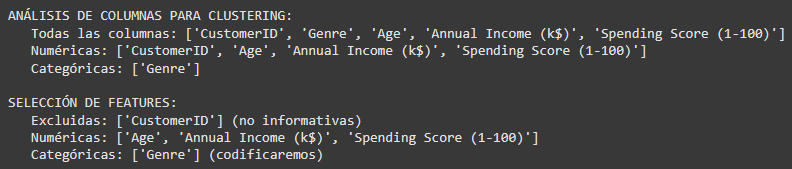

```python linenums="1"
# === IMPORT ONEHOTENCODER ===
from sklearn.preprocessing import OneHotEncoder

print("CODIFICACIÓN DE VARIABLES CATEGÓRICAS CON SKLEARN:")
print("Usaremos OneHotEncoder en lugar de pd.get_dummies() por varias razones:")
print("   Integración perfecta con pipelines de sklearn")
print("   Manejo automático de categorías no vistas en nuevos datos")
print("   Control sobre nombres de columnas y comportamiento")
print("   Consistencia con el ecosistema de machine learning")

# Crear y configurar OneHotEncoder
encoder = OneHotEncoder(sparse_output=False)

# Ajustar y transformar Genre
genre_data = df_customers[['Genre']]  # Debe ser 2D para sklearn
genre_encoded_array = encoder.fit_transform(genre_data)  # Método para ajustar y transformar

# Obtener nombres de las nuevas columnas
feature_names = encoder.get_feature_names_out(['Genre'])  # Método para obtener nombres de las features
genre_encoded = pd.DataFrame(genre_encoded_array, columns=feature_names)

print(f"\nRESULTADO DE CODIFICACIÓN:")
print(f"   Categorías originales: {df_customers['Genre'].unique()}")
print(f"   Columnas generadas: {list(genre_encoded.columns)}")
print(f"   Shape: {genre_data.shape} → {genre_encoded.shape}")

# Mostrar ejemplo de codificación
print(f"\nEJEMPLO DE TRANSFORMACIÓN:")
comparison = pd.concat([
    df_customers['Genre'].head().reset_index(drop=True),
    genre_encoded.head()
], axis=1)
print(comparison)
```

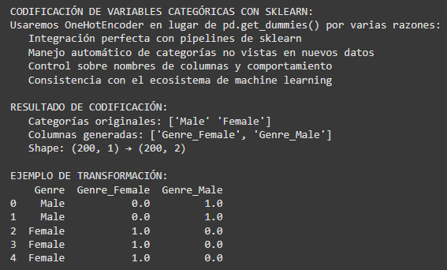

```python linenums="1"
# === CREACIÓN DEL DATASET FINAL ===
# Combinar variables numéricas + categóricas codificadas
X_raw = pd.concat([
    df_customers[numeric_columns],
    genre_encoded
], axis=1)

print("DATASET FINAL PARA CLUSTERING:")
print(f"   Shape: {X_raw.shape}")
print(f"   Columnas: {list(X_raw.columns)}")
print(f"   Variables numéricas: {numeric_columns}")
print(f"   Variables categóricas codificadas: {list(genre_encoded.columns)}")
print(f"   Total features: {X_raw.shape[1]} (3 numéricas + 2 categóricas binarias)")
print(f"   Memoria: {X_raw.memory_usage(deep=True).sum() / 1024:.1f} KB")
```

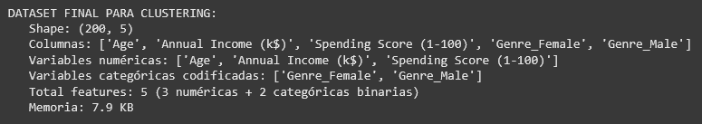

```python linenums="1"
# === VERIFICACIONES ANTES DE CONTINUAR ===
print("VERIFICACIÓN DE CALIDAD:")

# 1. Datos faltantes
missing_data = X_raw.isnull().sum()
print(f"\nDATOS FALTANTES:")
if missing_data.sum() == 0:
    print("   PERFECTO! No hay datos faltantes")
else:
    for col, missing in missing_data.items():
        if missing > 0:
            pct = (missing / len(X_raw)) * 100
            print(f"   WARNING {col}: {missing} faltantes ({pct:.1f}%)")

# 2. Vista previa
print(f"\nVISTA PREVIA DEL DATASET:")
print(X_raw.head())

# 3. Tipos de datos
print(f"\nTIPOS DE DATOS:")
print(X_raw.dtypes)
```

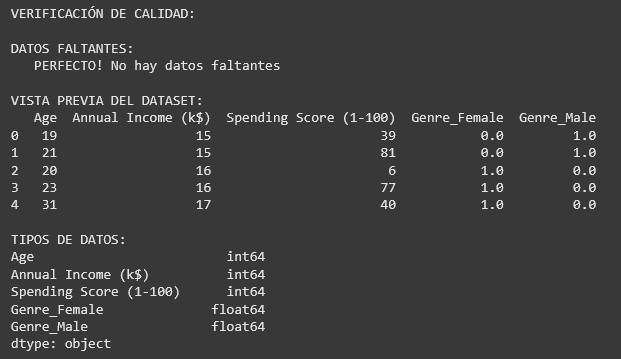

```python linenums="1"
# === ANÁLISIS DE ESCALAS ===
print("ANÁLISIS DE ESCALAS - ¿Por qué necesitamos normalización?")

print(f"\nESTADÍSTICAS POR VARIABLE:")
for col in X_raw.columns:
    if X_raw[col].dtype in ['int64', 'float64']:  # Solo numéricas
        min_val = X_raw[col].min()
        max_val = X_raw[col].max()
        mean_val = X_raw[col].mean()
        std_val = X_raw[col].std()

        print(f"\n   {col}:")
        print(f"      Rango: {min_val:.1f} - {max_val:.1f}")
        print(f"      Media: {mean_val:.1f}")
        print(f"      Desviación: {std_val:.1f}")

# Guardar para próximas fases
feature_columns = list(X_raw.columns)
print(f"\nLISTO PARA DATA PREPARATION con {len(feature_columns)} features")
```

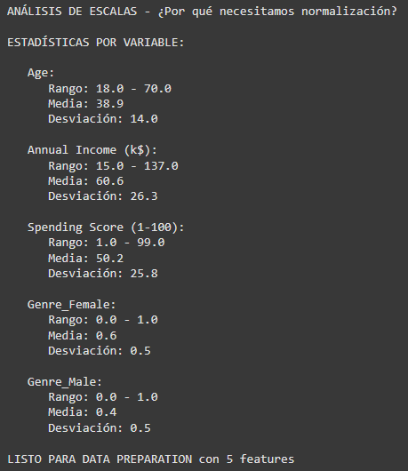

ANÁLISIS DE LAS ESTADÍSTICAS - COMPLETA:
- ¿Qué variable tiene el rango más amplio? Annual Income
- ¿Cuál es la distribución de género en el dataset? Uniforme
- ¿Qué variable muestra mayor variabilidad (std)? Annual Income
- ¿Los clientes son jóvenes o mayores en promedio? Mayores, alrededor de 40 años
- ¿El income promedio sugiere qué clase social? Clase media o media baja
- ¿Por qué la normalización será crítica aca? Será crítica ya que hay variables con valores 
de hasta 100 (Spending Score y Annual Income) y otras que su máximo es sólo 1 (Género) pero 
estas últimas pueden tener un aporte similar o mayor a las primeras en el resultado

### 3. Preparación de los datos

Habiendo preparado la información para normalizar, utilizaremos 3 diferentes técnicas:
MinMaxScaler, StandardScaler y RobustScaler

```python linenums="1"
# === CREAR Y APLICAR LOS 3 SCALERS ===
scalers = {
    'MinMax': MinMaxScaler(),        # Escala a rango [0,1]
    'Standard': StandardScaler(),      # Media=0, std=1
    'Robust': RobustScaler()         # Usa mediana y IQR, robusto a outliers
}

# Aplicar cada scaler
X_scaled = {}
for name, scaler in scalers.items():
    X_scaled[name] = scaler.fit_transform(X_raw)  # Método para entrenar y transformar
    print(f"{name}Scaler aplicado: {X_scaled[name].shape}")

print(f"\nTenemos 3 versiones escaladas de los datos para comparar")
```

```python linenums="1"
# === COMPARACIÓN VISUAL CON BOXPLOTS ===
fig, axes = plt.subplots(1, 4, figsize=(16, 4))
fig.suptitle('Comparación de Scalers - Boxplots', fontsize=14, fontweight='bold')

# Datos originales
axes[0].boxplot([X_raw[col] for col in X_raw.columns], tick_labels=X_raw.columns)
axes[0].set_title('Original')
axes[0].tick_params(axis='x', rotation=45)

# Datos escalados
for i, (name, X_scaled_data) in enumerate(X_scaled.items(), 1):
    axes[i].boxplot([X_scaled_data[:, j] for j in range(X_scaled_data.shape[1])],
                    tick_labels=X_raw.columns)
    axes[i].set_title(f'{name}')
    axes[i].tick_params(axis='x', rotation=45)

plt.tight_layout()
plt.show()

print("Observa cómo cada scaler ajusta las escalas de forma diferente")
```

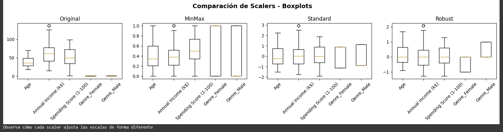

```python linenums="1"
# === COMPARAR DISTRIBUCIONES DE UNA VARIABLE ===
# Vamos a analizar 'Annual Income (k$)' en detalle
income_col_idx = 1  # Posición de Annual Income

fig, axes = plt.subplots(1, 4, figsize=(16, 4))
fig.suptitle('Annual Income: Original vs Scalers', fontsize=14, fontweight='bold')

# Original
axes[0].hist(X_raw.iloc[:, income_col_idx], bins=20, alpha=0.7, color='gray', edgecolor='black')
axes[0].set_title('Original')
axes[0].set_xlabel('Annual Income (k$)')

# Escalados
colors = ['#FF6B6B', '#4ECDC4', '#45B7D1']
for i, ((name, X_scaled_data), color) in enumerate(zip(X_scaled.items(), colors), 1):
    axes[i].hist(X_scaled_data[:, income_col_idx], bins=20, alpha=0.7, color=color, edgecolor='black')
    axes[i].set_title(f'{name}')
    axes[i].set_xlabel('Annual Income (escalado)')

plt.tight_layout()
plt.show()

print("¿Notas cómo cambia la forma de la distribución?")
```

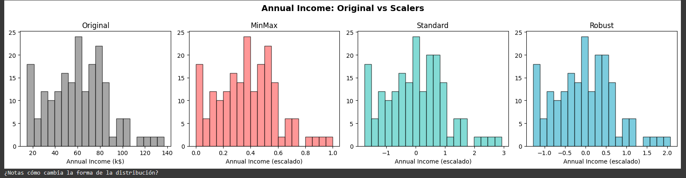

```python linenums="1"
# === ESTADÍSTICAS DESPUÉS DEL SCALING ===
print("ESTADÍSTICAS POST-SCALING (Annual Income):")

# Original
income_original = X_raw['Annual Income (k$)']
print(f"\n   Original:")
print(f"      Media: {income_original.mean():.1f}")
print(f"      Std:   {income_original.std():.1f}")
print(f"      Min:   {income_original.min():.1f}")
print(f"      Max:   {income_original.max():.1f}")

# Escalados
for name, X_scaled_data in X_scaled.items():
    income_scaled = X_scaled_data[:, income_col_idx]
    print(f"\n   {name}:")
    print(f"      Media: {income_scaled.mean():.3f}")
    print(f"      Std:   {income_scaled.std():.3f}")
    print(f"      Min:   {income_scaled.min():.3f}")
    print(f"      Max:   {income_scaled.max():.3f}")

print(f"\nOBSERVACIONES:")
print(f"   MinMaxScaler → Rango [0,1]")
print(f"   StandardScaler → Media=0, Std=1")
print(f"   RobustScaler → Menos afectado por outliers")
```

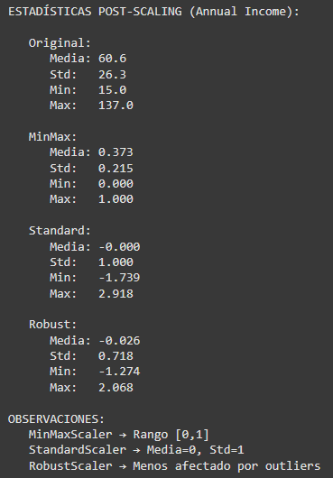

```python linenums="1"
# === IMPORT PARA CLUSTERING TEST ===
from sklearn.cluster import KMeans
from sklearn.metrics import silhouette_score

# === QUICK TEST: ¿Qué scaler funciona mejor para clustering? ===
print("QUICK TEST: Impacto en Clustering (K=4)")

clustering_results = {}
for name, X_scaled_data in X_scaled.items():
    # Aplicar K-Means con K=4
    kmeans = KMeans(n_clusters=4, random_state=42, n_init=10)  # Completar
    labels = kmeans.fit_predict(X_scaled_data)  # Método para obtener clusters

    # Calcular silhouette score
    silhouette = silhouette_score(X_scaled_data, labels)  # Métrica de calidad
    clustering_results[name] = silhouette

    print(f"   {name:>10}: Silhouette Score = {silhouette:.3f}")

# Encontrar el mejor
best_scaler = max(clustering_results, key=clustering_results.get)
best_score = clustering_results[best_scaler]

print(f"\nGANADOR: {best_scaler} (Score: {best_score:.3f})")
```

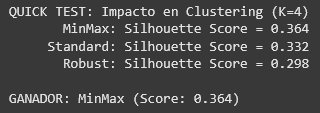

```python linenums="1"
# === TOMAR DECISIÓN BASADA EN RESULTADOS ===
print("DECISIÓN FINAL DEL SCALER:")

# Implementar decisión
selected_scaler_name = best_scaler  # O elige manualmente: 'MinMax', 'Standard', 'Robust'
selected_scaler = scalers[selected_scaler_name]

# Aplicar scaler elegido
X_preprocessed = X_scaled[selected_scaler_name]
feature_names_scaled = [f"{col}_scaled" for col in X_raw.columns]

print(f"\nSCALER SELECCIONADO: {selected_scaler_name}")
print(f"Datos preparados: {X_preprocessed.shape}")
print(f"Listo para PCA y Feature Selection")
```

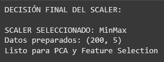

Breve análisis:

- Mejor scaler según silhouette: MinMax
- ¿Por qué crees que funcionó mejor? Debido a la poca cantidad de outliers presentes, y la manera en que manejo las variables de género puede haber sido superior a la de los otros scalers
- ¿Algún scaler tuvo problemas obvios? RobustScaler a pesar de resultar de manera similar a StandardScaler, tuvo altas distinciones en el manejo de las variables de género (y relacionado o no a esto), y resulto con el menor Silhouette score

```python linenums="1"
from sklearn.decomposition import PCA

# === OPERACIÓN: DIMENSION COLLAPSE ===
print("PCA: Reduciendo dimensiones sin perder la esencia")
print("   Objetivo: De 5D → 2D para visualización + análisis de varianza")

# 1. Aplicar PCA completo para análisis de varianza
pca_full = PCA()
X_pca_full = pca_full.fit_transform(X_preprocessed)

# 2. ANÁLISIS DE VARIANZA EXPLICADA
explained_variance_ratio = pca_full.explained_variance_ratio_
cumulative_variance = np.cumsum(explained_variance_ratio)

print(f"\n📊 ANÁLISIS DE VARIANZA EXPLICADA:")
for i, (var, cum_var) in enumerate(zip(explained_variance_ratio, cumulative_variance)):
    print(f"   PC{i+1}: {var:.3f} ({var*100:.1f}%) | Acumulada: {cum_var:.3f} ({cum_var*100:.1f}%)")

# 3. VISUALIZACIÓN DE VARIANZA EXPLICADA
fig, axes = plt.subplots(1, 2, figsize=(15, 6))

# Scree plot
axes[0].bar(range(1, len(explained_variance_ratio) + 1), explained_variance_ratio,
           alpha=0.7, color='#FF6B6B')
axes[0].set_xlabel('Componentes Principales')
axes[0].set_ylabel('Varianza Explicada')
axes[0].set_title('📊 Scree Plot - Varianza por Componente')
axes[0].set_xticks(range(1, len(explained_variance_ratio) + 1))

# Cumulative variance
axes[1].plot(range(1, len(cumulative_variance) + 1), cumulative_variance,
            marker='o', linewidth=2, markersize=8, color='#4ECDC4')
axes[1].axhline(y=0.95, color='red', linestyle='--', alpha=0.7, label='95% threshold')
axes[1].axhline(y=0.90, color='orange', linestyle='--', alpha=0.7, label='90% threshold')
axes[1].set_xlabel('Número de Componentes')
axes[1].set_ylabel('Varianza Acumulada')
axes[1].set_title('📈 Varianza Acumulada')
axes[1].legend()
axes[1].grid(True, alpha=0.3)
axes[1].set_xticks(range(1, len(cumulative_variance) + 1))

plt.tight_layout()
plt.show()

# 4. DECISIÓN SOBRE NÚMERO DE COMPONENTES
print(f"\n🎯 DECISIÓN DE COMPONENTES:")
n_components_90 = np.argmax(cumulative_variance >= 0.90) + 1
n_components_95 = np.argmax(cumulative_variance >= 0.95) + 1

print(f"   📊 Para retener 90% varianza: {n_components_90} componentes")
print(f"   📊 Para retener 95% varianza: {n_components_95} componentes")
print(f"   🎯 Para visualización: 2 componentes ({cumulative_variance[1]*100:.1f}% varianza)")

# 5. APLICAR PCA CON 2 COMPONENTES PARA VISUALIZACIÓN
pca_2d = PCA(n_components=2, random_state=42)
X_pca_2d = pca_2d.fit_transform(X_preprocessed)

print(f"\nPCA aplicado:")
print(f"   📊 Dimensiones: {X_preprocessed.shape} → {X_pca_2d.shape}")
print(f"   📈 Varianza explicada: {pca_2d.explained_variance_ratio_.sum()*100:.1f}%")

# 6. ANÁLISIS DE COMPONENTES PRINCIPALES
print(f"\n🔍 INTERPRETACIÓN DE COMPONENTES:")
feature_names = ['Age', 'Annual Income (k$)', 'Spending Score (1-100)', 'Genre_Female', 'Genre_Male']

for i, pc in enumerate(['PC1', 'PC2']):
    print(f"\n   {pc} (varianza: {pca_2d.explained_variance_ratio_[i]*100:.1f}%):")
    # Obtener los loadings (pesos de cada feature original en el componente)
    loadings = pca_2d.components_[i]
    for j, (feature, loading) in enumerate(zip(feature_names, loadings)):
        direction = "↑" if loading > 0 else "↓"
        print(f"     {feature:>15}: {loading:>7.3f} {direction}")

# 7. VISUALIZACIÓN EN 2D
plt.figure(figsize=(12, 8))
plt.scatter(X_pca_2d[:, 0], X_pca_2d[:, 1], alpha=0.6, s=50, color='#96CEB4')
plt.xlabel(f'PC1 ({pca_2d.explained_variance_ratio_[0]*100:.1f}% varianza)')
plt.ylabel(f'PC2 ({pca_2d.explained_variance_ratio_[1]*100:.1f}% varianza)')
plt.title('Mall Customers en Espacio PCA 2D')
plt.grid(True, alpha=0.3)
plt.axhline(y=0, color='black', linestyle='-', alpha=0.3)
plt.axvline(x=0, color='black', linestyle='-', alpha=0.3)
plt.tight_layout()
plt.show()
```

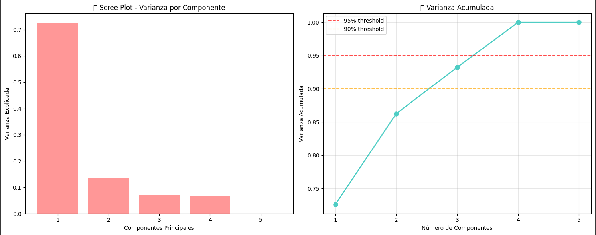

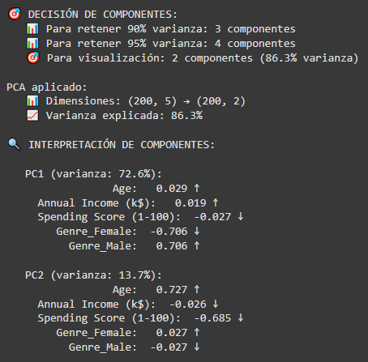

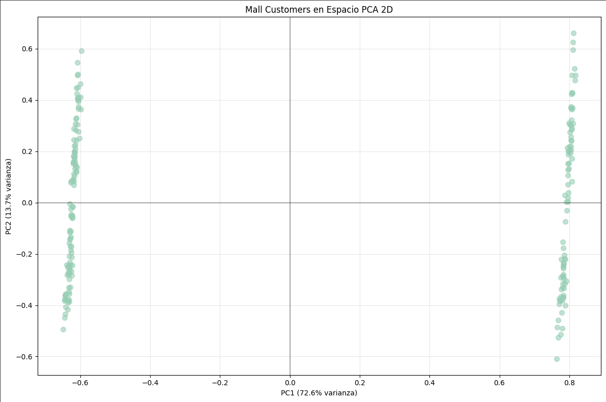

Interpretación del negocio:

- PC1 parece representar: Diferencia de género
- PC2 parece representar: Diferencia de edad y spending score
- Los clusters visibles sugieren: Segmentos separado por género y edad y spending score


```python linenums="1"
# === OPERACIÓN: FEATURE SELECTION SHOWDOWN ===
print("🎯 FEATURE SELECTION vs PCA: ¿Seleccionar o Transformar?")
print("   🎯 Objetivo: Comparar Forward/Backward Selection vs PCA")

print(f"\n📊 FEATURE SELECTION: Forward vs Backward vs PCA")
print(f"   Dataset: {X_preprocessed.shape[0]} muestras, {X_preprocessed.shape[1]} features")

# Setup: Función para evaluar features en clustering
def evaluate_features_for_clustering(X, n_clusters=4):
    """Evalúa qué tan buenas son las features para clustering usando Silhouette Score"""
    kmeans = KMeans(n_clusters=n_clusters, random_state=42, n_init=10)
    labels = kmeans.fit_predict(X)
    return silhouette_score(X, labels)

# === IMPORTS PARA ESTIMADORES PERSONALIZADOS ===
from sklearn.base import BaseEstimator, ClassifierMixin  # Clases base necesarias

# CLASE AUXILIAR: Estimador basado en KMeans para SequentialFeatureSelector
class ClusteringEstimator(BaseEstimator, ClassifierMixin):
    """Estimador que usa KMeans y Silhouette Score para feature selection"""
    def __init__(self, n_clusters=4):
        self.n_clusters = n_clusters

    def fit(self, X, y=None):
        self.kmeans_ = KMeans(n_clusters=self.n_clusters, random_state=42, n_init=10)
        self.labels_ = self.kmeans_.fit_predict(X)
        return self

    def score(self, X, y=None):
        # SequentialFeatureSelector llama a score() para evaluar features
        kmeans = KMeans(n_clusters=self.n_clusters, random_state=42, n_init=10)
        labels = kmeans.fit_predict(X)
        return silhouette_score(X, labels)

    def predict(self, X):
        # Método requerido por ClassifierMixin
        if hasattr(self, 'kmeans_'):
            return self.kmeans_.predict(X)
        else:
            # Si no está entrenado, entrenar primero
            kmeans = KMeans(n_clusters=self.n_clusters, random_state=42, n_init=10)
            return kmeans.fit_predict(X)

print("✅ Setup completado - Funciones de evaluación listas")
```

```python linenums="1"
# BASELINE: Todas las features
baseline_score = evaluate_features_for_clustering(X_preprocessed)
print(f"\n📊 BASELINE (todas las features): Silhouette = {baseline_score:.3f}")
print(f"   Este es el score con las {X_preprocessed.shape[1]} features originales")
print(f"   ¿Podremos mejorar seleccionando solo las mejores 3?")
```

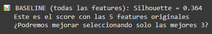

```python linenums="1"
# === FORWARD SELECTION (sklearn oficial) ===
print(f"\n🔄 FORWARD SELECTION (sklearn oficial):")
print(f"   Estrategia: Empezar con 0 features, agregar la mejor en cada paso")

forward_selector = SequentialFeatureSelector(
    estimator=ClusteringEstimator(n_clusters=4),  # Estimador que implementa fit() y score()
    n_features_to_select=3,
    direction='forward',  # ¿Qué dirección para Forward?
    cv=3,
    n_jobs=-1
)

forward_selector.fit(X_preprocessed)  # Método para entrenar
forward_mask = forward_selector.get_support()  # Método para obtener máscara booleana
X_forward = X_preprocessed[:, forward_mask]
forward_features = np.array(feature_columns)[forward_mask]
forward_score = evaluate_features_for_clustering(X_forward)

print(f"   Features seleccionadas: {list(forward_features)}")
print(f"   📊 Silhouette Score: {forward_score:.3f}")
print(f"   {'✅ Mejora!' if forward_score > baseline_score else '❌ Sin mejora'}")
```

```python linenums="1"
# === FORWARD SELECTION (sklearn oficial) ===
print(f"\n🔄 FORWARD SELECTION (sklearn oficial):")
print(f"   Estrategia: Empezar con 0 features, agregar la mejor en cada paso")

forward_selector = SequentialFeatureSelector(
    estimator=ClusteringEstimator(n_clusters=4),  # Estimador que implementa fit() y score()
    n_features_to_select=3,
    direction='forward',  # ¿Qué dirección para Forward?
    cv=3,
    n_jobs=-1
)

forward_selector.fit(X_preprocessed)  # Método para entrenar
forward_mask = forward_selector.get_support()  # Método para obtener máscara booleana
X_forward = X_preprocessed[:, forward_mask]
forward_features = np.array(feature_columns)[forward_mask]
forward_score = evaluate_features_for_clustering(X_forward)

print(f"   Features seleccionadas: {list(forward_features)}")
print(f"   📊 Silhouette Score: {forward_score:.3f}")
print(f"   {'✅ Mejora!' if forward_score > baseline_score else '❌ Sin mejora'}")
```

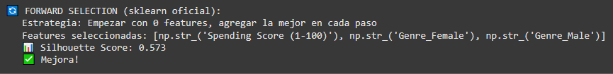

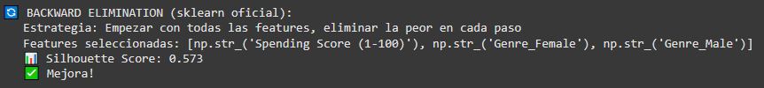

```python linenums="1"
# === COMPARACIÓN FINAL DE TODOS LOS MÉTODOS ===
print(f"\n📊 COMPARACIÓN DE MÉTODOS:")
print(f"   🏁 Baseline (todas): {baseline_score:.3f}")
print(f"   🔄 Forward Selection: {forward_score:.3f}")
print(f"   🔙 Backward Elimination: {backward_score:.3f}")

# Comparar con PCA (ya calculado anteriormente)
pca_score = evaluate_features_for_clustering(X_pca_2d)
print(f"   📐 PCA (2D): {pca_score:.3f}")

# Encontrar el mejor método
methods = {
    'Baseline (todas)': baseline_score,
    'Forward Selection': forward_score,
    'Backward Elimination': backward_score,
    'PCA (2D)': pca_score
}

best_method = max(methods, key=methods.get)
best_score = methods[best_method]

print(f"\n🏆 GANADOR: {best_method} con score = {best_score:.3f}")

# Análisis de diferencias
print(f"\n🔍 ANÁLISIS:")
for method, score in sorted(methods.items(), key=lambda x: x[1], reverse=True):
    improvement = ((score - baseline_score) / baseline_score) * 100
    print(f"   {method}: {score:.3f} ({improvement:+.1f}% vs baseline)")
```

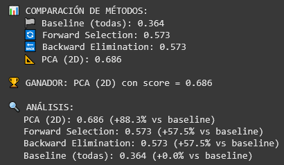

```python linenums="1"
# === VISUALIZACIÓN DE COMPARACIÓN ===
methods_names = ['Baseline', 'Forward', 'Backward', 'PCA 2D']
scores_values = [baseline_score, forward_score, backward_score, pca_score]
colors = ['#FF6B6B', '#4ECDC4', '#45B7D1', '#96CEB4']

plt.figure(figsize=(12, 6))
bars = plt.bar(methods_names, scores_values, color=colors, alpha=0.7)
plt.ylabel('Silhouette Score')
plt.title('Comparación de Métodos de Feature Selection')
plt.axhline(y=0.5, color='red', linestyle='--', alpha=0.5, label='Threshold Aceptable (0.5)')
plt.axhline(y=0.7, color='green', linestyle='--', alpha=0.5, label='Threshold Muy Bueno (0.7)')
plt.legend()
plt.grid(True, alpha=0.3, axis='y')

# Añadir valores en las barras
for bar, score in zip(bars, scores_values):
    plt.text(bar.get_x() + bar.get_width()/2, bar.get_height() + 0.01,
             f'{score:.3f}', ha='center', va='bottom', fontweight='bold')

plt.tight_layout()
plt.show()
```

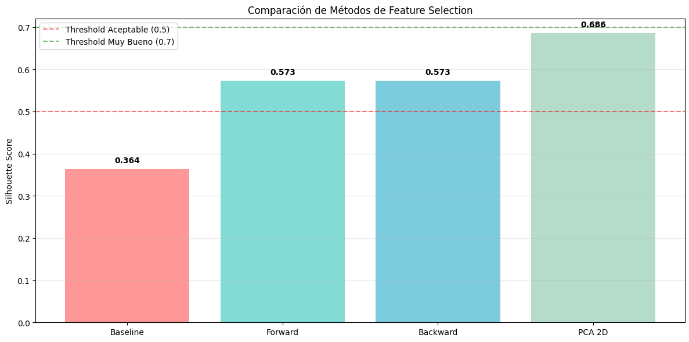

```python linenums="1"
# === ANÁLISIS DE RESULTADOS ===
print(f"\n🎯 ANÁLISIS DE RESULTADOS:")

# Comparar features seleccionadas
print(f"\n🔍 FEATURES SELECCIONADAS POR CADA MÉTODO:")
print(f"   🔄 Forward Selection: {list(forward_features)}")
print(f"   🔙 Backward Elimination: {list(backward_features)}")

# Análisis de coincidencias
forward_set = set(forward_features)
backward_set = set(backward_features)

common_forward_backward = forward_set & backward_set

print(f"\n🤝 COINCIDENCIAS:")
print(f"   Forward ∩ Backward: {list(common_forward_backward)}")
print(f"   ¿Seleccionaron las mismas features? {'Sí' if forward_set == backward_set else 'No'}")
```

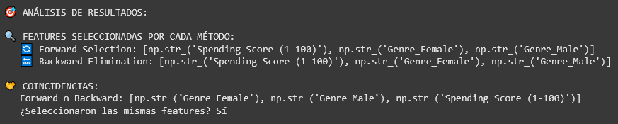

Preguntas de análisis:

- Método con mejor score: PCA
- ¿Forward y Backward seleccionaron exactamente las mismas features? Sí
- ¿PCA con 2 componentes es competitivo? Sí, superando tanto la baseline como a forward y backward selection
- ¿Algún método superó el threshold de 0.5? PCA, forward y backward
- ¿La reducción de dimensionalidad mejoró el clustering? Sí

```python linenums="1"
# === DECISIÓN PARA EL ANÁLISIS FINAL ===
print(f"\n🏢 DECISIÓN PARA EL ANÁLISIS:")

# Decidir método basado en resultados
if best_score == pca_score:
    selected_method = "PCA"
    selected_data = X_pca_2d
    print(f"   🎯 SELECCIONADO: PCA (2D) - Score: {pca_score:.3f}")
    print(f"   ✅ RAZÓN: Mejor balance entre reducción dimensional y performance")
elif best_score == forward_score:
    selected_method = "Forward Selection"
    selected_data = X_forward
    print(f"   🎯 SELECCIONADO: Forward Selection - Score: {forward_score:.3f}")
    print(f"   ✅ RAZÓN: Mejor score con features interpretables")
elif best_score == backward_score:
    selected_method = "Backward Elimination"
    selected_data = X_backward
    print(f"   🎯 SELECCIONADO: Backward Elimination - Score: {backward_score:.3f}")
    print(f"   ✅ RAZÓN: Mejor score eliminando features redundantes")
else:
    # Fallback to baseline if needed
    selected_method = "Baseline (todas las features)"
    selected_data = X_preprocessed
    print(f"   🎯 SELECCIONADO: Baseline - Score: {baseline_score:.3f}")
    print(f"   ✅ RAZÓN: Ningún método de reducción mejoró el clustering")

# Guardar para clustering final
X_final_for_clustering = selected_data
final_method_name = selected_method

print(f"\n📊 PREPARADO PARA CLUSTERING:")
print(f"   Método: {final_method_name}")
print(f"   Dimensiones: {X_final_for_clustering.shape}")
print(f"   Silhouette Score: {best_score:.3f}")
```

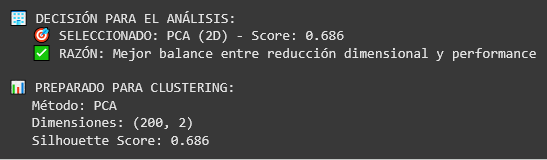

### 4. Modelado y clustering

```python linenums="1"
# === OPERACIÓN: CUSTOMER SEGMENTATION DISCOVERY ===
print("K-MEANS CLUSTERING: Descubriendo segmentos de clientes")
print(f"   Dataset: {X_final_for_clustering.shape} usando método '{final_method_name}'")

# 1. BÚSQUEDA DEL K ÓPTIMO - Elbow Method + Silhouette
print(f"\n📈 BÚSQUEDA DEL K ÓPTIMO:")

k_range = range(2, 9)
inertias = []
silhouette_scores = []

for k in k_range:
    # Aplicar K-Means
    kmeans = KMeans(n_clusters=k, random_state=42, n_init=10)
    labels = kmeans.fit_predict(X_final_for_clustering)

    # Calcular métricas
    inertias.append(kmeans.inertia_)
    sil_score = silhouette_score(X_final_for_clustering, labels)
    silhouette_scores.append(sil_score)

    print(f"   K={k}: Inertia={kmeans.inertia_:.2f}, Silhouette={sil_score:.3f}")

# 2. VISUALIZACIÓN ELBOW METHOD + SILHOUETTE
fig, axes = plt.subplots(1, 2, figsize=(15, 6))

# Elbow Method
axes[0].plot(k_range, inertias, marker='o', linewidth=2, markersize=8, color='#FF6B6B')
axes[0].set_xlabel('Número de Clusters (K)')
axes[0].set_ylabel('Inertia (WCSS)')
axes[0].set_title('📈 Elbow Method')
axes[0].grid(True, alpha=0.3)
axes[0].set_xticks(k_range)

# Silhouette Scores
axes[1].plot(k_range, silhouette_scores, marker='s', linewidth=2, markersize=8, color='#4ECDC4')
axes[1].axhline(y=0.5, color='orange', linestyle='--', alpha=0.7, label='Aceptable (0.5)')
axes[1].axhline(y=0.7, color='green', linestyle='--', alpha=0.7, label='Muy Bueno (0.7)')
axes[1].set_xlabel('Número de Clusters (K)')
axes[1].set_ylabel('Silhouette Score')
axes[1].set_title('📊 Silhouette Analysis')
axes[1].legend()
axes[1].grid(True, alpha=0.3)
axes[1].set_xticks(k_range)

plt.tight_layout()
plt.show()

# 3. ANÁLISIS DEL ELBOW METHOD
print(f"\n🧠 ELBOW METHOD - DEEP DIVE ANALYSIS:")
print(f"\n📉 **¿Qué es exactamente 'el codo'?**")
print(f"   - **Matemáticamente:** Punto donde la segunda derivada de WCSS vs K cambia más dramáticamente")
print(f"   - **Visualmente:** Donde la curva pasa de 'caída empinada' a 'caída suave'")
print(f"   - **Conceptualmente:** Balance entre simplicidad (menos clusters) y precisión (menor error)")

# Calcular diferencias para encontrar el codo
differences = np.diff(inertias)
second_differences = np.diff(differences)
elbow_candidate = k_range[np.argmin(second_differences) + 2]  # +2 por los dos diff()

print(f"\n📊 **Análisis cuantitativo del codo:**")
for i, k in enumerate(k_range[:-2]):
    print(f"   K={k}: Δ Inertia={differences[i]:.2f}, Δ²={second_differences[i]:.2f}")

print(f"\n🎯 **Candidato por Elbow Method:** K={elbow_candidate}")

# 4. DECISIÓN FINAL DE K
best_k_silhouette = k_range[np.argmax(silhouette_scores)]
print(f"🎯 **Candidato por Silhouette:** K={best_k_silhouette} (score={max(silhouette_scores):.3f})")

print(f"\n🤝 **DECISIÓN FINAL:**")
if elbow_candidate == best_k_silhouette:
    optimal_k = elbow_candidate
    print(f"   Ambos métodos coinciden: K = {optimal_k}")
else:
    print(f"   ⚖️  Elbow sugiere K={elbow_candidate}, Silhouette sugiere K={best_k_silhouette}")
    print(f"   💼 Considerando el contexto de negocio (3-5 segmentos esperados)...")
    # Elegir basado en contexto de negocio y calidad
    if 3 <= best_k_silhouette <= 5 and max(silhouette_scores) > 0.4:
        optimal_k = best_k_silhouette
        print(f"   Elegimos K = {optimal_k} (mejor silhouette + contexto negocio)")
    else:
        optimal_k = elbow_candidate if 3 <= elbow_candidate <= 5 else 4
        print(f"   Elegimos K = {optimal_k} (balance elbow + contexto negocio)")

# 5. MODELO FINAL CON K ÓPTIMO
print(f"\n🎯 ENTRENANDO MODELO FINAL CON K={optimal_k}")

final_kmeans = KMeans(n_clusters=optimal_k, random_state=42, n_init=20)
final_labels = final_kmeans.fit_predict(X_final_for_clustering)
final_silhouette = silhouette_score(X_final_for_clustering, final_labels)

print(f"Modelo entrenado:")
print(f"   📊 Silhouette Score: {final_silhouette:.3f}")
print(f"   🎯 Clusters encontrados: {optimal_k}")
print(f"   📈 Inertia final: {final_kmeans.inertia_:.2f}")

# 6. DISTRIBUCIÓN DE CLIENTES POR CLUSTER
cluster_counts = pd.Series(final_labels).value_counts().sort_index()
print(f"\n👥 DISTRIBUCIÓN DE CLIENTES:")
for cluster_id, count in cluster_counts.items():
    percentage = (count / len(final_labels)) * 100
    print(f"   Cluster {cluster_id}: {count:,} clientes ({percentage:.1f}%)")

# 7. AGREGAR CLUSTERS AL DATAFRAME ORIGINAL
df_customers['cluster'] = final_labels
df_customers['cluster_name'] = df_customers['cluster'].map({
    i: f"Cluster_{i}" for i in range(optimal_k)
})

print(f"\nClusters asignados al dataset original")
```

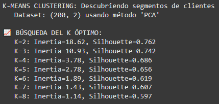

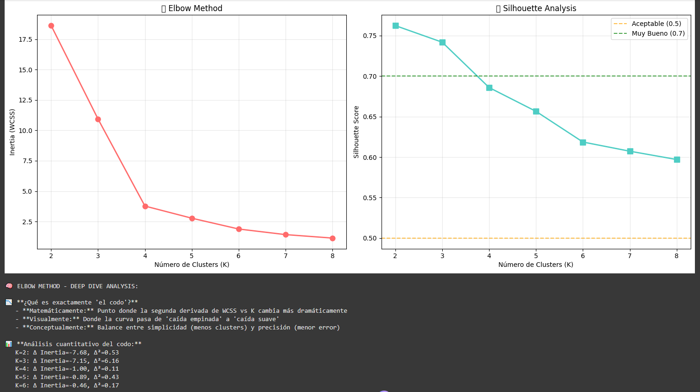


### 5. Evaluación y resumen

```python linenums="1"
# === OPERACIÓN: INTELLIGENCE REPORT ===
print("ANALISIS DE SEGMENTOS DE CLIENTES - REPORTE EJECUTIVO")

# 1. PERFILES DE CLUSTERS
print(f"\nPERFILES DETALLADOS POR CLUSTER:")

for cluster_id in sorted(df_customers['cluster'].unique()):
    cluster_data = df_customers[df_customers['cluster'] == cluster_id]
    cluster_size = len(cluster_data)

    print(f"\n**CLUSTER {cluster_id}** ({cluster_size} clientes, {cluster_size/len(df_customers)*100:.1f}%)")

    # Estadísticas usando las columnas CORRECTAS del Mall Customer Dataset
    avg_age = cluster_data['Age'].mean()
    avg_income = cluster_data['Annual Income (k$)'].mean()
    avg_spending = cluster_data['Spending Score (1-100)'].mean()

    # Distribución por género
    genre_counts = cluster_data['Genre'].value_counts()

    print(f"   **Perfil Demográfico:**")
    print(f"      Edad promedio: {avg_age:.1f} años")
    print(f"      Distribución género: {dict(genre_counts)}")

    print(f"   **Perfil Financiero:**")
    print(f"      Ingreso anual: ${avg_income:.1f}k")
    print(f"      Spending Score: {avg_spending:.1f}/100")

    # Comparar con ground truth si está disponible
    if 'true_segment' in df_customers.columns:
        true_segments_in_cluster = cluster_data['true_segment'].value_counts()
        dominant_segment = true_segments_in_cluster.index[0]
        purity = true_segments_in_cluster.iloc[0] / cluster_size
        print(f"   🎯 **Ground Truth:** {dominant_segment} ({purity*100:.1f}% purity)")

# 2. MATRIZ DE CONFUSIÓN CON GROUND TRUTH
if 'true_segment' in df_customers.columns:
    print(f"\n🎯 VALIDACIÓN CON GROUND TRUTH:")
    confusion_matrix = pd.crosstab(df_customers['true_segment'], df_customers['cluster'],
                                  margins=True, margins_name="Total")
    print(confusion_matrix)

    # Calcular pureza de clusters
    cluster_purities = []
    for cluster_id in sorted(df_customers['cluster'].unique()):
        cluster_data = df_customers[df_customers['cluster'] == cluster_id]
        dominant_true_segment = cluster_data['true_segment'].mode().iloc[0]
        purity = (cluster_data['true_segment'] == dominant_true_segment).mean()
        cluster_purities.append(purity)

    average_purity = np.mean(cluster_purities)
    print(f"\n📊 Pureza promedio de clusters: {average_purity:.3f}")

# 3. VISUALIZACIÓN DE CLUSTERS
if final_method_name == 'PCA':  # Si usamos PCA, podemos visualizar en 2D
    plt.figure(figsize=(15, 10))

    # Subplot 1: Clusters encontrados
    plt.subplot(2, 2, 1)
    colors = ['#FF6B6B', '#4ECDC4', '#45B7D1', '#96CEB4', '#FFEAA7']
    for cluster_id in sorted(df_customers['cluster'].unique()):
        cluster_mask = final_labels == cluster_id
        plt.scatter(X_pca_2d[cluster_mask, 0], X_pca_2d[cluster_mask, 1],
                   c=colors[cluster_id % len(colors)], label=f'Cluster {cluster_id}',
                   alpha=0.7, s=50)

    # Plotear centroides
    if final_method_name == 'PCA':
        centroids_pca = final_kmeans.cluster_centers_
        plt.scatter(centroids_pca[:, 0], centroids_pca[:, 1],
                   c='red', marker='X', s=200, linewidths=3, label='Centroides')

    plt.xlabel('PC1')
    plt.ylabel('PC2')
    plt.title('Clusters Descubiertos (PCA 2D)')
    plt.legend()
    plt.grid(True, alpha=0.3)

    # Subplot 2: Ground truth (si disponible)
    if 'true_segment' in df_customers.columns:
        plt.subplot(2, 2, 2)
        true_segment_colors = {'VIP': '#FF6B6B', 'Regular': '#4ECDC4',
                              'Occasional': '#45B7D1', 'At_Risk': '#96CEB4'}
        for segment, color in true_segment_colors.items():
            segment_mask = df_customers['true_segment'] == segment
            segment_indices = df_customers[segment_mask].index
            plt.scatter(X_pca_2d[segment_indices, 0], X_pca_2d[segment_indices, 1],
                       c=color, label=segment, alpha=0.7, s=50)

        plt.xlabel('PC1')
        plt.ylabel('PC2')
        plt.title('Ground Truth Segments')
        plt.legend()
        plt.grid(True, alpha=0.3)

    # Subplot 3: Feature distribution by cluster
    plt.subplot(2, 2, 3)
    # Usar las columnas correctas del Mall Customer Dataset
    cluster_means = df_customers.groupby('cluster')[['Age', 'Annual Income (k$)', 'Spending Score (1-100)']].mean()
    cluster_means.plot(kind='bar', ax=plt.gca(), color=['#FF6B6B', '#4ECDC4', '#45B7D1'])
    plt.title('Perfil Promedio por Cluster')
    plt.ylabel('Valor Promedio')
    plt.legend(title='Características', bbox_to_anchor=(1.05, 1), loc='upper left')
    plt.xticks(rotation=0)

    # Subplot 4: Cluster sizes
    plt.subplot(2, 2, 4)
    cluster_sizes = df_customers['cluster'].value_counts().sort_index()
    colors_subset = [colors[i] for i in cluster_sizes.index]
    bars = plt.bar(cluster_sizes.index, cluster_sizes.values, color=colors_subset, alpha=0.7)
    plt.xlabel('Cluster ID')
    plt.ylabel('Número de Clientes')
    plt.title('Distribución de Clientes por Cluster')

    # Añadir etiquetas en las barras
    for bar, size in zip(bars, cluster_sizes.values):
        plt.text(bar.get_x() + bar.get_width()/2, bar.get_height() + 10,
                f'{size}\n({size/len(df_customers)*100:.1f}%)',
                ha='center', va='bottom')

plt.tight_layout()
plt.show()
```

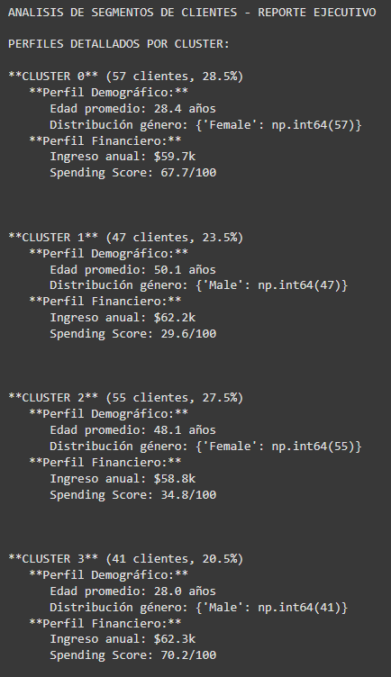

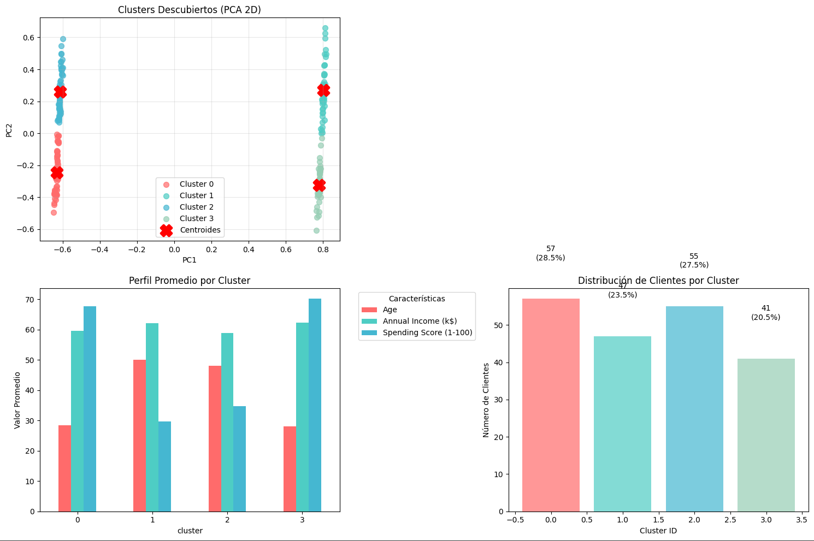

```python linenums="1"
# === ANÁLISIS SILHOUETTE POR CLUSTER ===
print(f"\n📊 ANÁLISIS SILHOUETTE DETALLADO:")

from sklearn.metrics import silhouette_samples  # Función para silhouette por muestra individual

# Calcular silhouette score por muestra
sample_silhouette_values = silhouette_samples(X_final_for_clustering, final_labels)

# Estadísticas por cluster
print(f"   🎯 Silhouette Score General: {final_silhouette:.3f}")
for cluster_id in sorted(df_customers['cluster'].unique()):
    cluster_silhouette_values = sample_silhouette_values[final_labels == cluster_id]
    cluster_avg_silhouette = cluster_silhouette_values.mean()
    cluster_min_silhouette = cluster_silhouette_values.min()

    print(f"   Cluster {cluster_id}: μ={cluster_avg_silhouette:.3f}, "
          f"min={cluster_min_silhouette:.3f}, "
          f"samples={len(cluster_silhouette_values)}")
```

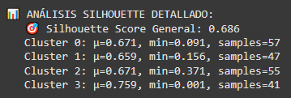

```python linenums="1"
# === DETECCIÓN DE OUTLIERS EN CLUSTERING ===
print(f"\n🚨 DETECCIÓN DE OUTLIERS EN CLUSTERING:")
outlier_threshold = 0.0  # Silhouette negativo = mal asignado

for cluster_id in sorted(df_customers['cluster'].unique()):
    cluster_mask = final_labels == cluster_id
    cluster_silhouette = sample_silhouette_values[cluster_mask]
    outliers = np.sum(cluster_silhouette < outlier_threshold)

    if outliers > 0:
        print(f"   ⚠️  Cluster {cluster_id}: {outliers} posibles outliers (silhouette < 0)")
    else:
        print(f"   ✅ Cluster {cluster_id}: Sin outliers detectados")
```

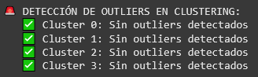

```python linenums="1"
# === ANÁLISIS DE PERFILES POR CLUSTER ===
print(f"\nANALISIS DE SEGMENTOS DE CLIENTES - REPORTE EJECUTIVO")
print(f"\nPERFILES DETALLADOS POR CLUSTER:")

# Análisis por cluster usando las columnas REALES del dataset
for cluster_id in sorted(df_customers['cluster'].unique()):
    cluster_data = df_customers[df_customers['cluster'] == cluster_id]
    cluster_size = len(cluster_data)
    cluster_pct = (cluster_size / len(df_customers)) * 100

    # Estadísticas usando las columnas CORRECTAS del Mall Customer Dataset
    avg_age = cluster_data['Age'].mean()
    avg_income = cluster_data['Annual Income (k$)'].mean()
    avg_spending = cluster_data['Spending Score (1-100)'].mean()

    # Distribución por género
    genre_counts = cluster_data['Genre'].value_counts()

    print(f"\n🏷️  **CLUSTER {cluster_id}** ({cluster_size} clientes, {cluster_pct:.1f}%)")
    print(f"   📊 **Perfil Demográfico:**")
    print(f"      👤 Edad promedio: {avg_age:.1f} años")
    print(f"      👥 Distribución género: {dict(genre_counts)}")

    print(f"   💰 **Perfil Financiero:**")
    print(f"      💵 Ingreso anual: ${avg_income:.1f}k")
    print(f"      🛍️  Spending Score: {avg_spending:.1f}/100")
```

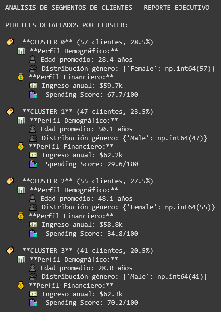

### Preguntas posteriores

- ¿Qué fase fue más desafiante y por qué? _


- ¿Cómo el entendimiento del negocio influyó en tus decisiones técnicas? _

Al no llegar a un acuerdo del K óptimo con el Elbow Method y Silhouette, se tomó una
decisión en base a la solicitud del negocio de manter los segmentos entre 3 y 5, y no
usó simplemente el Elbow Method o el Silhouette sino un promedio de los dos, cuyo 
resultado entraba en el rango anterior.

- ¿Qué scaler funcionó mejor y por qué? _


- ¿PCA o Feature Selection fue más efectivo para tu caso? _

En este caso, PCA fue más efectivo que ambos Feature Selection con un márgen de
+0.113 en base al Silhouette Score.

- ¿Cómo balanceaste interpretabilidad vs performance? _


- ¿El Elbow Method y Silhouette coincidieron en el K óptimo?

No, el Elbow Method proponía un número de mayor de clusters, mientras que en base
al Silhouette Score se proponía sólo un par. Tomando en cuenta el contexto de negocio,
se llegó al resultado intermedio de 4 clusters.

- ¿Los clusters encontrados coinciden con la intuición de negocio? _


- ¿Qué harías diferente si fueras a repetir el análisis? _


- ¿Cómo presentarías estos resultados en un contexto empresarial? _


- ¿Qué valor aportan estas segmentaciones? _


- ¿Qué limitaciones tiene este análisis? _


## Evidencias
- [Link al Colab](https://colab.research.google.com/drive/1CF5oHvPmK4o1lfW5oue_HXQhEuPSry79?usp=sharing)

## Reflexión
- Qué aprendiste, qué mejorarías, próximos pasos

## Referencias
- Fuentes consultadas con enlaces relativos cuando corresponda