# Entrada 06 — De Perceptrón a Redes Neuronales MLP

## Contexto
En este artículo retornaremos al pasado y veremos el perceptrón en su forma más básica y sus
limitaciones, luego veremos su evolución en las redes de perceptrones multicapa (MLP) y como
estas son capaces de superar a sus predecesores en sus limitantes. Adicionalmente, veremos 
como se puede aplicar una MLP para resolver un posible problema real.

## Objetivos
- Descubrir las limitaciones del perceptrón simple (problema XOR)
- Resolver problemas reales con redes multicapa (sklearn MLP)
- Implementar redes neuronales profesionales (TensorFlow/PyTorch Lightning)
- Entender cuándo usar cada herramienta

## Actividades (con tiempos estimados)
- Explorando el perceptrón — 15 min
- Explorando las redes MLP — 20 min
- MLP en problema real — 35 min

## Desarrollo

### 1. Explorando el perceptrón

Primeramente, creamos una función de perceptrón básica (junto con una función de gráfica) 
con 2 entradas que utilizaremos para resolver las operaciones básicas de AND, OR, NOT 
y la operación XOR.

```python linenums="1"
import numpy as np
import matplotlib.pyplot as plt

# Función perceptrón básica
def perceptron(x1, x2, w1, w2, bias):
    return 1 if (w1*x1 + w2*x2 + bias) >= 0 else 0

# Función para visualizar el perceptrón
def graficar_perceptron(w1, w2, bias, datos, resultados_esperados, titulo):
    plt.figure(figsize=(8, 6))

    # Graficar puntos
    for i, (x1, x2) in enumerate(datos):
        color = 'red' if resultados_esperados[i] == 0 else 'blue'
        marker = 'o' if resultados_esperados[i] == 0 else 's'
        plt.scatter(x1, x2, c=color, s=200, marker=marker,
                   edgecolor='black', linewidth=2)
        plt.text(x1+0.05, x2+0.05, f'({x1},{x2})', fontsize=12)

    # Graficar línea de separación: w1*x1 + w2*x2 + bias = 0
    if w2 != 0:  # Para evitar división por cero
        x_line = np.linspace(-0.5, 1.5, 100)
        y_line = -(w1*x_line + bias) / w2
        plt.plot(x_line, y_line, 'green', linewidth=3, alpha=0.8,
                label=f'Línea: {w1:.1f}x₁ + {w2:.1f}x₂ + {bias:.1f} = 0')

    plt.xlim(-0.3, 1.3)
    plt.ylim(-0.3, 1.3)
    plt.xlabel('x1', fontsize=14)
    plt.ylabel('x2', fontsize=14)
    plt.title(titulo, fontsize=16)
    plt.legend()
    plt.grid(True, alpha=0.3)
    plt.show()

    print(f"🔍 Interpretación: Los puntos ROJOS (○) son clase 0, los AZULES (■) son clase 1")
    print(f"   La línea VERDE separa las clases. ¿Lo logra perfectamente?")
    print(f"💡 Recordá: Un perceptrón es la ecuación de una línea: y = w₁x₁ + w₂x₂ + b")

# Datos para lógica booleana
datos = np.array([[0,0], [0,1], [1,0], [1,1]])
print("🧠 Vamos a entrenar un perceptrón para lógica booleana")
print("   (¡Y ver cómo funciona visualmente!)")
```


#### Resolvemos el problema del AND :+1:

```python linenums="1"
# === LÓGICA AND ===
print("\n1️⃣ PROBLEMA AND: Solo verdadero cuando AMBAS entradas son 1")
print("x1 | x2 | AND esperado")
print(" 0 |  0 |      0")
print(" 0 |  1 |      0")
print(" 1 |  0 |      0")
print(" 1 |  1 |      1")  # estudiantes completan

# Encontremos pesos que funcionen para AND
w1, w2, bias = 0.5, 0.5, -0.6  # pesos iguales, ¿qué bias?

print(f"\nProbando AND con pesos: w1={w1}, w2={w2}, bias={bias}")
resultados_and = [0, 0, 0, 1]

for i, (x1, x2) in enumerate(datos):
    prediccion = perceptron(x1, x2, w1, w2, bias)
    esperado = resultados_and[i]
    ok = "✅" if prediccion == esperado else "❌"
    print(f"  {x1},{x2} → {prediccion} (esperado {esperado}) {ok}")

# 📊 VISUALIZACIÓN AND
graficar_perceptron(w1, w2, bias, datos, resultados_and, "Perceptrón AND")
```

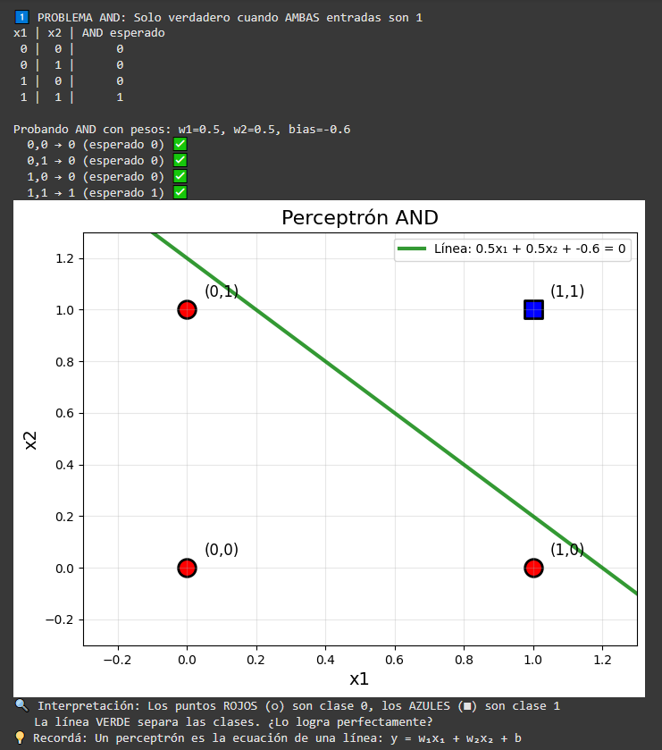

Como podemos ver, con w1 y w2 = 1/2 y bias = -0.6, logramos la recta x<sub>1</sub>/2 + x<sub>2</sub>/2 - 0.6 = 0,
que pasa por encima de los puntos (0,1) y (1,0) pero no por encima de (1,1).


#### Resolvemos el problema del OR :+1:

```python linenums="1"
# === LÓGICA OR ===
print("\n2️⃣ PROBLEMA OR: Verdadero cuando AL MENOS UNA entrada es 1")
print("x1 | x2 | OR esperado")
print(" 0 |  0 |      0")
print(" 0 |  1 |      1")
print(" 1 |  0 |      1")
print(" 1 |  1 |      1")

# Para OR necesitamos ser más permisivos
w1, w2, bias = 0.5, 0.5, -0.4  # ¿qué bias permite que una sola entrada active?

print(f"\nProbando OR con pesos: w1={w1}, w2={w2}, bias={bias}")
resultados_or = [0, 1, 1, 1]

for i, (x1, x2) in enumerate(datos):
    prediccion = perceptron(x1, x2, w1, w2, bias)
    esperado = resultados_or[i]
    ok = "✅" if prediccion == esperado else "❌"
    print(f"  {x1},{x2} → {prediccion} (esperado {esperado}) {ok}")

# 📊 VISUALIZACIÓN OR
graficar_perceptron(w1, w2, bias, datos, resultados_or, "Perceptrón OR")
```

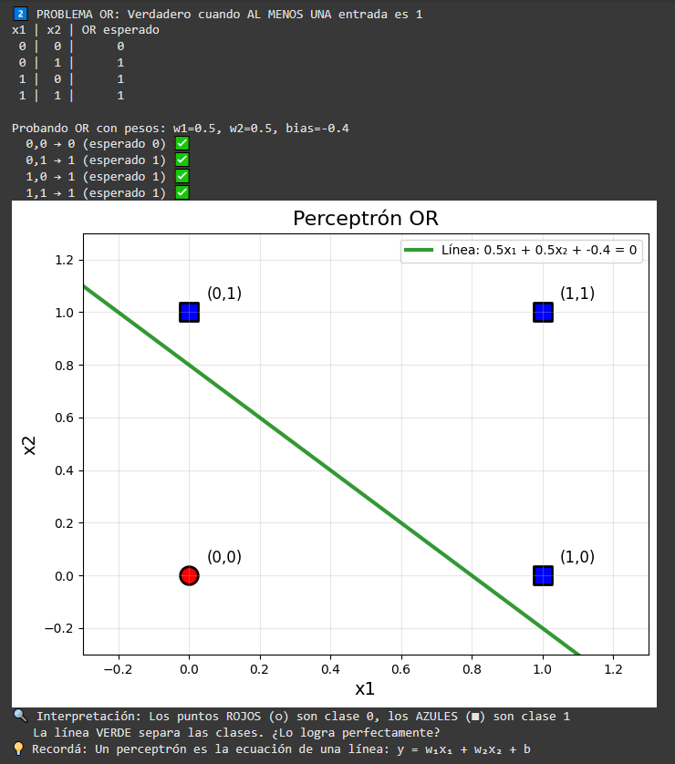

Como podemos ver, con w1 y w2 = 1/2 y bias = -0.4, logramos la recta x<sub>1</sub>/2 + x<sub>2</sub>/2 - 0.4 = 0,
que pasa por debajo de los puntos (0,1) y (1,0) pero no por debajo de (0,0).


#### Resolvemos el problema del NOT :+1:

```python linenums="1"
# === LÓGICA NOT (1 entrada) ===
print("\n3️⃣ PROBLEMA NOT: Inversor simple")
datos_not = np.array([[0], [1]])
print("x | NOT esperado")
print("0 |      1")
print("1 |      0")

# Para NOT: cuando x=0 → salida=1, cuando x=1 → salida=0
w1, bias = -0.5, 0.25  # peso negativo + bias positivo

print(f"\nProbando NOT con peso: w1={w1}, bias={bias}")
resultados_not = [1, 0]

for i, x in enumerate([0, 1]):
    prediccion = perceptron(x, 0, w1, 0, bias)
    esperado = resultados_not[i]
    ok = "✅" if prediccion == esperado else "❌"
    print(f"  {x} → {prediccion} (esperado {esperado}) {ok}")

print("🎉 ¡NOT también funciona! El perceptrón es genial...")

# 📊 VISUALIZACIÓN NOT (1D)
def graficar_not(w1, bias):
    plt.figure(figsize=(8, 4))

    # Puntos NOT
    puntos_x = [0, 1]
    puntos_y = [1, 0]  # NOT: 0→1, 1→0
    colores = ['blue', 'red']  # 1→azul, 0→rojo

    plt.scatter(puntos_x, [0, 0], c=colores, s=300, edgecolor='black', linewidth=2)
    for i, (x, y) in enumerate(zip(puntos_x, puntos_y)):
        plt.text(x, 0.05, f'x={x}\nNOT={y}', ha='center', fontsize=12)

    # Línea de decisión: w1*x + bias = 0 → x = -bias/w1
    umbral = -bias/w1 if w1 != 0 else 0
    plt.axvline(x=umbral, color='green', linewidth=3, alpha=0.8,
               label=f'Umbral: x = {umbral:.2f}')
    plt.text(umbral+0.1, 0.15, f'Línea de\nseparación', fontsize=10)

    plt.xlim(-0.5, 1.5)
    plt.ylim(-0.1, 0.2)
    plt.xlabel('Entrada x', fontsize=14)
    plt.title(f'Perceptrón NOT: {w1:.1f}x + {bias:.1f} = 0', fontsize=16)
    plt.legend()
    plt.grid(True, alpha=0.3)
    plt.show()

    print(f"🔍 El umbral está en x = {umbral:.2f}")
    print(f"   Si x < {umbral:.2f} → salida 1 (azul)")
    print(f"   Si x > {umbral:.2f} → salida 0 (rojo)")

graficar_not(w1, bias)
```

!!! note "Nota"
    Nótese que como el NOT requiere sólo una entrada, seteamos x2 y w2 = 0 para utilizar la
    misma función perceptrón.

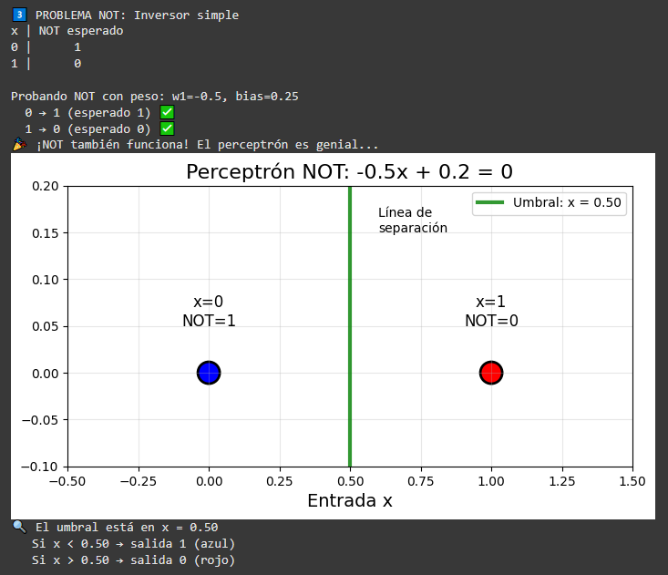

Como podemos ver, con w1 = -1/2 y bias = 1/4, logramos la recta vertical -x/2 + 1/4 = 0,
que pasa por el punto (1/2,0) y divide los puntos (0,0) y (1,0) en dos sectores diferentes.


#### ¿Resolvemos el problema XOR? :question:

```python linenums="1"
# === EL PROBLEMA XOR ===
print("\n4️⃣ PROBLEMA XOR: Verdadero solo cuando las entradas son DIFERENTES")
print("x1 | x2 | XOR esperado")
print(" 0 |  0 |      0")
print(" 0 |  1 |      1")
print(" 1 |  0 |      1")
print(" 1 |  1 |      0")

resultados_xor = [0, 1, 1, 0]

# Intentemos varios pesos para XOR
print("\n🤔 Intentemos resolver XOR...")
intentos = [
    (1, 1, -0.5),   # Similar a AND
    (1, 1, -1.5),   # AND más estricto
    (0.5, 0.5, -0.1),  # Similar a OR
    (1, -1, 0.5),   # Pesos diferentes
]

mejor_intento = 0
mejor_aciertos = 0

for j, (w1, w2, bias) in enumerate(intentos):
    print(f"\n  Intento {j+1}: w1={w1}, w2={w2}, bias={bias}")
    aciertos = 0
    for i, (x1, x2) in enumerate(datos):
        prediccion = perceptron(x1, x2, w1, w2, bias)
        esperado = resultados_xor[i]
        if prediccion == esperado:
            aciertos += 1
        ok = "✅" if prediccion == esperado else "❌"
        print(f"    {x1},{x2} → {prediccion} (esperado {esperado}) {ok}")

    print(f"    Aciertos: {aciertos}/4 ({aciertos/4:.0%})")
    if aciertos > mejor_aciertos:
        mejor_aciertos = aciertos
        mejor_intento = j+1
```

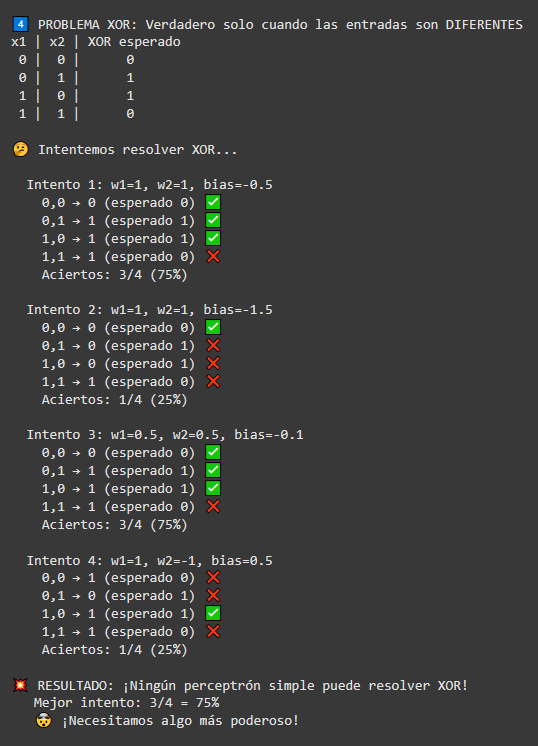

```python linenums="1"
# 📊 VISUALIZACIÓN XOR - ¡El Problema!
def graficar_xor_imposible():
    fig, axes = plt.subplots(2, 2, figsize=(12, 10))
    fig.suptitle('XOR: ¡IMPOSIBLE con una línea recta!', fontsize=20)

    resultados_xor = [0, 1, 1, 0]
    intentos = [
        (1, 1, -0.5, "Intento 1: Similar a AND"),
        (1, 1, -1.5, "Intento 2: AND estricto"),
        (0.5, 0.5, -0.1, "Intento 3: Similar a OR"),
        (1, -1, 0.5, "Intento 4: Pesos diferentes")
    ]

    for idx, (w1, w2, bias, titulo) in enumerate(intentos):
        ax = axes[idx//2, idx%2]

        # Puntos XOR
        for i, (x1, x2) in enumerate(datos):
            color = 'red' if resultados_xor[i] == 0 else 'blue'
            marker = 'o' if resultados_xor[i] == 0 else 's'
            ax.scatter(x1, x2, c=color, s=200, marker=marker,
                      edgecolor='black', linewidth=2)

        # Línea de separación
        if w2 != 0:
            x_line = np.linspace(-0.5, 1.5, 100)
            y_line = -(w1*x_line + bias) / w2
            ax.plot(x_line, y_line, 'green', linewidth=3, alpha=0.8)

        # Verificar predicciones
        aciertos = 0
        for i, (x1, x2) in enumerate(datos):
            pred = perceptron(x1, x2, w1, w2, bias)
            if pred == resultados_xor[i]:
                aciertos += 1

        ax.set_xlim(-0.3, 1.3)
        ax.set_ylim(-0.3, 1.3)
        ax.set_title(f'{titulo}\nAciertos: {aciertos}/4')
        ax.grid(True, alpha=0.3)

    plt.tight_layout()
    plt.show()

    print("🔍 ANÁLISIS VISUAL:")
    print("   🔵■ Puntos azules (cuadrados) deben estar de UN lado de la línea")
    print("   🔴○ Puntos rojos (círculos) deben estar del OTRO lado")
    print("   💥 ¡Es IMPOSIBLE dibujar una línea recta que los separe perfectamente!")
    print("   🧠 Por eso necesitamos REDES MULTICAPA (más de una línea)")

graficar_xor_imposible()
```

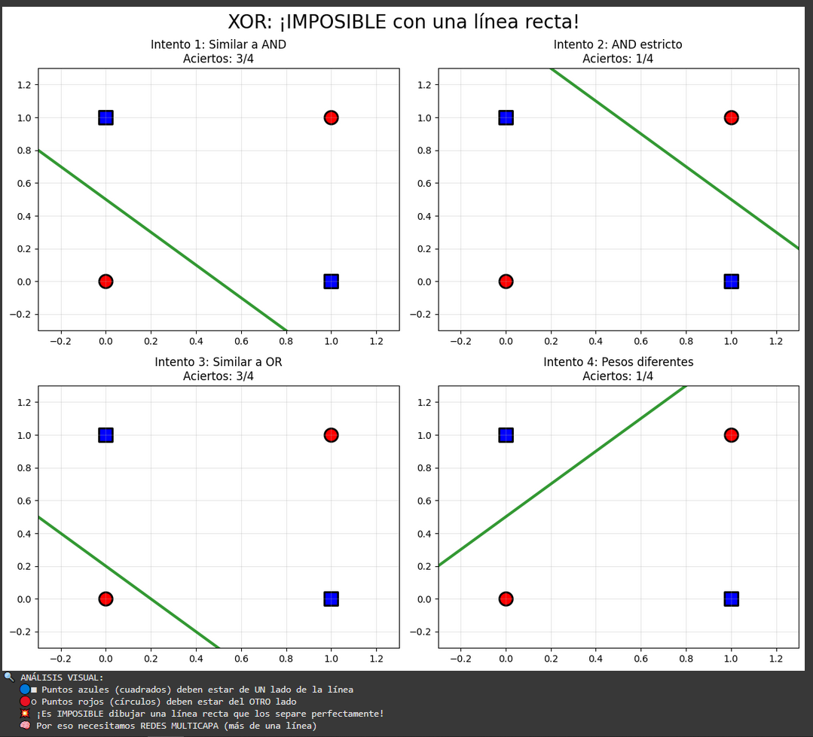

Como podemos ver, es imposible resolver el problema XOR sólo con un perceptrón, ya que
la línea recta que este represente no puede dividir en 2 sectores diferentes los puntos
rojos de los azules.

### 2. Explorando las redes MLP

Para intentar reslver le problema del XOR, creamos una red MLP con 4 neuronas ocultas
para ver si puede resolver el problema.

```python linenums="1"
# === SETUP COMPLETO ===
from sklearn.neural_network import MLPClassifier

# Primero: resolver XOR que era imposible con perceptrón
X_xor = np.array([[0,0], [0,1], [1,0], [1,1]])
y_xor = np.array([0, 1, 1, 0])


hidden_sizes = (4,) # ¿cuántas neuronas ocultas?
# Crear MLP
mlp_xor = MLPClassifier(
    hidden_layer_sizes=hidden_sizes,
    activation='tanh',           # relu, logistic, tanh
    solver='adam',
    random_state=42,
    max_iter=2000
)

# Entrenar y evaluar
mlp_xor.fit(X_xor, y_xor)
y_pred_xor = mlp_xor.predict(X_xor)

print("🎯 MLP resuelve XOR:")
print("x1 | x2 | esperado | predicción | ✓")
for i in range(len(X_xor)):
    ok = "✓" if y_pred_xor[i] == y_xor[i] else "✗"
    print(f" {X_xor[i][0]} |  {X_xor[i][1]} |    {y_xor[i]}     |     {y_pred_xor[i]}      | {ok}")

print(f"Accuracy: {(y_pred_xor == y_xor).mean():.1%}")
print("💡 ¡La red multicapa SÍ puede resolver XOR!")
```

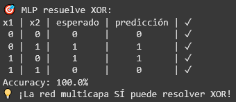

Sorprendentemente, esta red MLP parece ser capaz de resolver el problema del XOR, ahora
visualicémoslo con una gráfica para entender el porqué

```python linenums="1"
# === SUPERFICIE DE DECISIÓN MLP vs PERCEPTRÓN ===
def comparar_superficies_decision(mlp_xor):
    """
    Compara cómo separa datos un perceptrón vs MLP
    """
    fig, axes = plt.subplots(1, 2, figsize=(15, 6))

    # Crear grid para superficie de decisión
    h = 0.01  # resolución del grid
    x_min, x_max = -0.5, 1.5
    y_min, y_max = -0.5, 1.5
    xx, yy = np.meshgrid(np.arange(x_min, x_max, h),
                         np.arange(y_min, y_max, h))

    # === Subplot 1: Perceptrón (línea recta) ===
    ax1 = axes[0]

    # Intentar perceptrón para XOR (sabemos que fallará)
    def perceptron_xor(x1, x2):
        w1, w2, bias = 1, 1, -1.5  # Mejor intento
        return 1 if (w1*x1 + w2*x2 + bias) >= 0 else 0

    # Aplicar perceptrón al grid
    Z_perceptron = np.array([perceptron_xor(x1, x2) for x1, x2 in
                            zip(xx.ravel(), yy.ravel())])
    Z_perceptron = Z_perceptron.reshape(xx.shape)

    # Graficar superficie de decisión
    ax1.contourf(xx, yy, Z_perceptron, levels=1, alpha=0.8,
                colors=['lightcoral', 'lightblue'])

    # Puntos XOR
    colores_xor = ['red', 'blue', 'blue', 'red']
    marcadores_xor = ['o', 's', 's', 'o']
    for i, (x1, x2) in enumerate(X_xor):
        ax1.scatter(x1, x2, c=colores_xor[i], s=200, marker=marcadores_xor[i],
                   edgecolor='black', linewidth=3, zorder=5)
        ax1.text(x1+0.05, x2+0.05, f'({x1},{x2})', fontsize=10, weight='bold')

    ax1.set_title('Perceptrón: Línea Recta\n❌ No puede separar XOR',
                 fontsize=14, weight='bold')
    ax1.set_xlabel('x1')
    ax1.set_ylabel('x2')
    ax1.grid(True, alpha=0.3)

    # === Subplot 2: MLP (superficie curva) ===
    ax2 = axes[1]

    # Aplicar MLP al grid
    grid_points = np.c_[xx.ravel(), yy.ravel()]
    Z_mlp = mlp_xor.predict(grid_points)
    Z_mlp = Z_mlp.reshape(xx.shape)

    # Graficar superficie de decisión
    ax2.contourf(xx, yy, Z_mlp, levels=1, alpha=0.8,
                colors=['lightcoral', 'lightblue'])

    # Puntos XOR
    for i, (x1, x2) in enumerate(X_xor):
        ax2.scatter(x1, x2, c=colores_xor[i], s=200, marker=marcadores_xor[i],
                   edgecolor='black', linewidth=3, zorder=5)
        ax2.text(x1+0.05, x2+0.05, f'({x1},{x2})', fontsize=10, weight='bold')

    ax2.set_title('MLP: Superficie Curva\n✅ ¡Puede separar XOR!',
                 fontsize=14, weight='bold')
    ax2.set_xlabel('x1')
    ax2.set_ylabel('x2')
    ax2.grid(True, alpha=0.3)

    plt.tight_layout()
    plt.show()

    print("🔍 ANÁLISIS VISUAL:")
    print("   🔴 Zonas ROJAS = predicción 0 (clase 0)")
    print("   🔵 Zonas AZULES = predicción 1 (clase 1)")
    print("   📏 Perceptrón: Solo puede crear línea recta → falla en XOR")
    print("   🌊 MLP: Puede crear superficie curva → ¡resuelve XOR!")

# Ejecutar comparación
comparar_superficies_decision(mlp_xor)
```

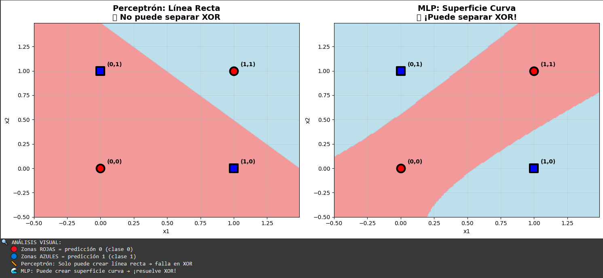

Como podemos ver, la red MLP triunfa en donde el perceptrón falló, las redes MLP son
capaces de crear superficies más flexibles en formas que permiten resolver problemas
más complejos como el XOR.

### 3. MLP en problema real

Habiendo visto la capacidad de las MLP, pongámoslas a prueba con un problema realista
más complejo.

Primero generamos un set de datos para la clasiicación utilizando 'make_classification' de sklearn,
que nos permite generar sets de datos eligiendo cantidad de muestras, cantidad de features, cuántas
features brindarán información pertinente, número de clases, entre otras características.

```python linenums="1"
# === PROBLEMA REALISTA ===
from sklearn.datasets import make_classification
from sklearn.model_selection import train_test_split
from sklearn.metrics import classification_report

# Dataset más complejo
X_real, y_real = make_classification(
    n_samples=1000,
    n_features=20,
    n_informative=15,
    n_classes=2,
    random_state=42
)

# Dividir datos
X_train, X_test, y_train, y_test = train_test_split(
    X_real, y_real, test_size=0.3, random_state=42
)
```

Creamos la MLP con 2 capas ocultas, la primera de 100 neuronas y la segunda de 50,
la entrenamos con los datos de entrenamiento recién creados, y finalmente la
testeamos y evaluamos los resultados

```python linenums="1"
# === PROBLEMA REALISTA ===
from sklearn.datasets import make_classification
from sklearn.model_selection import train_test_split
from sklearn.metrics import classification_report

# Dataset más complejo
X_real, y_real = make_classification(
    n_samples=1000,
    n_features=20,
    n_informative=15,
    n_classes=2,
    random_state=42
)

# Dividir datos
X_train, X_test, y_train, y_test = train_test_split(
    X_real, y_real, test_size=0.3, random_state=42
)

# MLP para problema real
mlp_real = MLPClassifier(
    hidden_layer_sizes=(100,50),  # 2 capas ocultas
    activation='relu',
    solver='adam',
    random_state=42,
    max_iter=1000
)

# Entrenar
mlp_real.fit(X_train, y_train)

# Evaluar
train_acc = mlp_real.score(X_train, y_train)
test_acc = mlp_real.score(X_test, y_test)

print(f"📊 Resultados MLP en dataset real:")
print(f"  Training Accuracy: {train_acc:.1%}")
print(f"  Test Accuracy: {test_acc:.1%}")
print(f"  Arquitectura: {X_real.shape[1]} → {mlp_real.hidden_layer_sizes} → 2")
```

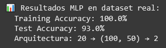

Como podemos ver, esta MLP parece resolver muy bien este problema de clasifiación, teniendo una
accuracy del 93%; pero, ¿se podrá mejorar?

A continuación, probaremos una red neuronal profesional con tensorflow utilizando el mismo
dataset intentando conseguir un mejor resultado.

```python linenums="1"
# === RED NEURONAL PROFESIONAL ===
import tensorflow as tf
from tensorflow import keras
from tensorflow.keras import layers

# Usar mismo dataset que sklearn para comparar
print(f"Dataset: {X_train.shape[0]} samples, {X_train.shape[1]} features")

# Crear modelo Sequential
model = keras.Sequential([
    layers.Dense(units=128 , activation='relu', input_shape=(X_train.shape[1],)),
    layers.Dense(units=64 , activation='relu'),
    layers.Dense(1, activation='sigmoid')  # salida binaria
])

# Compilar modelo
model.compile(
    optimizer='adam',              # adam, sgd, rmsprop
    loss='binary_crossentropy',                   # binary_crossentropy
    metrics=['accuracy']
)

# Entrenar
print("Entrenando red neuronal...")
history = model.fit(
    X_train, y_train,
    epochs=50,                   # número de épocas
    batch_size=32,               # tamaño de batch
    validation_data=(X_test, y_test),
    verbose=1
)

# Evaluar
train_loss, train_acc = model.evaluate(X_train, y_train, verbose=0)
test_loss, test_acc = model.evaluate(X_test, y_test, verbose=0)

print(f"\n🎯 Resultados TensorFlow:")
print(f"  Training Accuracy: {train_acc:.1%}")
print(f"  Test Accuracy: {test_acc:.1%}")
print(f"  Parámetros totales: {model.count_params():,}")
```


Utilizando una leve mayor cantidad de neuronas (28 y 14 más en la primera y segunda capa oculta
respectivamente) se logró una mejora de 2% de accuracy.

Ahora visualicemos como se llegó a este resultado a través de las épocas en el entrenamiento

```python linenums="1"
# === CURVAS DE APRENDIZAJE ===
import _______ as plt

plt.figure(figsize=(12, 4))

# Subplot 1: Loss
plt.subplot(1, 2, 1)
plt.plot(history.history['loss'], label='Training Loss')
plt.plot(history.history['val_loss'], label='Validation Loss')
plt.title('Pérdida durante entrenamiento')
plt.xlabel('Época')
plt.ylabel('Loss')
plt.legend()
plt.grid(True, alpha=0.3)

# Subplot 2: Accuracy
plt.subplot(1, 2, 2)
plt.plot(history.history['accuracy'], label='Training Accuracy')
plt.plot(history.history['val_accuracy'], label='Validation Accuracy')
plt.title('Precisión durante entrenamiento')
plt.xlabel('Época')
plt.ylabel('Accuracy')
plt.legend()
plt.grid(True, alpha=0.3)

plt.tight_layout()
plt.show()

print("📈 ¿Ves overfitting? ¿La red converge bien?")
```

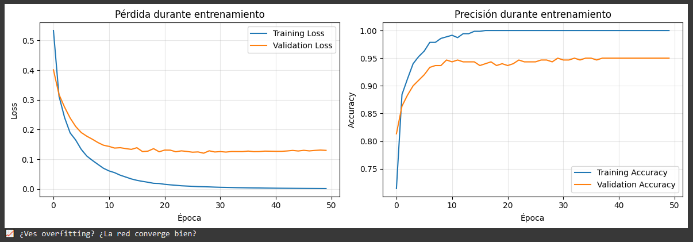

Viendo las gráficas del entrenamiento, podemos ver un claro overfitting que empieza
alrededor de la época 10, donde la pérdida del set de validación comienza a estancarse
mientras que la del set de entrenamiento continua a descender hasta 0.

Realizando una prueba adicional, crearemos nuestra propia red neuronal utilizando
pytorch lightning

```python linenums="1"
# === PYTORCH LIGHTNING ===
import pytorch_lightning as pl
import torch
import torch.nn as nn

class SimpleNet(pl.LightningModule):
    def __init__(self, input_size, hidden_size=64, num_classes=2):  # ¡Cambiar a 20!
        super().__init__()
        self.network = nn.Sequential(
            nn.Linear(input_size, hidden_size),
            nn.ReLU(True),                    # ReLU con inplace
            nn.Linear(hidden_size, 32),     # segunda capa oculta
            nn.ReLU(True),
            nn.Linear(32, num_classes)
        )
        self.test_preds = []
        self.test_labels = []

    def forward(self, x):
        return self.network(x)

    def training_step(self, batch, batch_idx):
        x, y = batch
        y_hat = self(x)
        loss = nn.functional.cross_entropy(y_hat, y)
        self.log('train_loss', loss)
        return loss

    def configure_optimizers(self):
        return torch.optim.Adam(self.parameters(), lr=0.001)

    def test_step(self, batch, batch_idx):
        x, y = batch
        y_hat = self(x)
        loss = nn.functional.cross_entropy(y_hat, y)

        # Calcular accuracy
        preds = torch.argmax(y_hat, dim=1)
        acc = torch.sum(preds == y).float() / len(y)

        # Logging
        self.log('test_loss', loss)
        self.log('test_acc', acc)

        self.test_preds.append(preds.detach().cpu())
        self.test_labels.append(y.detach().cpu())
        
        return loss

    def on_test_epoch_end(self) -> None:
        self.all_test_preds = torch.cat(self.test_preds)
        self.all_test_labels = torch.cat(self.test_labels)
        
        # Limpiar las listas para evitar problemas si se vuelve a llamar trainer.test()
        self.test_preds.clear()
        self.test_labels.clear()

# Crear modelo con el tamaño correcto de entrada
input_features = X_train.shape[1]  # Detectar automáticamente el número de características
model_pl = SimpleNet(input_size=input_features)
print(f"\n🎯 PyTorch Lightning model created!")
print(f"Input features: {input_features}")
print(f"Parameters: {sum(p.numel() for p in model_pl.parameters()):,}")
```

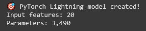

Teniendo casi un tercio de la cantidad de parámetros de la red de tensorflow, veamos
como es su rendimiento

!!! note "Nota"
    Tener en cuenta que las capas de esta red tiene la mitad de neuronas en cada capa en
    comparación con la red de tf.

```python linenums="1"
# === ENTRENAR MODELO PYTORCH LIGHTNING ===
from torch.utils.data import DataLoader, TensorDataset

# Preparar datos para PyTorch
X_train_torch = torch.FloatTensor(X_train)
y_train_torch = torch.LongTensor(y_train)
X_test_torch = torch.FloatTensor(X_test)
y_test_torch = torch.LongTensor(y_test)

# Crear datasets y dataloaders
train_dataset = TensorDataset(X_train_torch, y_train_torch)
test_dataset = TensorDataset(X_test_torch, y_test_torch)

train_loader = DataLoader(train_dataset, batch_size=32, shuffle=True)
test_loader = DataLoader(test_dataset, batch_size=32, shuffle=False)

# Crear trainer
trainer = pl.Trainer(
    max_epochs=50,           # número de épocas
    logger=True,               # True/False para logging
    enable_progress_bar=True,     # mostrar barra de progreso
    deterministic=True            # reproducibilidad
)

# Entrenar modelo
print("🚀 Entrenando con PyTorch Lightning...")
trainer.fit(model_pl, train_loader)

# Evaluar modelo
print("📊 Evaluando modelo...")
results = trainer.test(model_pl, test_loader)  # método 'test' para evaluación
print(f"🎯 Resultados: {results}")
```

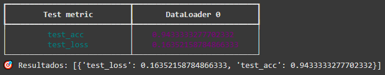

Parece ser que, incluso con una gran cantidad menos de neuronas en las capas, se mantiene bastante
bien con 94.3% de accuracy.

Por último, veremos los resultados expresados a través de una matriz de confusión

```python linenums="1"
# === MATRIZ DE CONFUSIÓN COMPARATIVA ===
from sklearn.metrics import confusion_matrix, classification_report
import seaborn as sns

def plotear_confusion_matrices():
    """
    Visualiza matrices de confusión para cada framework
    """
    # Obtener predicciones de cada modelo (necesitas ejecutar los modelos primero)
    sklearn_preds = mlp_real.predict(X_test)
    tensorflow_preds = (model.predict(X_test) > 0.5).astype(int)
    pytorch_preds = model_pl.all_test_preds.numpy()  # (desde el results de PyTorch Lightning)

    fig, axes = plt.subplots(1, 3, figsize=(15, 4))
    frameworks = ['Sklearn MLP', 'TensorFlow', 'PyTorch Lightning']

    # Matrices de confusión típicas para cada framework
    confusion_matrices = [
        confusion_matrix(y_test, sklearn_preds),    # Sklearn MLP
        confusion_matrix(y_test, tensorflow_preds),   # TensorFlow
        confusion_matrix(y_test, pytorch_preds)     # PyTorch Lightning
    ]

    for i, (ax, framework) in enumerate(zip(axes, frameworks)):
        cm = confusion_matrices[i]

        sns.heatmap(cm, annot=True, fmt='d', cmap='Blues',
                   xticklabels=['Pred 0', 'Pred 1'],
                   yticklabels=['True 0', 'True 1'], ax=ax)
        ax.set_title(f'{framework}\nConfusion Matrix')

    plt.tight_layout()
    plt.show()

    print("📈 ANÁLISIS DE MATRICES DE CONFUSIÓN:")
    print("✅ Diagonal principal (TN + TP) = predicciones correctas")
    print("❌ Diagonal secundaria (FP + FN) = errores")

# Ejecutar matrices de confusión
plotear_confusion_matrices()
```

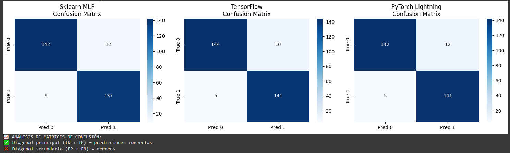

### Preguntas posteriores
- ¿Por qué AND, OR y NOT funcionaron pero XOR no?

Debido a que, esencialmente un perceptro sólo representa una línea recta en el plano, no se puede separar
los puntos (0,0) y (1,1) sólo con este; sin embargo, sí se puede separar cualquier punto único de los otros
3 (o 1 en el caso del NOT) con una sola recta.

- ¿Cuál es la diferencia clave entre los pesos de AND vs OR?

El AND requiere un bias menor a -0.5 (para que no esté debajo de los puntos de la diagonal) y mayor a -1 (para que no incluya al punto (1,1) con los otros)
mientras que el OR requiere un bias mayor a -0.5 (para no estar por encima de los puntos de la diagonal) y menor a 0 (para que no incluya al punto (0,0) con
los otros).

- ¿Qué otros problemas del mundo real serían como XOR?

Cualquier problema que involucre una decisión cuando ocurra un evento a, b, c, etc.; pero no más de uno de estos a la vez ni tampoco ninguno.
Por ejemplo, una decisión que involucre que un auto inteligente gire a la izquierda o la derecha si tiene un peatón en el lado opuesto pero
no maneje el caso donde tengo peatones en ambos lados.

- ¿Por qué sklearn MLP puede resolver XOR pero un perceptrón no?

Un perceptrón puede crear una sola línea de decisión mientras que sklearn MLP puede crear tantas como neuronas tenga en la capa 
oculta, lo que le permite dividir sectores más flexiblemente que una línea recta sola. 

- ¿Cuál es la principal diferencia entre TensorFlow/Keras y sklearn MLP?

Sklearn MLP da una versión más simplificada y fácil de utilizar pensada para problemas más simples y con orientación a aprender
más que a estar en un contexto real, mientras que TensorFlow da mayor liberta para el proceso de creación de redes neuronales
pero implica un mayor conocimiento y está pensado para implementaciones más profesionales.

- ¿Por qué TensorFlow usa epochs y batch_size mientras sklearn MLP no?

TensorFlow procesa el conjunto de datos a través de lotes por épocas utilizando SGD. Sklearn MLP con las configuraciones predeterminadas, 
si bien no maneja directamente el término epoch, setea el máximo número de iteraciones a 200 y el tamaño de batch a un número proporcional
a la cantidad de muestras.

- ¿Cuándo usarías sigmoid vs relu como función de activación?

Sigmoid suele utilizarse para la salida en problemas de clasificación binaria, donde se busca que la salida sea 0 o 1 y que se elija
en base a la probabilidad más cercana. ReLU se utiliza entre capas ocultas ya que funciona como forma de conseguir no linealidad
entre las capas ocultas y además ayuda a mitigar el problema de desvanecimiento de gradiente.

- ¿Qué ventaja tiene PyTorch Lightning sobre TensorFlow puro?

Pytorch Lightning ya tiene implementada configuraciones de manera simplificada o automática, permitiendo al desarrollador
centrarse sólo en lo relevante a su problema; mientras que en TensorFlow, el desarrollador debe no solo resolver el problema
sino también realizar las configuraciones manuales que ya realiza Pytorch Lightning.

- ¿Por qué PyTorch Lightning separa training_step y test_step?

En la evaluación se registra tanto la loss como la accuracy y no se actualizan los pesos de las conexiones, mientras que en el
entrenamiento se registra sólo la loss y sí se actualizan los pesos.

- ¿Cuál framework elegirías para cada escenario?
        Prototipo rápido: sklearn
        Modelo en producción: TensorFlow
        Investigación avanzada: PyTorch

- ¿Por qué el error dimensional mat1 and mat2 shapes cannot be multiplied es común en PyTorch?

Esto ocurre cuando en una multiplicación de matrices mxn * pxq, n != p, y por tanto no se pueden multiplicar las matrices; por ejemplo, esto ocurre
cuando la cantidad de features del dataset no corresponde con el input size de la primera capa oculta de la MLP.

- ¿Qué significa el parámetro deterministic=True en PyTorch Lightning Trainer?

El parámetro deterministic=True sirve para mantener reproductibidad entre ejecuciones, de este modo se puede
ver la mejora o el deterioro del rendimiento de los modelos.

- ¿Por qué TensorFlow muestra curvas de loss y val_loss durante entrenamiento?

Ya que permite identificar de manera sencilla si el modelo está desarrollando algún problema o no está funcionando correctamente,
por ejemplo, permite identificar si hay overfitting cuando la curva de loss se mantiene decreciendo mientras que la de val_loss
se mantiene hasta un punto.

- ¿Cuál es la diferencia entre trainer.test() y trainer.predict() en PyTorch Lightning?

Trainer.test() realiza una evaluación sobre el set de test y devuelve una lista de diccionarios con las métricas registradas
durante la fase de testeo. Trainer.predict() infiere sobre los datos, sin el registro de métricas y devuelve una lista de 
diccionarios con las predicciones.

- ¿Por qué sklearn MLP es más fácil pero menos flexible?

Sklearn MLP es más fácil pero menos flexible ya que si bien tiene muchas configuraciones automatizadas y un enfoque
'plug & play', hay algunas características que no se pueden cambiar o no se pueden modificar a gusto; por ejemplo,
el que sólo se pueda elegir el tamaño de las capas ocultas y no el tipo, opciones limitadas para funciones de activación
y estás aplican para todas las capas ocultas, etc.


## Evidencias

[Link al Colab](https://colab.research.google.com/drive/12fQbZ6dVBxa9d5x2mNroKWfTNkxO-GDL?usp=sharing)

## Reflexión
Es interesante ver la evolución de los perceptrones básicos con sus limitaciones a redes neuronales
capaces de abordar problemas más complejos, y con herramientas como TensorFlow y Pytorch Lightning que
permiten a los desarrolladores configuar a sus necesidades las MLP de manera extensa, o herramientas
más sencillas y rápidas para problemas más chicos como las pertenecientes a sklearn; crean un
entorno para todo tipo diferente de personas que facilita la entrada al mundo.
