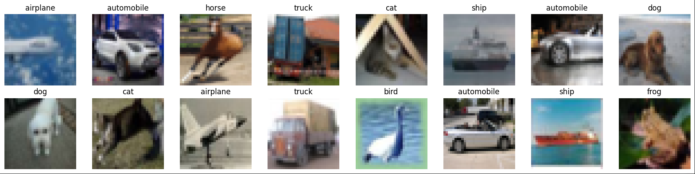
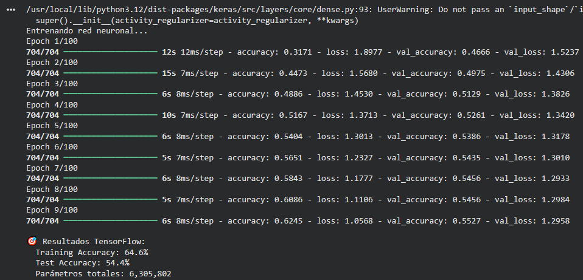

# Backpropagation y Optimizadores

## Contexto
Esta actividad se centra en la experimentación de un MLP basada en
keras para que clasifique las imágenes del dataset CIFAR-10.

En la práctica se experimentará con la arquitectura, optimizadores e hiperparámetros
y funciones de callback para lograr aumentar lo máximo posible la capacidad del modelo
de clasificar correctamente las imágenes.

Adicionalmente, se utilizará TensorBoard para el análisis del entrenamiento del modelo
en sus diferentes etapas.

## Objetivos
- Desarrollar un MLP capaz de clasificar las imágenes de CIFAR-10
- Experimentar con diferentes arquitecturas
- Experimentar con diferentes optimizadores e hiperparámetros
- Experimentar con diferentes callbacks

## Actividades
- Cargar datos
- Red neuronal

## Desarrollo

### Cargar datos
Para el desarrollo de la actividad, se utilizó el dataset CIFAR-10, el cual consiste
en 60000 imágenes a color de 32x32 pixeles divididas equitativamente en 10 clases diferentes;
las clases siendo: "airplane", "automobile", "bird", "cat", "deer", "dog", "frog", "horse", 
"ship" y "truck".

Estas imágenes fueron luego normalizadas a valores [-1, 1] para facilitar el entrenamiento,
se dividieron en sets de entrenamiento y validación, y se aplanaron las imágenes de
32x32x3 a un vector de tamaño 3072 para servir de input para el modelo MLP.

Esta es una visualización de ejemplo de algunas imágenes del dataset junto con sus categorías.



### Red neuronal
El modelo desarrollado resultó en una red neuronal con 4 capas densas de 1024 neuronas con funciónes de 
activación de tipo relu y capas de dropout con 20% de probabilidad entre cada una; la
capa final presentando una función de activación de softmax para poder determinar las
clases.

Se implementaron diferentes optimizadores, eligiendo finalmente Adam por su mejor desempeño
y un callback de EarlyStopping buscando evitar el overfitting del modelo.

El modelo fue entrenado en 100 epochs con tamaño de batch de 64, registrando las métricas en
tensorboard, y finalmente evaluado tanto para el set de entrenamiento como para el de testeo.

```python linenums="1"
# === RED NEURONAL ===
import tensorflow as tf
from tensorflow import keras
from tensorflow.keras import layers

# Crear modelo Sequential
model = keras.Sequential([
    layers.Dense(1024, activation='relu', input_shape=(x_train.shape[1],)),
    layers.Dropout(0.2),
    layers.Dense(1024, activation='relu'),
    layers.Dropout(0.2),
    layers.Dense(1024, activation='relu'),
    layers.Dropout(0.2),
    layers.Dense(1024, activation='relu'),
    layers.Dropout(0.2),
    layers.Dense(len(class_names), activation='softmax')  # salida binaria
])

optimizer = tf.keras.optimizers.Adam(
    learning_rate=0.0001,
    beta_1=0.9,
    beta_2=0.999,
    epsilon=1e-07,
    amsgrad=False,
    weight_decay=None,
    clipnorm=None,
    clipvalue=None,
    global_clipnorm=None,
    use_ema=False,
    ema_momentum=0.99,
    ema_overwrite_frequency=None,
    loss_scale_factor=None,
    gradient_accumulation_steps=None,
    name='adam'
)


# Compilar modelo
model.compile(
    optimizer=optimizer,              # adam, sgd, rmsprop
    loss='sparse_categorical_crossentropy',
    metrics=['accuracy']
)

early_stopping = keras.callbacks.EarlyStopping(
    monitor="val_loss",
    min_delta=0.01,
    patience=3,
    verbose=0,
    mode="auto",
    baseline=None,
    restore_best_weights=True,
    start_from_epoch=0,
)


# Entrenar
print("Entrenando red neuronal...")
run_dir = os.path.join(ROOT_LOGDIR, "experiment" + dt.datetime.now().strftime("%Y%m%d-%H%M%S"))
history = model.fit(
    x_train, y_train,
    epochs=100,                   # número de épocas
    batch_size=64,               # tamaño de batch
    validation_data=(x_test, y_test),
    verbose=1,
    callbacks=[keras.callbacks.TensorBoard(log_dir=run_dir, histogram_freq=1),
               early_stopping]
)

# Evaluar
train_loss, train_acc = model.evaluate(x_train, y_train, verbose=0)
test_loss, test_acc = model.evaluate(x_test, y_test, verbose=0)

print(f"\n🎯 Resultados TensorFlow:")
print(f"  Training Accuracy: {train_acc:.1%}")
print(f"  Test Accuracy: {test_acc:.1%}")
print(f"  Parámetros totales: {model.count_params():,}")
```



El modelo logró obtener una precisión del 64.6% para el set de entrenamiento y una precisión
del 54.4% para el set de testeo, con un total de 6.305.802 parámetros totales.

Si bien estos resultados no son malos, se puede ver un claro overfitting del modelo,
teniendo más de 10% mejor precisión en el set de entrenamiento, además que la precisión con 
el set de testeo es tan solo ligermante mayor al 50% (el cuál era el valor inicial).

## Reflexión
En esta actividad aprendí ligeramente las diferentes formas en las que se puede "jugar" con un
modelo de keras (y en general) para mejorar los resultados que este devuelva.

También me permitió ver la dificultad de resolver problemas de clasificación de imágenes con
una aplicación práctica.

Si bien el modelo logró un resultado mejor al que había incialmente, para nada se podría decir que
está especializado en clasificación de imágenes; es por esto que un próximo paso evidente es
el experimentar con distintos tipos de redes neuronales o modelos preentrenados para la clasificación
de imágenes, y comparar los resultados que estos pueden llegar a obtener frente a los obtenidos
en esta actividad.

## Referencias
[Link al Colab](https://colab.research.google.com/drive/123b4GSv0BRKtVrmxV7SHnayH4p2KKU7k?usp=sharing)