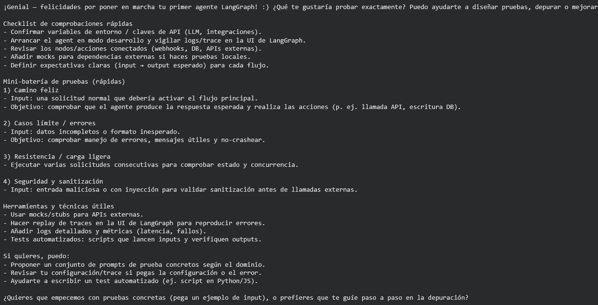
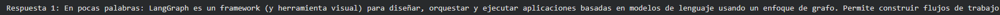
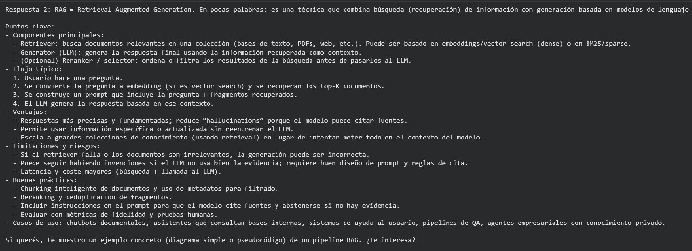
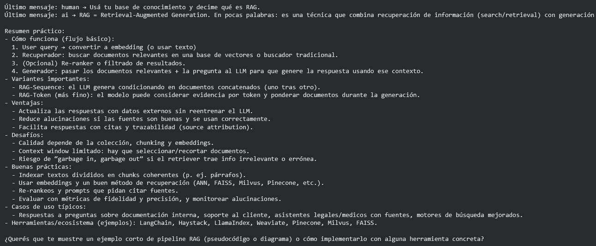

# IA con agencia: Diseño de sistemas autónomos capaces de razonar y usar herramientas

## Contexto
Anteriormente, habíamos trabajado con cadenas lineales de ejecución (donde A lleva a B y luego a C). Sin embargo, para construir un sistema verdaderamente "inteligente", necesitamos algo más flexible: agentes.

En este artículo nos alejamos de las cadenas rígidas para adoptar una arquitectura de grafos usando LangGraph. Esto nos permite crear flujos cíclicos donde el modelo puede "pensar", actuar, observar el resultado y volver a pensar. El contexto de este trabajo es simular un entorno de desarrollo real donde necesitamos crear un asistente de soporte que no solo charle, sino que tenga acceso a manuales internos (RAG) y datos en tiempo real (Tools), manteniendo la memoria de la conversación intacta.

## Objetivos
- Diseñar un AgentState que retenga información a lo largo de una conversación
- Crear un sistema donde el LLM se cómo y cuándo utilizar funciones externas
- Lograr una integración de RAG como herramienta para que use el agente

## Actividades (con tiempos estimados)
- Setup y "Hello Agent" (LangGraph mínimo)
- Estado del agente con memoria "ligera"
- Construir un RAG "mini" para usarlo como tool
- Otra tool adicional (no RAG)
- LLM con tool calling + ToolNode en LangGraph
- Conversación multi-turn con el agente

## Desarrollo
### Setup y "Hello Agent" (LangGraph mínimo)

Primeramente, en esta etapa inicial preparamos todo nuestro entorno de trabajo. Instalamos las librerías esenciales (LangGraph, LangChain) y configuramos las credenciales de acceso. Creamos el primer "grafo" básico con un único nodo (el asistente) que simplemente recibe un mensaje y devuelve una respuesta directa del modelo.

El objetivo es validar que la infraestructura base funcione correctamente y entender la estructura fundamental de LangGraph, asegurándonos de que el flujo de información entre nodos está operativo antes de complicar la lógica.

```python linenums="1"
from typing_extensions import TypedDict, Annotated
import operator
from langgraph.graph import StateGraph, START, END   # START, END
from langchain_core.messages import HumanMessage
from langchain_openai import ChatOpenAI

class AgentState(TypedDict):
    messages: Annotated[list, operator.add]

llm = ChatOpenAI(model="gpt-5-mini", temperature=0)

def assistant_node(state: AgentState) -> AgentState:
    # TODO: llamar al modelo con todo el historial
    response = llm.invoke(state['messages'])
    return {"messages": [response]}

builder = StateGraph(AgentState)
builder.add_node("assistant", assistant_node)
builder.add_edge(START, "assistant")
builder.add_edge("assistant", END)

graph = builder.compile()

initial_state = {"messages": [HumanMessage(content="Probando mi primer agente LangGraph :)")]}
result = graph.invoke(initial_state)
print(result["messages"][-1].content)
```



### Estado del agente con memoria "ligera"

A continuación, procedemos a modificar la estructura del estado (AgentState). Ya no nos conformamos solo con una lista de mensajes; añadimos un campo de resumen (summary) a nuestra definición de datos.

Con esto preparamos el terreno para una memoria a largo plazo más eficiente. En lugar de procesar siempre el historial completo, habilitamos al sistema para guardar síntesis de lo conversado, optimizando recursos para el futuro.

```python linenums="1"
from typing import Optional
from typing_extensions import TypedDict, Annotated
import operator

class AgentState(TypedDict):
    messages: Annotated[list, operator.add]
    summary: Optional[str]   # p.ej. Optional[str]

# Tip: podés inicializar summary en None en el estado inicial
initial_state = {
    "messages": [],
    "summary": None
}
```

### Construir un RAG "mini" para usarlo como tool

Luego, nos enfocamos en brindar al agente conocimiento externo. Construimos un pequeño sistema RAG (Generación Aumentada por Recuperación) indexando documentos locales en una base vectorial. Envolvemos esta funcionalidad en una función (rag_search) y la etiquetamos como una herramienta (@tool).

Le damos al agente la capacidad de "leer" documentación específica que no conoce por defecto. Al convertirlo en una tool, permitimos que el agente decida autónomamente cuándo necesita consultar esta información para respondernos.

```python linenums="1"
from langchain_text_splitters import RecursiveCharacterTextSplitter
from langchain_openai import OpenAIEmbeddings
from langchain_community.vectorstores import FAISS
from langchain_core.documents import Document

# Corpus mínimo (podés cambiarlo por algo de tu dominio)
raw_docs = [
    "LangGraph permite orquestar agentes como grafos de estado.",
    "RAG combina recuperación + generación para mejorar grounding.",
    "LangChain y LangGraph se integran con OpenAI, HuggingFace y más."
]

docs = [Document(page_content=t) for t in raw_docs]

# Split en chunks
splitter = RecursiveCharacterTextSplitter(chunk_size=300, chunk_overlap=50)
chunks = splitter.split_documents(docs)

# Vector store FAISS
emb = OpenAIEmbeddings()
vs = FAISS.from_documents(chunks, embedding=emb)
retriever = vs.as_retriever(search_kwargs={"k": 3})
```

```python linenums="1"
from langchain_text_splitters import RecursiveCharacterTextSplitter
from langchain_openai import OpenAIEmbeddings
from langchain_community.vectorstores import FAISS
from langchain_core.documents import Document

# Corpus mínimo (podés cambiarlo por algo de tu dominio)
raw_docs = [
    "LangGraph permite orquestar agentes como grafos de estado.",
    "RAG combina recuperación + generación para mejorar grounding.",
    "LangChain y LangGraph se integran con OpenAI, HuggingFace y más."
]

docs = [Document(page_content=t) for t in raw_docs]

# Split en chunks
splitter = RecursiveCharacterTextSplitter(chunk_size=300, chunk_overlap=50)
chunks = splitter.split_documents(docs)

# Vector store FAISS
emb = OpenAIEmbeddings()
vs = FAISS.from_documents(chunks, embedding=emb)
retriever = vs.as_retriever(search_kwargs={"k": 3})
```

### Otra tool adicional (no RAG)

Simultáneamente, implementamos herramientas deterministas más allá de la búsqueda de texto. Programamos funciones para consultar datos exactos, como el estado de un pedido ficticio (get_order_status) o la hora actual.

Esto nos sirve para demostrar que nuestro agente puede interactuar con sistemas lógicos o bases de datos simuladas, algo crucial para dar soporte preciso y evitar que el modelo invente datos.

```python linenums="1"
from datetime import datetime
from langchain_core.tools import tool

FAKE_ORDERS = {
    "ABC123": "En preparación",
    "XYZ999": "Entregado",
}

@tool
def get_order_status(order_id: str) -> str:
    """
    Devuelve el estado de un pedido ficticio dado su ID.
    """
    status = FAKE_ORDERS.get(order_id)
    if status is None:
        return f"No encontré el pedido {order_id}."
    return f"Estado actual del pedido {order_id}: {status}"

@tool
def get_utc_time(_: str = "") -> str:
    """
    Devuelve la hora actual en UTC (formato ISO).
    """
    return datetime.utcnow().isoformat()
```

### LLM con tool calling + ToolNode en LangGraph

Posteriormente, llegamos a la etapa central donde conectamos todas las piezas. Vinculamos las herramientas que creamos al LLM y configuramos el grafo con dos nodos principales: el "assistant" (que razona) y el "tools" (que ejecuta). Agregamos lógica condicional para que el flujo derive al nodo de herramientas solo si el asistente lo solicita.

Este es el corazón de nuestro desarrollo. Habilitamos el ciclo de razonamiento y acción (reasoning loop), donde el agente decide dinámicamente si tiene la información suficiente para responder o si debe ejecutar una acción primero.

```python linenums="1"
from langgraph.prebuilt import ToolNode
from langchain_core.messages import AIMessage

# 1) Lista de tools
tools = [rag_search, get_order_status, get_utc_time]  # o tus propias tools

# 2) LLM con tools
llm_with_tools = ChatOpenAI(model="gpt-5-mini", temperature=0).bind_tools(tools)

def assistant_node(state: AgentState) -> AgentState:
    """
    Nodo de reasoning: decide si responder directo o llamar tools.
    """
    response = llm_with_tools.invoke(state["messages"])
    return {"messages": [response]}

# 3) Nodo de tools
tool_node = ToolNode(tools)
```

```python linenums="1"
def route_from_assistant(state: AgentState) -> str:
    last = state["messages"][-1]
    if isinstance(last, AIMessage) and last.tool_calls:
        return "tools"
    return END
```

```python linenums="1"
def route_from_assistant(state: AgentState) -> str:
    last = state["messages"][-1]
    if isinstance(last, AIMessage) and last.tool_calls:
        return "tools"
    return END
```

### Conversación multi-turn con el agente

Por último, ejecutamos el grafo en un bucle continuo, alimentando cada nuevo paso con el estado resultante del anterior. Probamos realizar varias preguntas seguidas para verificar la continuidad.

Verificamos que la "memoria" funciona correctamente y que el agente puede sostener el hilo de la conversación, recordando el contexto inmediato mientras decide si llamar a nuevas herramientas.

```python linenums="1"
from langchain_core.messages import HumanMessage

state = {
    "messages": [
        HumanMessage(content="Hola, ¿qué es LangGraph en pocas palabras?")
    ],
    "summary": None
}

result = graph.invoke(state)
print("Respuesta 1:", result["messages"][-1].content)
```



```python linenums="1"
from langchain_core.messages import HumanMessage

state = {
    "messages": [
        HumanMessage(content="Hola, ¿qué es LangGraph en pocas palabras?")
    ],
    "summary": None
}

result = graph.invoke(state)
print("Respuesta 1:", result["messages"][-1].content)
```



```python linenums="1"
from langchain_core.messages import HumanMessage

state = {
    "messages": [
        HumanMessage(content="Hola, ¿qué es LangGraph en pocas palabras?")
    ],
    "summary": None
}

result = graph.invoke(state)
print("Respuesta 1:", result["messages"][-1].content)
```



## Reflexión
Considero que esta actividad es bastante importante, ya que demuestra que la inteligencia de un agente no reside solo en el modelo que usa, sino en cómo gestionamos su estado.

Habiendo pasado de scriptar instrucciones rígidas a diseñar un "cerebro" capaz de decidir su propio camino. Aprendimos que el éxito de un sistema de agente depende de cuán limpias sean nuestras herramientas y cuán clara sea la memoria que le proporcionamos. Ya no estamos simplemente "llamando a una API de OpenAI", estamos orquestando un sistema autónomo que razona, actúa y recuerda.

## Referencias
- [Link al Colab](https://colab.research.google.com/drive/1p_GiDw7CiExtlYQbeM5LxO8JWUGsPp0o?usp=sharing)