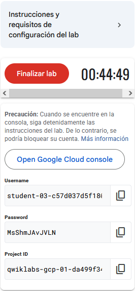
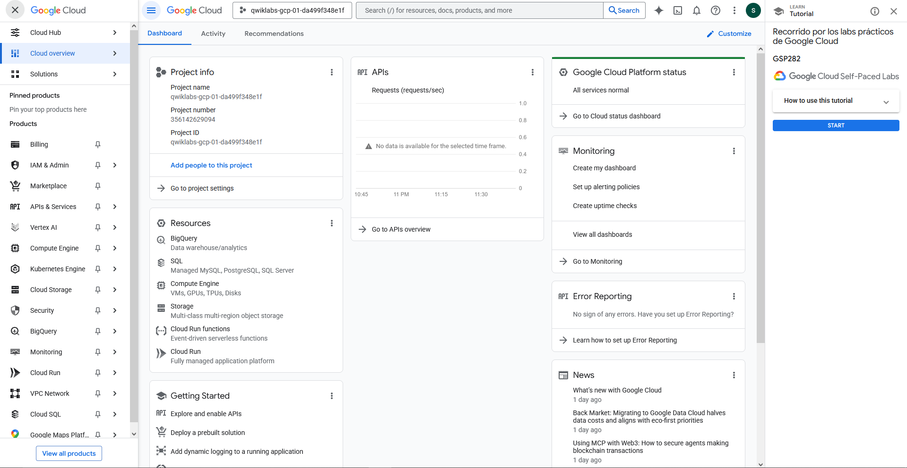
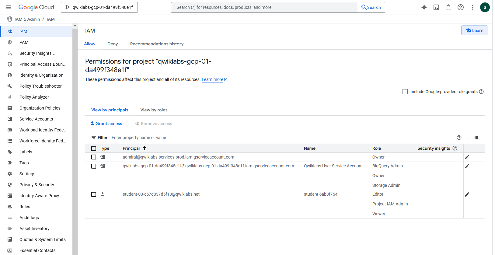
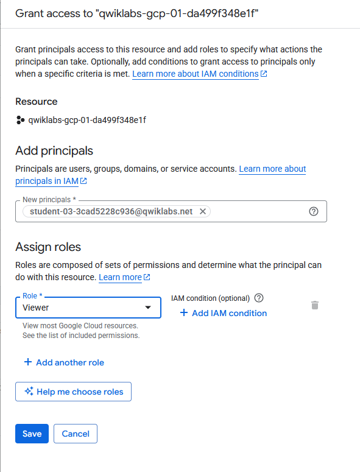
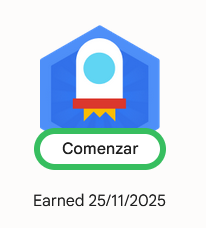

# Escalabilidad y producción: Implementación de soluciones de IA generativa en Google Cloud

## Contexto
En esta artículo realizaremos el laboratorio de Google Skills: "Recorrido por los labs prácticos de Google Cloud".
Este laboratorio se trata de una introducción por la consola de Google Cloud, así como a los laboratios de Google Cloud Skills Boost.

## Objetivos
- Acceder a la consola de Cloud con credenciales específicas para explorar la plataforma de lab y, además, identificar las características clave de un entorno de lab
- Ver varios proyectos de Google Cloud e identificar conceptos erróneos comunes en relación con estos
- Usar el menú de navegación de la consola de Google Cloud para identificar los tipos de servicios de Google Cloud
- Administrar los roles básicos y usar el servicio de Cloud IAM para inspeccionar acciones disponibles para usuarios específicos.
- Explorar la biblioteca de APIs y examinar sus funciones principales

## Desarrollo
Al iniciar el laboratorio (ya habiendose logueado con una cuenta de google skills) se le asignará
un entorno de Google Cloud temporal junto con las credenciales únicas para ingresar y comenzará a correr el tiempo.

Entrando en al link del entorno e ingresando con las credenciales proporcionadas, nos permitará acceso a la consola de Cloud.
En la primera pantalla se nos presentará con un overview de los proyectos en Cloud.

Utilizando el menú de navegación, se nos indicará ir a la pestaña de IAM para poder crear un usuario y asignarle
el rol de Viewer.

Continuando con el laboratorio, veremos como la consola nos permite habilitar servicios y APIs para el uso dentro del
proyecto.
En este ejemplo, activaremos la API de Dialogflow, que permite crear apliaciones conversacionales eficientes (a pesar de que
no la utilizaremos en este laboratorio).

Una vez activada la API, podremos realizar la comprobación del paso y finalizar el lab, recibiendo la medalla correspondiente.

## Referencias
- [Link al lab](https://www.skills.google/focuses/2794?catalog_rank=%7B%22rank%22%3A3%2C%22num_filters%22%3A2%2C%22has_search%22%3Atrue%7D&parent=catalog&search_id=60924676)