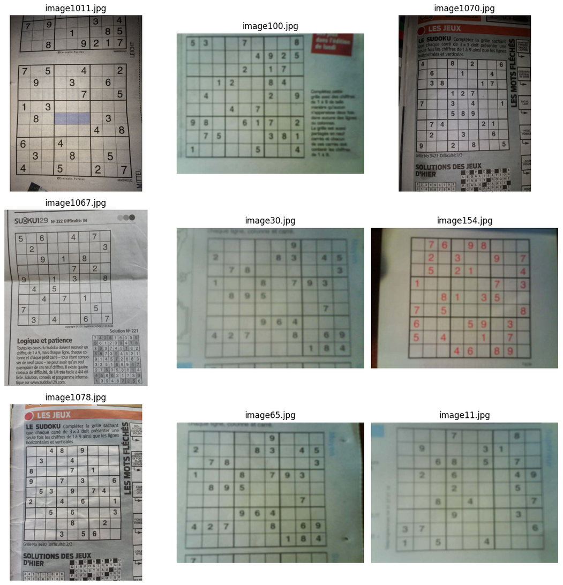
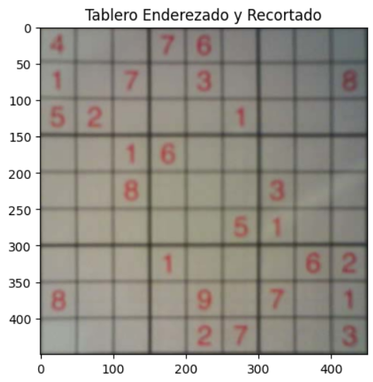

# Del ojo al juego: Digitalización de tableros Sudoku

## Contexto
En esta actividad nos adentraremos en intentar pasar de un tablero de Sudoku
presente en una imágen a uno representado en una matriz con la que
podamos interactuar.

Para esto, utilizaremos SAM para segmentar el tablero de la imágen completa,
recortaremos solamente el tablero y utilizaremos una CNN basada en keras
entranada con el dataset de MNIST para entender los dígitos presentes en
el tablero.

## Objetivos
- Implementar SAM para poder discernir el tablero de la imagen completa
- Utilizar OpenCV para la modificación de la imágen para pasarla a la CNN
- Entrendar una CNN con el dataset MNIST para la digitalización de los números

## Actividades (con tiempos estimados)
- Entendimiento del dataset — 10 min
- Implementación de SAM — 20 min
- Procesamiento de la imagen — 15 min
- Entrenamiento de la CNN — 35 min

## Desarrollo
### Entendimiento del dataset
Para la realización de la actividad utilizaremos el dataset mexwell/sudoku-image-dataset,
que contiene 200 imágenes de tableros sudoku tomadas por celular junto con los valores en
cada celda, reemplzando las celdas vacías con 0s.

Las imágenes del dataset varían de tamaños entre 640x480 hasta 1280x960, algunas incluso
estando rotadas 90°; la cantidad de números en los sudoku varía y el ángulo, distancia y
calidad con las que las fotos fueron tomadas es cambiante; todos estos factores pueden
eventualmente significar un problema a la hora de reconocer los tableros o los números.



### Implementación de SAM
Para poder reconocer el tablero de la imagen completa, utilizamos el generador automático
de máscaras de SAM y nos quedamos con la máscara más grande (que en la mayoría de las 
imágenes es el tablero).


!!! note "Nota"
    Si bien esta manera de elegir la máscara no es la mejor,
    para este uso, es lo suficientemente decente.

### Procesamiento de la imagen
Una vez habiendo encontrado el tablero, utilizaremos OpenCV para encontrar las 4 esquinas
del mismo, enderezarlo en caso de que estuviera rotado y redimensionarlo a 450x450 para
poder dividir mejor celda por celda en los pasos posteriores.



### Entrenamiento de la CNN
Ya teniendo la imagen lista para reconocer cada número, falta el modelo que los reconozca.
Para eso, crearemos y entrenaremos una CNN

## Reflexión
- Qué aprendiste, qué mejorarías, próximos pasos

## Referencias
- Fuentes consultadas con enlaces relativos cuando corresponda


---

## Guía de formato y ejemplos (MkDocs Material)

Usá estos ejemplos para enriquecer tus entradas. Todos funcionan con la configuración del template.

### Admoniciones

!!! note "Nota"
    Este es un bloque informativo.

!!! tip "Sugerencia"
    Considerá alternativas y justifica decisiones.

!!! warning "Atención"
    Riesgos, limitaciones o supuestos relevantes.

### Detalles colapsables

???+ info "Ver desarrollo paso a paso"
    - Paso 1: preparar datos
    - Paso 2: entrenar modelo
    - Paso 3: evaluar métricas

### Código con resaltado y líneas numeradas

```python hl_lines="2 6" linenums="1"
def train(
    data_path: str,
    epochs: int = 10,
    learning_rate: float = 1e-3,
) -> None:
    print("Entrenando...")
    # TODO: implementar
```

### Listas de tareas (checklist)

- [ ] Preparar datos
- [x] Explorar dataset
- [ ] Entrenar baseline

### Tabla de actividades con tiempos

| Actividad           | Tiempo | Resultado esperado               |
|---------------------|:------:|----------------------------------|
| Revisión bibliográfica |  45m  | Lista de fuentes priorizadas     |
| Implementación      |  90m   | Script ejecutable/documentado    |
| Evaluación          |  60m   | Métricas y análisis de errores   |

### Imágenes con glightbox y atributos

Imagen directa (abre en lightbox):

{ width="420" }

Click para ampliar (lightbox):

[{ width="280" }](../assets/placeholder.png)

### Enlaces internos y relativos

Consultá también: [Acerca de mí](../acerca.md) y [Recursos](../recursos.md).

### Notas al pie y citas

Texto con una afirmación que requiere aclaración[^nota].

[^nota]: Esta es una nota al pie con detalles adicionales y referencias.

### Emojis y énfasis

Resultados destacados :rocket: :sparkles: y conceptos `clave`.
