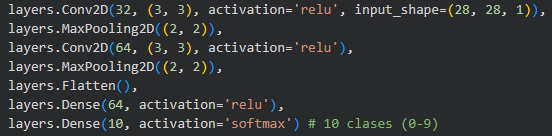
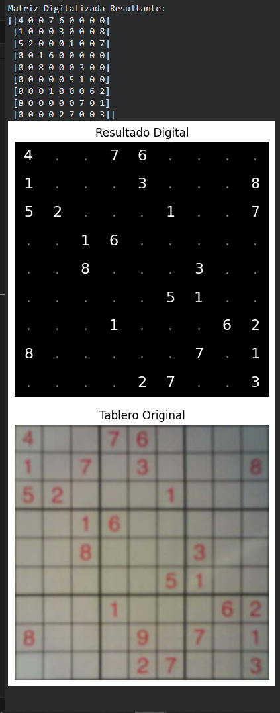

# Del ojo al juego: Digitalización de tableros Sudoku

## Contexto
En esta actividad nos adentraremos en intentar pasar de un tablero de Sudoku
presente en una imágen a uno representado en una matriz con la que
podamos interactuar.

Para esto, utilizaremos SAM para segmentar el tablero de la imágen completa,
recortaremos solamente el tablero y utilizaremos una CNN basada en keras
entranada con el dataset de MNIST para entender los dígitos presentes en
el tablero.

## Objetivos
- Implementar SAM para poder discernir el tablero de la imagen completa
- Utilizar OpenCV para la modificación de la imágen para pasarla a la CNN
- Entrendar una CNN con el dataset MNIST para la digitalización de los números

## Actividades (con tiempos estimados)
- Entendimiento del dataset — 10 min
- Implementación de SAM — 20 min
- Procesamiento de la imagen — 15 min
- Entrenamiento de la CNN — 35 min

## Desarrollo
### Entendimiento del dataset
Para la realización de la actividad utilizaremos el dataset mexwell/sudoku-image-dataset,
que contiene 200 imágenes de tableros sudoku tomadas por celular junto con los valores en
cada celda, reemplzando las celdas vacías con 0s.

Las imágenes del dataset varían de tamaños entre 640x480 hasta 1280x960, algunas incluso
estando rotadas 90°; la cantidad de números en los sudoku varía y el ángulo, distancia y
calidad con las que las fotos fueron tomadas es cambiante; todos estos factores pueden
eventualmente significar un problema a la hora de reconocer los tableros o los números.

### Implementación de SAM
Para poder reconocer el tablero de la imagen completa, utilizamos el generador automático
de máscaras de SAM y nos quedamos con la máscara más grande (que en la mayoría de las 
imágenes es el tablero).

!!! note "Nota"
    Si bien esta manera de elegir la máscara no es la mejor,
    para este uso, es lo suficientemente decente.

### Procesamiento de la imagen
Una vez habiendo encontrado el tablero, utilizaremos OpenCV para encontrar las 4 esquinas
del mismo, enderezarlo en caso de que estuviera rotado y redimensionarlo a 450x450 para
poder dividir mejor celda por celda en los pasos posteriores.

### Entrenamiento de la CNN
Ya teniendo la imagen lista para reconocer cada número, falta el modelo que los reconozca.
Para eso, crearemos y entrenaremos una CNN con el dataset de números de MNIST.
La primera capa de la CNN es una capa convolucional 2D con 32 filtros, tamaño de kernel de 3x3 y una
función de activación relu seguida de una capa de MaxPooling2D para comprimir la información..
Seguido hay dos capas practicamente identicas a las anteriores con la distinción de que la capa
convolucional tiene 64 filtros en vez de 32.
Luego, una capa Flatten que transforme las matrices en un vector de datos para que los pueda procesar
la siguiente capa densa de 64 neuronas con activación relu, y la última capa densa con 10 neuronas
de salida, por cada dígito, teniendo una función de activación softmax para obtener las probabilidades.

Una vez construida la CNN, se realiza el entrenamiento con el dataset de MNIST, que consta de 60000
ejemplso en el set de entrenamiento y 10000 en el de testeo.
El modelo se entrena utilizando el optimizador Adam en 5 épocas con tamaño de batch de 64.

Una vez entrenado, se recorre cada celda del tablero conteniendo un número (sabemos como recorrer el
tablero dado que redimensionamos la imágen a 450x450) y se predice con el modelo el dígito en dicha celda.

Finalmente, se muestra el resultado de la matriz como la predijo el modelo y se presenta en conjunto
al tablero original.

### Resultados
Si bien la aplicación es capaz de separar el tablero de la imagen total y identificar de manera decente
los números presentes en el mismo, existe un espacio de mejora; tanto en la segmentación, que suele
mostrar errores con algunas de las diferentes imágenes teniendo diferentes ángulos o distancias al 
tablero; como en la CNN, que suele confundir números similares (como 3 y 8, 1 y 7, etc.) e interpretar
números en donde no los hay.

## Reflexión
Esta actividad me pareció una manera interesante de vincular un interés personal como los es el Sudoku
con computer vision, teniendo una aplicación directa que cualquier persona puede probar solo con su
celular.

La actividad me ayudo a cerrar algunos conceptos de computer vision como las CNN y SAM, además de
darme a conocer el dataset MNIST, el cual es bastante conocido y utilizado para enternamiento.

Considero que esta actividad está bien como una "primera etapa", dado que existen varios punto de mejora
que se le podría aplicar, entre ellos:
- Mejorar el método de selección de la máscara de SAM, buscando por ejemplo que su forma se cuadrada y
este centrada en vez de buscar la de mayor área.
- Evaluar el tablero resultante contra el tablero real en los archivos del dataset, pudiendo obtener
métricas no solo de un tablero arbitario sino también del dataset en general.
- Reentrenar la CNN con algún otro dataset que clasifique números o aplicar técnicas de data augmentation
para aumentar la cantidad de samples de entrenamiento y testeo.

## Referencias
[Link al Colab](https://colab.research.google.com/drive/16vN8gRp20rYqbPatHrpFaB4J7UNoF-q2?usp=sharing)